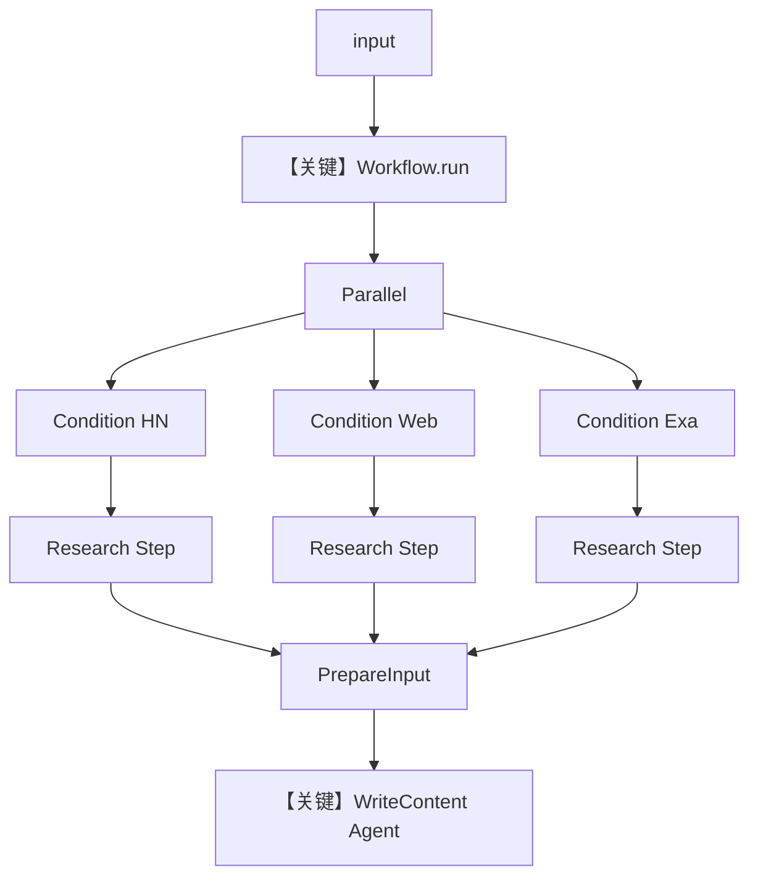

# condition_with_parallel.py — 实现原理分析

> 源文件：`cookbook/04_workflows/02_conditional_execution/condition_with_parallel.py`

## 概述

本示例展示 Agno 的 **多路 Condition 并行（Parallel）** 机制：在单个 `Parallel` 块内放置多个 `Condition`，各自 `evaluator` 独立判定；命中则执行对应研究 `Step`，再经准备与写作两步顺序执行。

**核心配置一览：**

| 配置项 | 值 | 说明 |
|--------|------|------|
| `Workflow.name` | `"Conditional Workflow"` | 名称 |
| `Workflow.steps` | `Parallel(三个Condition), prepare_input_for_write_step, write_step` | 并行条件研究 → 准备 → 写作 |
| `Workflow.description` | `None` | 未设置 |
| `Workflow.db` | `None` | 未设置 |
| `Agent` | HN / Web / Exa / Content | 均未显式 `model` |

## 架构分层

```
用户代码层                agno.workflow 层
┌──────────────────┐    ┌──────────────────────────────────┐
│ condition_with_  │    │ Workflow.run()                   │
│ parallel.py      │───>│  Parallel: 多 Condition 并行      │
│                  │    │  Condition.evaluator → 单/多 Step│
│                  │    │  后续顺序 Step                   │
└──────────────────┘    └──────────────────────────────────┘
                                │
                                ▼
                        ┌──────────────┐
                        │ 子 Agent +   │
                        │ Tools        │
                        └──────────────┘
```

## 核心组件解析

### 四个独立 evaluator

`check_if_we_should_search_hn` / `web` / `x` / `exa`（`L83-L120`）分别从 `StepInput` 取主题并匹配不同关键词集合；**注意**：`check_if_we_should_search_x` 在本 `Workflow` 的 `steps` 中**未被任何 Condition 引用**，属于扩展预留。

### Parallel + Condition 组合

与 `condition_with_list.py` 相比，本例每个 `Condition` 的 `steps` 多为单步 `Step`，强调 **多源并行检索** 后再 `PrepareInput` 与 `WriteContent`（`L126-L153`）。

### 运行机制与因果链

1. **数据路径**：`input` → `Parallel` 内各 `Condition` 并行评估 → 命中的分支执行对应 `Step` → 顺序执行 `prepare_input_for_write_step`、`write_step`。
2. **状态与副作用**：工具（HackerNews、WebSearch、Exa）产生网络副作用；无 `db` 则持久化依赖默认行为。
3. **关键分支**：关键词集合决定走 HN / Web / Exa；未命中则该分支不产生该步输出。
4. **与相邻示例差异**：比 `condition_with_list` 多 **Web 条件** 与 **prepare 步骤**，并演示 **sync / async / stream** 多种 `print_response` 调用（`L159-L181`）。

## System Prompt 组装

无单一工作流级 Agent；各 `Agent` instructions 字面量如下（`L23-L44`）。

| 序号 | 组成部分 | 本文件中的值 | 是否生效 |
|------|---------|-------------|---------|
| 1 | HackerNews Researcher | `"Research tech news and trends from Hacker News"` | 执行该 Step 时 |
| 2 | Web Researcher | `"Research general information from the web"` | 是 |
| 3 | Exa Researcher | `"Research using Exa advanced search capabilities"` | 是 |
| 4 | Content Creator | `"Create well-structured content from research data"` | 是（Prepare 与 Write 共用） |

### 还原后的完整 System 文本（Content Creator 示例）

```text
Create well-structured content from research data
```

（Prepare 步与 Write 步共用同一 `content_agent`，instructions 相同。）

### 段落释义

- 分工明确：三源检索 Agent 只负责各自渠道；Content Agent 负责整理与成文。
- 条件步仅决定调用链，不改变各 Agent 的 system 字面量。

## 完整 API 请求

```python
# 子 Agent 典型 Chat Completions 形态（示意）：
# client.chat.completions.create(
#   model=<默认>,
#   messages=[
#     {"role": "system", "content": "<instructions + 框架默认段>"},
#     {"role": "user", "content": "<workflow 输入或前序内容>"},
#   ],
#   tools=<WebSearchTools / HackerNewsTools / ExaTools 定义>,
# )
```

## Mermaid 流程图


```mermaid
flowchart TD
    U["input"] --> W["【关键】Workflow.run"]
    W --> P["Parallel"]
    P --> C1["Condition HN"]
    P --> C2["Condition Web"]
    P --> C3["Condition Exa"]
    C1 --> S1["Research Step"]
    C2 --> S2["Research Step"]
    C3 --> S3["Research Step"]
    S1 --> Prep["PrepareInput"]
    S2 --> Prep
    S3 --> Prep
    Prep --> Wr["【关键】WriteContent Agent"]
```

## 关键源码文件索引

| 文件 | 关键函数/类 | 作用 |
|------|------------|------|
| `agno/workflow/workflow.py` | `Workflow.run` L6411 | 同步执行 |
| `agno/workflow/parallel.py` | `Parallel` L42 | 并行 |
| `agno/workflow/condition.py` | `Condition` L41 | 条件 |
| `agno/utils/print_response/workflow.py` | `print_response` L44 | 打印封装 |
