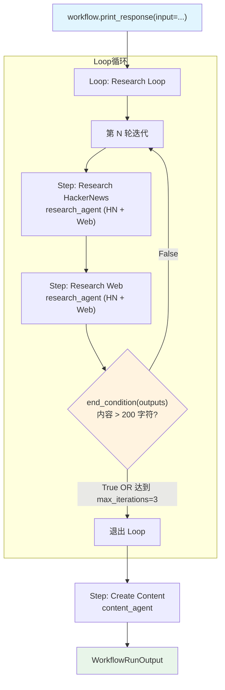

# loop_basic.py — 实现原理分析

> 源文件：`cookbook/04_workflows/03_loop_execution/loop_basic.py`

## 概述

本示例展示 Agno Workflow 的 **`Loop 循环执行`** 机制：`Loop(steps=[...], end_condition=fn, max_iterations=N)` 重复执行步骤列表，每次迭代后调用 `end_condition` 检查是否满足退出条件，最多执行 `max_iterations` 轮，实现「质量驱动的迭代研究」。

**核心配置一览：**

| 配置项 | 值 | 说明 |
|--------|------|------|
| `Loop.name` | `"Research Loop"` | 循环名称 |
| `Loop.steps` | `[research_hackernews_step, research_web_step]` | 每轮执行的步骤 |
| `Loop.end_condition` | `research_evaluator` | 退出条件函数 |
| `Loop.max_iterations` | `3` | 最大迭代次数 |
| 退出条件 | 内容长度 > 200 字符 | 研究充分性判断 |

## 架构分层

```
用户代码层                              agno.workflow 层
┌──────────────────────────────────┐  ┌────────────────────────────────────────────┐
│ loop_basic.py                   │  │ Workflow._run()                            │
│                                  │  │  ├─ Loop._run()                           │
│ workflow                         │──>│  │   ├─ 第 1 轮：research_hn + research_web│
│   steps=[                        │  │  │   │   └─ end_condition(outputs) → T/F   │
│     Loop(                        │  │  │   ├─ True → 退出 Loop                  │
│       steps=[hn_step, web_step], │  │  │   ├─ False → 继续第 2 轮               │
│       end_condition=evaluator,   │  │  │   └─ max_iterations=3 安全退出          │
│       max_iterations=3,          │  │  └─ Step(content)._run()                  │
│     ),                           │  └────────────────────────────────────────────┘
│     content_step,                │
│   ]                              │
└──────────────────────────────────┘
```

## 核心组件解析

### Loop 退出条件函数

`end_condition` 接受**本轮所有步骤的输出列表**（`List[StepOutput]`），返回 `True` 表示退出循环：

```python
def research_evaluator(outputs: List[StepOutput]) -> bool:
    if not outputs:
        return False

    for output in outputs:
        if output.content and len(output.content) > 200:
            print(f"[PASS] Research evaluation passed ({len(output.content)} chars)")
            return True  # 内容足够充分，退出循环

    print("[FAIL] Need more research")
    return False  # 继续下一轮迭代
```

### Loop 配置

```python
Loop(
    name="Research Loop",
    steps=[research_hackernews_step, research_web_step],  # 每轮串行执行
    end_condition=research_evaluator,   # 每轮结束后调用
    max_iterations=3,                   # 安全上限，防止无限循环
)
```

### Loop 执行逻辑

```
第 1 轮:
  → research_hackernews_step → research_web_step
  → end_condition(outputs) → False（内容不足）→ 继续

第 2 轮:
  → research_hackernews_step → research_web_step
  → end_condition(outputs) → True（内容充分）→ 退出

content_step（始终执行）
```

### end_condition 参数说明

| 参数 | 类型 | 内容 |
|------|------|------|
| `outputs` | `List[StepOutput]` | **本轮**所有步骤的输出（不含历史轮次） |
| `outputs[i].content` | `str` | 第 i 个步骤的文本输出 |
| `outputs[i].success` | `bool` | 第 i 个步骤是否成功 |

## Mermaid 流程图



## 关键源码文件索引

| 文件 | 关键类/函数 | 作用 |
|------|------------|------|
| `agno/workflow/loop.py` | `Loop` L40 | 循环执行容器 |
| `agno/workflow/loop.py` | `Loop.end_condition` | 退出条件（callable/bool/CEL） |
| `agno/workflow/loop.py` | `Loop.max_iterations` | 最大迭代次数安全上限 |
| `agno/workflow/types.py` | `StepOutput.content` | end_condition 访问的内容字段 |
