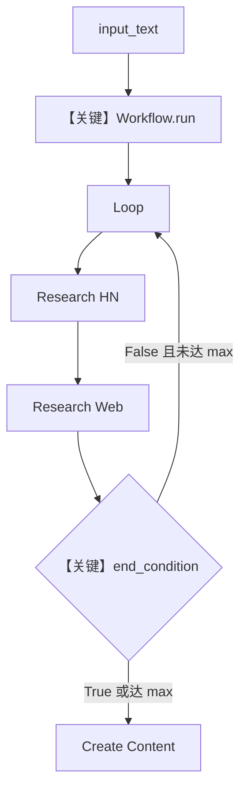

# loop_basic.py — 实现原理分析

> 源文件：`cookbook/04_workflows/03_loop_execution/loop_basic.py`

## 概述

本示例展示 Agno 的 **Loop + end_condition + max_iterations** 机制：`Loop` 内顺序执行多步，每轮结束用 `end_condition(List[StepOutput]) -> bool` 判断是否结束；未满足则继续下一轮直至达到 `max_iterations`。

**核心配置一览：**

| 配置项 | 值 | 说明 |
|--------|------|------|
| `Workflow.name` | `"Research and Content Workflow"` | 名称 |
| `Workflow.description` | `"Research topics in a loop until conditions are met, then create content"` | 描述 |
| `Workflow.steps` | `Loop(...), content_step` | 研究循环后写作 |
| `Loop.name` | `"Research Loop"` | 循环名 |
| `Loop.steps` | `research_hackernews_step, research_web_step` | 循环体内两步 |
| `Loop.end_condition` | `research_evaluator` | 函数，见 `L60-L72` |
| `Loop.max_iterations` | `3` | 最大迭代次数 |
| `research_agent` | `role`, `tools`, `instructions`, `markdown=True` | 未设置 `model` |
| `content_agent` | `role`, `instructions`, `markdown=True` | 未设置 `model` |

## 架构分层

```
用户代码层                agno.workflow 层
┌──────────────────┐    ┌──────────────────────────────────┐
│ loop_basic.py    │    │ Workflow.run()                   │
│ input_text       │───>│  Loop: 迭代执行 steps             │
│                  │    │  每轮末 end_condition(outputs)    │
│                  │    │  True → 退出循环；否则继续        │
│                  │    │  然后 content_step               │
└──────────────────┘    └──────────────────────────────────┘
                                │
                                ▼
                        ┌──────────────┐
                        │ Agent + Tools│
                        └──────────────┘
```

## 核心组件解析

### Loop 与 end_condition

`Loop` 定义见 `agno/workflow/loop.py` `L39-L106`：`end_condition` 可为 `Callable[[List[StepOutput]], bool]` 或 CEL 字符串；`max_iterations` 默认 3（`L73`）。

`research_evaluator`（`L60-L72`）在任一步输出长度超过 200 字符时返回 `True`，否则 `False` 迫使继续迭代。

### 运行机制与因果链

1. **数据路径**：用户 `input_text` 进入工作流 → `Loop` 每轮跑 `Research HackerNews` 再 `Research Web` → 收集本轮 `StepOutput` 列表传入 `research_evaluator` → 成功则退出循环 → `Create Content`。
2. **状态与副作用**：`forward_iteration_output` 未设为 `True`（默认 `False`，`loop.py` `L77`），每轮迭代仍接收**原始**工作流输入（与 `loop_iterative_accumulation.py` 对比）。
3. **关键分支**：`end_condition` 返回 `True` 提前结束；若三轮均不满足则强制结束循环进入 `content_step`（行为由框架在达到 `max_iterations` 时处理）。
4. **与相邻示例差异**：`loop_iterative_accumulation.py` 演示 `forward_iteration_output=True` 与纯函数 `executor`；本例演示 **Agent + 工具** 的研究循环。

## System Prompt 组装

无单一顶层 Agent；子 Agent instructions（`L20-L33`）：

| 组成部分 | 值 | 是否生效 |
|---------|-----|---------|
| Research Agent `role` | `"Research specialist"` | 是 |
| Research Agent `instructions` | `"You are a research specialist. Research the given topic thoroughly."` | 是 |
| Research Agent `markdown` | `True` | 是 |
| Content Agent `role` | `"Content creator"` | 是 |
| Content Agent `instructions` | `"You are a content creator. Create engaging content based on research."` | 是 |

### 还原后的完整 System 文本（Research Agent）

```text
You are a research specialist. Research the given topic thoroughly.
```

（另含 `role` 等若由框架注入为独立段，以 `_messages.py` 为准。）

## 完整 API 请求

```python
# Research Agent 一步内：Chat Completions + tools(HackerNews, WebSearch)
# messages: system 拼装自 instructions/role/markdown 默认
# user: 工作流传入的研究主题字符串
```

## Mermaid 流程图


```mermaid
flowchart TD
    I["input_text"] --> R["【关键】Workflow.run"]
    R --> L["Loop"]
    L --> S1["Research HN"]
    S1 --> S2["Research Web"]
    S2 --> E{"【关键】end_condition"}
    E -->|False 且未达 max| L
    E -->|True 或达 max| C["Create Content"]
```

## 关键源码文件索引

| 文件 | 关键函数/类 | 作用 |
|------|------------|------|
| `agno/workflow/loop.py` | `Loop` L39 | 循环定义 |
| `agno/workflow/workflow.py` | `Workflow.run` L6411 | 执行 |
| `agno/agent/_messages.py` | `get_system_message()` | Agent system |
