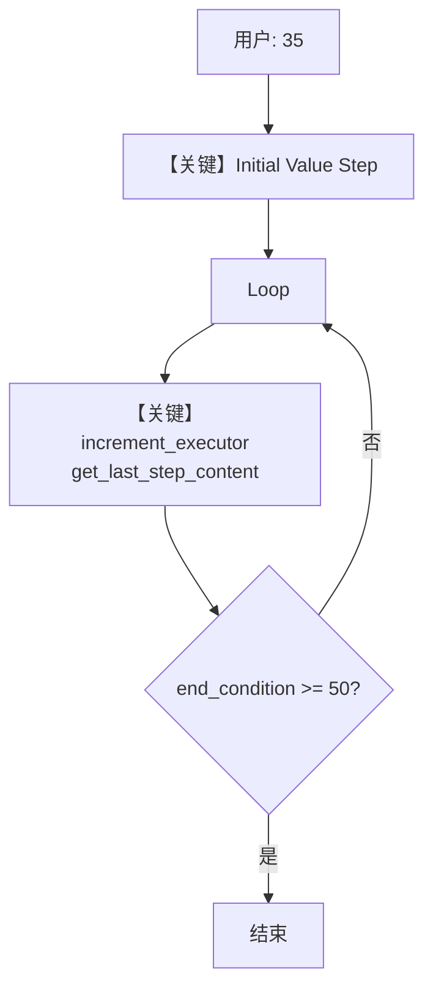

# loop_iterative_accumulation.py — 实现原理分析

<!-- cookbook-py-source:start -->
## 完整源码

```python
"""
Loop Iterative Accumulation
============================

Demonstrates that Loop iterations carry forward the output from the previous iteration.
Each iteration receives the previous iteration's output via `step_input.get_last_step_content()`,
enabling iterative processing patterns like accumulation, refinement, and convergence.

This example increments a numeric value by 10 each iteration, stopping when it reaches 50 or more.
Starting from 35, the loop should:
  - Iteration 1: 35 -> 45
  - Iteration 2: 45 -> 55 (>= 50, end condition met)
"""

from agno.workflow import Loop, Step, Workflow
from agno.workflow.types import StepInput, StepOutput


def increment_executor(step_input: StepInput) -> StepOutput:
    """Increment the previous step's numeric content by 10."""
    last_content = step_input.get_last_step_content()
    if last_content and last_content.isdigit():
        new_value = int(last_content) + 10
        return StepOutput(content=str(new_value))
    return StepOutput(content="0")


workflow = Workflow(
    name="Iterative Accumulation Workflow",
    description="Demonstrates loop iterations carrying forward output from previous iterations.",
    steps=[
        Step(
            name="Initial Value",
            description="Pass through the initial input value.",
            executor=lambda step_input: StepOutput(content=step_input.input),
        ),
        Loop(
            name="Increment Loop",
            description="Increment value by 10 each iteration until it reaches 50.",
            steps=[
                Step(
                    name="Increment Step",
                    description="Add 10 to the current value.",
                    executor=increment_executor,
                )
            ],
            end_condition=lambda step_outputs: int(step_outputs[-1].content) >= 50,
            max_iterations=10,
            forward_iteration_output=True,
        ),
    ],
)

if __name__ == "__main__":
    workflow.print_response("35")
```

<!-- cookbook-py-source:end -->

> 源文件：`cookbook/04_workflows/03_loop_execution/loop_iterative_accumulation.py`

## 概述

本示例展示 Agno 的 **`forward_iteration_output=True` 迭代累加** 机制：循环体内后一步通过 `StepInput.get_last_step_content()` 读取上一步/上一轮输出，使数值或文本在迭代间传递；`end_condition` 根据最新 `StepOutput` 判定退出。

**核心配置一览：**

| 配置项 | 值 | 说明 |
|--------|------|------|
| `Workflow.name` | `"Iterative Accumulation Workflow"` | 名称 |
| `Workflow.description` | `"Demonstrates loop iterations carrying forward output from previous iterations."` | 描述 |
| `Workflow.steps` | `Step(Initial Value), Loop(...)` | 初始步 + 循环 |
| `Loop.name` | `"Increment Loop"` | 循环名 |
| `Loop.steps` | 单步 `Increment Step` + `executor` | `increment_executor` |
| `Loop.end_condition` | `lambda step_outputs: int(step_outputs[-1].content) >= 50` | `L47` |
| `Loop.max_iterations` | `10` | 上限 |
| `Loop.forward_iteration_output` | `True` | **跨轮转发输出** |

## 架构分层

```
用户代码层                agno.workflow 层
┌──────────────────┐    ┌──────────────────────────────────┐
│ loop_iterative_  │    │ Step: 透传 input 为 content       │
│ accumulation.py  │───>│ Loop: forward_iteration_output=True│
│ print_response   │    │  每轮 executor 读 last_content    │
│ "35"             │    │  end_condition 检查末条输出       │
└──────────────────┘    └──────────────────────────────────┘
```

## 核心组件解析

### increment_executor

`increment_executor`（`L19-L25`）用 `step_input.get_last_step_content()` 取上一内容，若为数字则 +10 写入 `StepOutput.content`。

### forward_iteration_output

`Loop.forward_iteration_output`（`loop.py` `L76-L78`）：为 `True` 时下一轮迭代输入来自**上一轮输出**，而非原始工作流输入（与 `loop_basic` 默认行为对照）。

### 运行机制与因果链

1. **数据路径**：`"35"` → Initial Step 输出 `"35"` → 第一轮循环：`get_last_step_content()` 得 `35` → `45` → 第二轮得 `45` → `55`，`end_condition` 因 `>=50` 为真结束。
2. **状态与副作用**：无 LLM、无 db；纯内存数值推演。
3. **关键分支**：若 `last_content` 非数字则回到 `"0"`（`L24-L25`），可能影响收敛。
4. **与相邻示例差异**：本文件**无 Agent**，用于演示循环语义与 `forward_iteration_output`，与 `loop_basic` 的 Agent+工具形成对比。

## System Prompt 组装

本示例**无 Agent**，不存在 `get_system_message()`。指令仅体现在 `Step` 的 `description` 与代码逻辑中。

| 组成部分 | 值 | 是否生效 |
|---------|-----|---------|
| Workflow 级 system | 无 | 否 |
| LLM system | 无 | 否 |

### 说明

若需观察工作流层是否注入其它上下文，可在 `Workflow.run` 前后对 `StepInput` 打日志验证。

## 完整 API 请求

本示例**无 LLM 调用**；`print_response` 仍会执行工作流并打印步骤结果，不产生 `chat.completions` 请求。

## Mermaid 流程图



## 关键源码文件索引

| 文件 | 关键函数/类 | 作用 |
|------|------------|------|
| `agno/workflow/loop.py` | `Loop` L39；`forward_iteration_output` L76 | 循环与转发 |
| `agno/workflow/types.py` | `StepInput.get_last_step_content` | 取上一内容 |
| `agno/workflow/workflow.py` | `Workflow.run` L6411 | 执行 |
