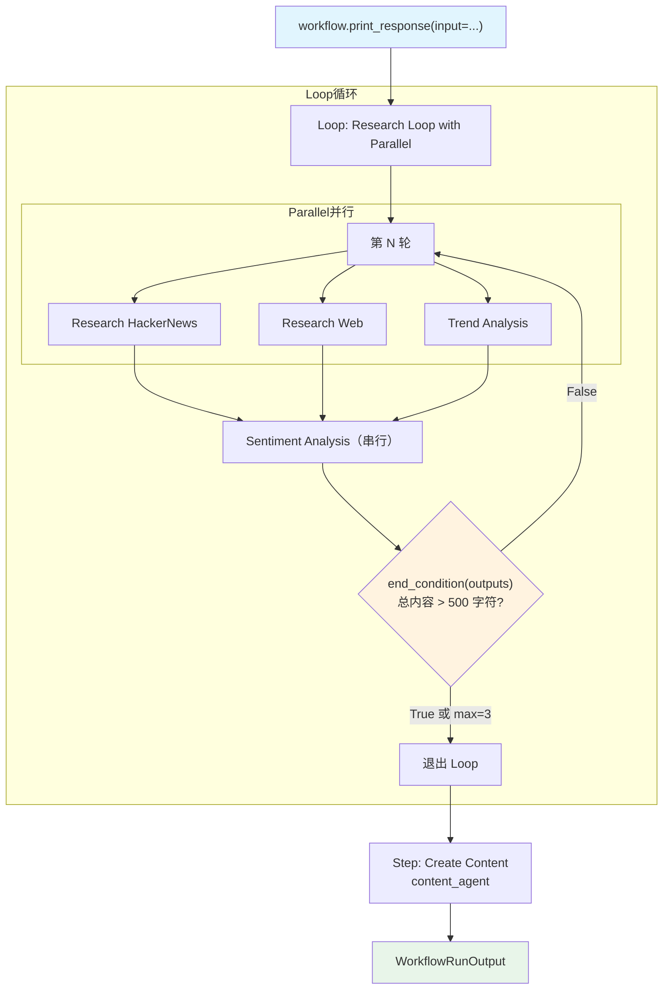

# loop_with_parallel.py — 实现原理分析

> 源文件：`cookbook/04_workflows/03_loop_execution/loop_with_parallel.py`

## 概述

本示例展示 Agno Workflow 的 **`Loop 内嵌 Parallel（循环体包含并行步骤）`** 机制：Loop 的每轮迭代先并行执行研究和分析步骤，再串行执行情感分析步骤，实现「每轮都有并行加速的迭代研究循环」。

**核心配置一览：**

| 配置项 | 值 | 说明 |
|--------|------|------|
| `Loop.steps` | `[Parallel(hn,web,trend), sentiment]` | 每轮：并行 + 串行 |
| `Parallel` 内容 | `research_hn, research_web, trend_analysis` | 三个并行步骤 |
| `Loop.end_condition` | `research_evaluator` | 总内容 > 500 字符退出 |
| `Loop.max_iterations` | `3` | 最大 3 轮 |

## 架构分层

```
Workflow._run()
  ├─ Loop: "Research Loop with Parallel Execution"
  │   └─ 每轮迭代:
  │       ├─ Parallel("Parallel Research & Analysis")
  │       │   ├─ Step(Research HackerNews)  ─┐
  │       │   ├─ Step(Research Web)          ├─ 并行
  │       │   └─ Step(Trend Analysis)       ─┘
  │       ├─ Step(Sentiment Analysis)  ← 串行继续
  │       └─ end_condition(outputs) → True/False
  └─ Step(Create Content)
```

## 核心组件解析

### Loop 内嵌 Parallel 配置

```python
Loop(
    name="Research Loop with Parallel Execution",
    steps=[
        Parallel(
            research_hackernews_step,  # 并行 1：HN 研究
            research_web_step,         # 并行 2：Web 研究
            trend_analysis_step,       # 并行 3：趋势分析
            name="Parallel Research & Analysis",
        ),
        sentiment_analysis_step,       # 串行：情感分析
    ],
    end_condition=research_evaluator,
    max_iterations=3,
)
```

### 聚合评估器

```python
def research_evaluator(outputs: List[StepOutput]) -> bool:
    # outputs 包含本轮所有步骤的输出：
    # - Parallel 输出（以 StepOutput.steps 列表形式）
    # - sentiment_analysis 输出
    total_content_length = sum(len(output.content or "") for output in outputs)
    if total_content_length > 500:
        print(f"[PASS] Total: {total_content_length} chars")
        return True
    print(f"[FAIL] Total: {total_content_length} chars, need more")
    return False
```

### Parallel 输出结构

当 Loop 内有 Parallel 时，`outputs` 中的 Parallel 步骤输出为聚合的 `StepOutput`，其中：
- `StepOutput.step_type = "Parallel"`
- `StepOutput.steps = [hn_output, web_output, trend_output]`（各并行步骤的输出）

## 执行时序

```
第 1 轮:
  Parallel ─────────────────────────┐
    hn_research ─────────────────┐  │（并行，同时执行）
    web_research ─────────────┐  │  │
    trend_analysis ─────────┐ │  │  │
                            └─┴──┴──┘
  sentiment_analysis（等待 Parallel 完成后）
  end_condition(outputs) → False → 继续

第 2 轮:
  ...（同上）
  end_condition(outputs) → True → 退出

Create Content
```

## Mermaid 流程图



## 关键源码文件索引

| 文件 | 关键类/函数 | 作用 |
|------|------------|------|
| `agno/workflow/loop.py` | `Loop` L40 | 循环容器（steps 可嵌套 Parallel） |
| `agno/workflow/parallel.py` | `Parallel` L43 | 并行执行（ThreadPoolExecutor） |
| `agno/workflow/types.py` | `StepOutput.steps` L363 | 嵌套步骤输出列表 |
