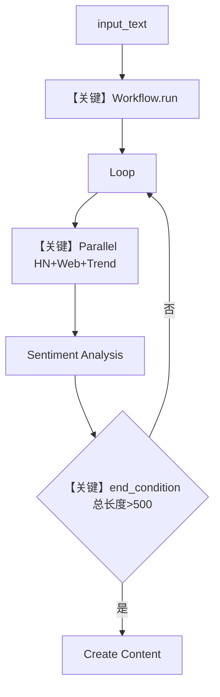

# loop_with_parallel.py — 实现原理分析

> 源文件：`cookbook/04_workflows/03_loop_execution/loop_with_parallel.py`

## 概述

本示例展示 Agno 的 **Loop 体内嵌 Parallel** 机制：每轮迭代先并行执行「HN 研究 + Web 研究 + 趋势分析」，再顺序执行「情感分析」；`end_condition` 根据**本轮**所有相关 `StepOutput` 的内容长度总和判断是否达标，然后进入最终 `content_step`。

**核心配置一览：**

| 配置项 | 值 | 说明 |
|--------|------|------|
| `Workflow.name` | `"Advanced Research and Content Workflow"` | 名称 |
| `Workflow.description` | `"Research topics with parallel execution in a loop until conditions are met, then create content"` | 描述 |
| `Loop.name` | `"Research Loop with Parallel Execution"` | 循环名 |
| `Loop.steps` | `Parallel(三步), sentiment_analysis_step` | 并行块后接一步 |
| `Loop.end_condition` | `research_evaluator` | `L79-L93` |
| `Loop.max_iterations` | `3` | 最大迭代 |
| `Parallel.name` | `"Parallel Research & Analysis"` | 并行块名称 |
| `research_agent` / `analysis_agent` / `content_agent` | 见源码 | 未显式 `model` |

## 架构分层

```
用户代码层                agno.workflow 层
┌──────────────────┐    ┌──────────────────────────────────┐
│ loop_with_       │    │ Loop 每轮:                        │
│ parallel.py      │───>│  Parallel(3) → sentiment_step   │
│                  │    │  end_condition(本轮 outputs)      │
│                  │    │  通过后 content_step            │
└──────────────────┘    └──────────────────────────────────┘
```

## 核心组件解析

### research_evaluator

`L79-L93`：对 `outputs` 求 `content` 长度之和，`>500` 则返回 `True`。与 `loop_basic` 单步长度判断不同，这里聚合**并行+后续一步**产出的总字数。

### Parallel inside Loop

每轮迭代重复：`Parallel` 内三步同时调度，完成后进入 `Sentiment Analysis`；再进入 `end_condition`。

### 运行机制与因果链

1. **数据路径**：`input_text` → 多轮 `Parallel` + `sentiment_analysis_step` → evaluator → `Create Content`。
2. **状态与副作用**：默认 `forward_iteration_output=False`，每轮输入仍为原始工作流输入（未开启跨轮累加）。
3. **关键分支**：总字数阈值与 `max_iterations=3` 共同约束退出。
4. **与 `loop_basic` 差异**：循环体内组合 **Parallel** 与更多 Agent 角色（analysis）。

## System Prompt 组装

子 Agent instructions（`L20-L40`）：

| Agent | instructions 摘要 | 生效 |
|-------|------------------|------|
| Research | `"You are a research specialist..."` | 是 |
| Analysis | `"You are a data analyst..."` | 是 |
| Content | `"You are a content creator..."` | 是 |

### 还原后的完整 System 文本（Research Agent）

```text
You are a research specialist. Research the given topic thoroughly.
```

## 完整 API 请求

各 Agent 步等价于带 `messages` + 可选 `tools` 的 Chat 调用；精确适配器以运行时模型为准。

## Mermaid 流程图


```mermaid
flowchart TD
    IN["input_text"] --> WR["【关键】Workflow.run"]
    WR --> LP["Loop"]
    LP --> PR["【关键】Parallel<br/>HN+Web+Trend"]
    PR --> SA["Sentiment Analysis"]
    SA --> EV{"【关键】end_condition<br/>总长度>500"}
    EV -->|否| LP
    EV -->|是| CT["Create Content"]
```

## 关键源码文件索引

| 文件 | 关键函数/类 | 作用 |
|------|------------|------|
| `agno/workflow/loop.py` | `Loop` L39 | 循环 |
| `agno/workflow/parallel.py` | `Parallel` L42 | 并行 |
| `agno/workflow/workflow.py` | `Workflow.run` L6411 | 执行 |
