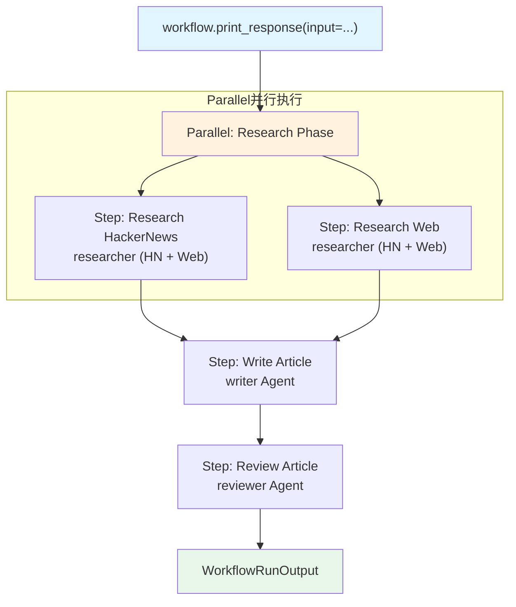

# parallel_basic.py — 实现原理分析

> 源文件：`cookbook/04_workflows/04_parallel_execution/parallel_basic.py`

## 概述

本示例展示 Agno Workflow 的 **`Parallel 并行执行`** 机制：`Parallel(step1, step2, name=...)` 使用线程池并发执行多个独立步骤，显著降低总耗时，然后将结果汇聚为单个 `StepOutput` 传递给后续串行步骤。

**核心配置一览：**

| 配置项 | 值 | 说明 |
|--------|------|------|
| `Parallel` 步骤 | `research_hn_step, research_web_step` | 两个独立研究步骤 |
| `Parallel.name` | `"Research Phase"` | 并行块名称 |
| 后续串行步骤 | `write_step, review_step` | 顺序执行 |

## 架构分层

```
用户代码层                              agno.workflow 层
┌──────────────────────────────────┐  ┌────────────────────────────────────────────┐
│ parallel_basic.py               │  │ Workflow._run()                            │
│                                  │  │  ├─ Parallel._run()                       │
│ workflow                         │──>│  │   ├─ ThreadPoolExecutor                │
│   steps=[                        │  │  │   ├─ hn_step._run() ─────────┐ 并行    │
│     Parallel(hn_step, web_step), │  │  │   └─ web_step._run() ────────┘         │
│     write_step,                  │  │  ├─ Step(write)._run()（等待 Parallel）   │
│     review_step,                 │  │  └─ Step(review)._run()                   │
│   ]                              │  └────────────────────────────────────────────┘
└──────────────────────────────────┘
```

## 核心组件解析

### Parallel 配置语法

```python
from agno.workflow.parallel import Parallel

# 方式 1：步骤作为位置参数（最常用）
Parallel(research_hn_step, research_web_step, name="Research Phase")

# 方式 2：Name 作为第一个位置参数
Parallel("Research Phase", research_hn_step, research_web_step)

# 方式 3：Name 作为关键字参数
Parallel(research_hn_step, research_web_step, name="Research Phase")
```

### 工作流组合

```python
workflow = Workflow(
    name="Content Creation Pipeline",
    steps=[
        Parallel(research_hn_step, research_web_step, name="Research Phase"),
        write_step,     # 等待 Parallel 完成后执行
        review_step,    # 串行继续
    ],
)
```

### Parallel 内部执行机制

`Parallel._run()` 使用 `ThreadPoolExecutor` 并发执行所有步骤，结合 `as_completed` 收集结果：

```python
# 内部伪代码（agno/workflow/parallel.py）
with ThreadPoolExecutor() as executor:
    futures = {executor.submit(step._run, step_input): step for step in self.steps}
    results = []
    for future in as_completed(futures):
        results.append(future.result())
```

并行结果以 `StepOutput(steps=[hn_output, web_output])` 的形式聚合，后续步骤通过 `step_input.previous_step_outputs` 访问各子步骤结果。

### 并行 vs 串行性能对比

| 模式 | 示意耗时 | 说明 |
|------|---------|------|
| 串行（hn → web → write） | T_hn + T_web + T_write | 各步骤顺序等待 |
| 并行（hn \|\| web → write） | max(T_hn, T_web) + T_write | 研究阶段并行加速 |

## Mermaid 流程图



## 关键源码文件索引

| 文件 | 关键类/函数 | 作用 |
|------|------------|------|
| `agno/workflow/parallel.py` | `Parallel.__init__()` L59 | 变长参数初始化（支持多种调用语法） |
| `agno/workflow/parallel.py` | `Parallel._run()` | ThreadPoolExecutor 并发执行 |
| `agno/workflow/types.py` | `StepOutput.steps` L363 | 并行结果嵌套列表 |
