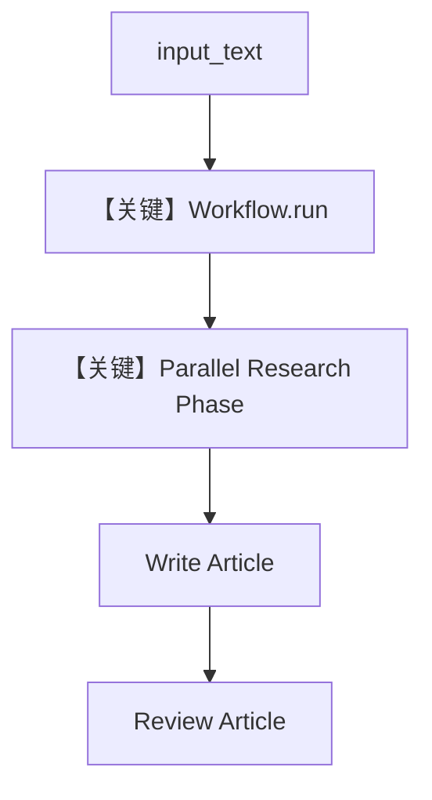

# parallel_basic.py — 实现原理分析

<!-- cookbook-py-source:start -->
## 完整源码

```python
"""
Parallel Basic
==============

Demonstrates running independent research steps in parallel before sequential writing and review steps.
"""

import asyncio

from agno.agent import Agent
from agno.tools.hackernews import HackerNewsTools
from agno.tools.websearch import WebSearchTools
from agno.workflow import Step, Workflow
from agno.workflow.parallel import Parallel

# ---------------------------------------------------------------------------
# Create Agents
# ---------------------------------------------------------------------------
researcher = Agent(name="Researcher", tools=[HackerNewsTools(), WebSearchTools()])
writer = Agent(name="Writer")
reviewer = Agent(name="Reviewer")

# ---------------------------------------------------------------------------
# Define Steps
# ---------------------------------------------------------------------------
research_hn_step = Step(name="Research HackerNews", agent=researcher)
research_web_step = Step(name="Research Web", agent=researcher)
write_step = Step(name="Write Article", agent=writer)
review_step = Step(name="Review Article", agent=reviewer)

# ---------------------------------------------------------------------------
# Create Workflow
# ---------------------------------------------------------------------------
workflow = Workflow(
    name="Content Creation Pipeline",
    steps=[
        Parallel(research_hn_step, research_web_step, name="Research Phase"),
        write_step,
        review_step,
    ],
)

# ---------------------------------------------------------------------------
# Run Workflow
# ---------------------------------------------------------------------------
if __name__ == "__main__":
    input_text = "Write about the latest AI developments"

    # Sync
    workflow.print_response(input_text)

    # Sync Streaming
    workflow.print_response(
        input_text,
        stream=True,
    )

    # Async
    asyncio.run(workflow.aprint_response(input_text))

    # Async Streaming
    asyncio.run(
        workflow.aprint_response(
            input_text,
            stream=True,
        )
    )
```

<!-- cookbook-py-source:end -->

> 源文件：`cookbook/04_workflows/04_parallel_execution/parallel_basic.py`

## 概述

本示例展示 Agno 的 **Parallel 并行 Phase + 顺序后处理** 机制：先用 `Parallel` 同时跑多个独立 `Step`，再顺序执行写作与审核，适合 I/O 型研究任务并行缩短墙钟时间。

**核心配置一览：**

| 配置项 | 值 | 说明 |
|--------|------|------|
| `Workflow.name` | `"Content Creation Pipeline"` | 名称 |
| `Workflow.description` | `None` | 未设置 |
| `Workflow.steps` | `Parallel(...), write_step, review_step` | 并行后串行 |
| `Parallel` | `research_hn_step, research_web_step, name="Research Phase"` | 两步并行 |
| `researcher` | `name`, `tools=[HackerNewsTools(), WebSearchTools()]` | 未设置 `instructions`、`model` |
| `writer` / `reviewer` | 仅 `name` | 默认模型 |

## 架构分层

```
用户 input              Workflow.run()
     │                        │
     └────────────────────────┼── Parallel → 两研究 Step 同时调度
                              └── Write → Review 顺序
```

## 核心组件解析

### Parallel

`Parallel(research_hn_step, research_web_step, name="Research Phase")`（`L37`）见 `agno/workflow/parallel.py` `L42`：`steps` 内各子步独立执行，结果再汇入后续 `StepInput`。

### 运行机制与因果链

1. **数据路径**：`input_text` → 并行两研究 → 合并上下文供 `Write Article` → `Review Article`。
2. **状态与副作用**：两工具源可能重复网络请求；无 `db`。
3. **关键分支**：无路由；始终执行全部分支。
4. **与 `parallel_with_condition` 差异**：本例**无条件**，结构最简单。

## System Prompt 组装

各 Agent 未写 `instructions`，仅 `Researcher` 有 `tools`；system 以框架默认 + 空 instructions 为主。验证方式：对 `Researcher` 在 `get_system_message()` 返回处断点。

| 组成部分 | 本文件 | 是否生效 |
|---------|--------|---------|
| Researcher instructions | 未设置 | 依赖默认 |
| Writer/Reviewer instructions | 未设置 | 依赖默认 |

### 还原后的完整 System 文本

无法仅从 cookbook 静态还原长正文；请运行时打印 `get_system_message()` 或查阅默认 Agent 行为。

## 完整 API 请求

带 `HackerNewsTools`/`WebSearchTools` 的 Chat Completions 调用（具体 `model` 由环境决定）。

## Mermaid 流程图


```mermaid
flowchart TD
    A["input_text"] --> B["【关键】Workflow.run"]
    B --> C["【关键】Parallel Research Phase"]
    C --> D["Write Article"]
    D --> E["Review Article"]
```

## 关键源码文件索引

| 文件 | 关键函数/类 | 作用 |
|------|------------|------|
| `agno/workflow/parallel.py` | `Parallel` L42 | 并行块 |
| `agno/workflow/workflow.py` | `Workflow.run` L6411 | 执行 |
