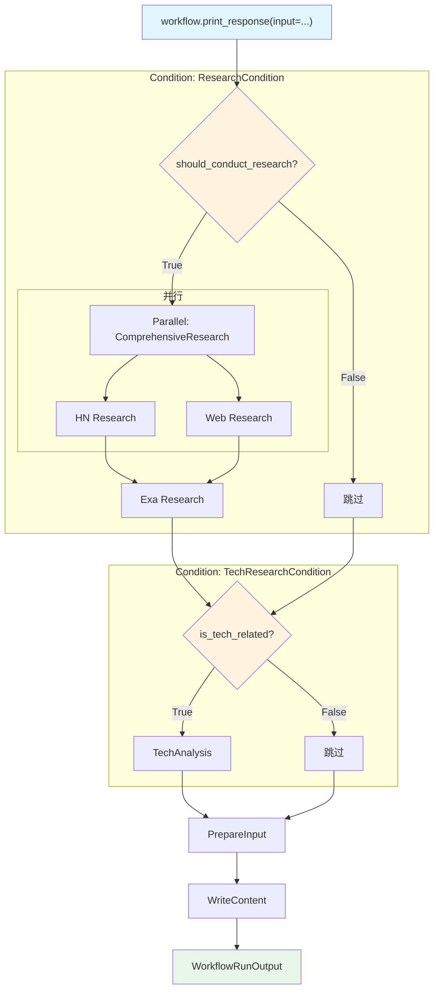

# parallel_with_condition.py — 实现原理分析

> 源文件：`cookbook/04_workflows/04_parallel_execution/parallel_with_condition.py`

## 概述

本示例展示 Agno Workflow 的 **`Condition 内嵌 Parallel（条件触发并行研究 + 多条件串行）`** 机制：第一个 `Condition` 内包含 `Parallel` 和后续串行步骤，第二个 `Condition` 独立串行，展示如何通过多条件门控实现自适应研究流水线。

**核心配置一览：**

| 配置项 | 值 | 说明 |
|--------|------|------|
| Condition 1 steps | `[Parallel(hn,web), exa]` | 条件触发并行研究 |
| Condition 2 steps | `[tech_analysis_step]` | 独立技术分析条件 |
| 公共步骤 | `prepare_input + write_step` | 始终执行 |

## 核心组件解析

### 条件内的并行

```python
Condition(
    name="ResearchCondition",
    evaluator=should_conduct_research,
    steps=[
        Parallel(
            research_hackernews_step,  # HN 研究（并行）
            research_web_step,         # Web 研究（并行）
            name="ComprehensiveResearch",
        ),
        research_exa_step,             # Exa 研究（Parallel 后串行）
    ],
)
```

### 多评估器

```python
def should_conduct_research(step_input: StepInput) -> bool:
    # 宽泛匹配：ai, news, research, facts, developments 等
    return any(k in topic.lower() for k in research_keywords)

def is_tech_related(step_input: StepInput) -> bool:
    # 严格技术：ai, machine learning, software, tech 等
    return any(k in topic.lower() for k in tech_keywords)
```

## 执行路径

| 输入 | C1(Research) | C2(Tech) | 实际步骤 |
|------|-------------|---------|---------|
| "AI developments" | True | True | Parallel(hn,web) + exa + tech_analysis + prepare + write |
| "climate news" | True | False | Parallel(hn,web) + exa + prepare + write |
| "recipe tips" | False | False | prepare + write |

## Mermaid 流程图



## 关键源码文件索引

| 文件 | 关键类/函数 | 作用 |
|------|------------|------|
| `agno/workflow/condition.py` | `Condition` L42 | 条件分支，steps 支持 Parallel |
| `agno/workflow/parallel.py` | `Parallel` L43 | 并行执行 |
