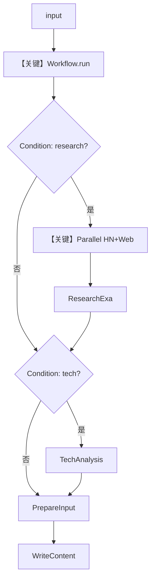

# parallel_with_condition.py — 实现原理分析

<!-- cookbook-py-source:start -->
## 完整源码

```python
"""
Parallel With Condition
=======================

Demonstrates combining conditional branches with parallel execution for adaptive research pipelines.
"""

import asyncio

from agno.agent import Agent
from agno.tools.exa import ExaTools
from agno.tools.hackernews import HackerNewsTools
from agno.tools.websearch import WebSearchTools
from agno.workflow.condition import Condition
from agno.workflow.parallel import Parallel
from agno.workflow.step import Step
from agno.workflow.types import StepInput
from agno.workflow.workflow import Workflow

# ---------------------------------------------------------------------------
# Create Agents
# ---------------------------------------------------------------------------
hackernews_agent = Agent(
    name="HackerNews Researcher",
    instructions="Research tech news and trends from Hacker News",
    tools=[HackerNewsTools()],
)

web_agent = Agent(
    name="Web Researcher",
    instructions="Research general information from the web",
    tools=[WebSearchTools()],
)

exa_agent = Agent(
    name="Exa Search Researcher",
    instructions="Research using Exa advanced search capabilities",
    tools=[ExaTools()],
)

content_agent = Agent(
    name="Content Creator",
    instructions="Create well-structured content from research data",
)

# ---------------------------------------------------------------------------
# Define Steps
# ---------------------------------------------------------------------------
research_hackernews_step = Step(
    name="ResearchHackerNews",
    description="Research tech news from Hacker News",
    agent=hackernews_agent,
)

research_web_step = Step(
    name="ResearchWeb",
    description="Research general information from web",
    agent=web_agent,
)

research_exa_step = Step(
    name="ResearchExa",
    description="Research using Exa search",
    agent=exa_agent,
)

prepare_input_for_write_step = Step(
    name="PrepareInput",
    description="Prepare and organize research data for writing",
    agent=content_agent,
)

write_step = Step(
    name="WriteContent",
    description="Write the final content based on research",
    agent=content_agent,
)

tech_analysis_step = Step(
    name="TechAnalysis",
    description="Deep dive tech analysis and trend identification",
    agent=content_agent,
)


# ---------------------------------------------------------------------------
# Define Condition Evaluators
# ---------------------------------------------------------------------------
def should_conduct_research(step_input: StepInput) -> bool:
    topic = step_input.input or step_input.previous_step_content or ""
    research_keywords = [
        "ai",
        "machine learning",
        "programming",
        "software",
        "tech",
        "startup",
        "coding",
        "news",
        "information",
        "research",
        "facts",
        "data",
        "analysis",
        "comprehensive",
        "trending",
        "viral",
        "social",
        "discussion",
        "opinion",
        "developments",
    ]
    return any(keyword in topic.lower() for keyword in research_keywords)


def is_tech_related(step_input: StepInput) -> bool:
    topic = step_input.input or step_input.previous_step_content or ""
    tech_keywords = [
        "ai",
        "machine learning",
        "programming",
        "software",
        "tech",
        "startup",
        "coding",
    ]
    return any(keyword in topic.lower() for keyword in tech_keywords)


# ---------------------------------------------------------------------------
# Create Workflow
# ---------------------------------------------------------------------------
workflow = Workflow(
    name="Conditional Research Workflow",
    description="Conditionally execute parallel research based on topic relevance",
    steps=[
        Condition(
            name="ResearchCondition",
            description="Check if comprehensive research is needed for this topic",
            evaluator=should_conduct_research,
            steps=[
                Parallel(
                    research_hackernews_step,
                    research_web_step,
                    name="ComprehensiveResearch",
                    description="Run multiple research sources in parallel",
                ),
                research_exa_step,
            ],
        ),
        Condition(
            name="TechResearchCondition",
            description="Additional tech-focused research if topic is tech-related",
            evaluator=is_tech_related,
            steps=[tech_analysis_step],
        ),
        prepare_input_for_write_step,
        write_step,
    ],
)

# ---------------------------------------------------------------------------
# Run Workflow
# ---------------------------------------------------------------------------
if __name__ == "__main__":
    try:
        # Sync Streaming
        workflow.print_response(
            input="Latest AI developments in machine learning",
            stream=True,
        )

        # Async Streaming
        asyncio.run(
            workflow.aprint_response(
                input="Latest AI developments in machine learning",
                stream=True,
            )
        )
    except Exception as e:
        print(f"[ERROR] Error: {e}")
    print()
```

<!-- cookbook-py-source:end -->

> 源文件：`cookbook/04_workflows/04_parallel_execution/parallel_with_condition.py`

## 概述

本示例展示 Agno 的 **Condition 嵌套 Parallel 与顺序 Exa** 机制：第一层 `Condition` 在 `should_conduct_research` 为真时先跑 `Parallel(HN, Web)`，再跑 `research_exa_step`；第二层 `Condition` 在 `is_tech_related` 为真时追加 `tech_analysis_step`；最后 `prepare` + `write`。

**核心配置一览：**

| 配置项 | 值 | 说明 |
|--------|------|------|
| `Workflow.name` | `"Conditional Research Workflow"` | 名称 |
| `Workflow.description` | `"Conditionally execute parallel research based on topic relevance"` | 描述 |
| `Condition` ×2 | 见 `L137-L156` | 顺序的两个条件块 |
| 内层 `Parallel` | HN + Web | `L142-L147` |
| `evaluator` | `should_conduct_research`, `is_tech_related` | `L89-L127` |

## 核心组件解析

### 顺序 Condition

两个 `Condition` 顶层顺序排列：先决定是否做「并行+Exa」研究包，再决定是否加技术分析步（`L137-L156`）。

### 运行机制与因果链

1. **数据路径**：`input` → 第一 `Condition` → 可能执行 `Parallel`+`Exa` → 第二 `Condition` → 可能 `TechAnalysis` → `Prepare` → `Write`。
2. **副作用**：多工具与多 Agent 调用。
3. **关键分支**：`should_conduct_research` 为假则第一块整体跳过；`is_tech_related` 为假则跳过技术分析。

## System Prompt 组装

子 Agent 含完整 `instructions`（`L23-L44`），可按 Agent 逐字还原，例如 Exa：`"Research using Exa advanced search capabilities"`。

## 完整 API 请求

各研究/写作步为带 tools 的 Chat 调用；模型默认。

## Mermaid 流程图


```mermaid
flowchart TD
    I["input"] --> W["【关键】Workflow.run"]
    W --> C1{"Condition: research?"}
    C1 -->|是| P["【关键】Parallel HN+Web"]
    P --> E["ResearchExa"]
    C1 -->|否| C2
    E --> C2{"Condition: tech?"}
    C2 -->|是| T["TechAnalysis"]
    C2 -->|否| Prep
    T --> Prep["PrepareInput"]
    Prep --> Wr["WriteContent"]
```

## 关键源码文件索引

| 文件 | 关键函数/类 | 作用 |
|------|------------|------|
| `agno/workflow/condition.py` | `Condition` L41 | 条件 |
| `agno/workflow/parallel.py` | `Parallel` L42 | 并行 |
