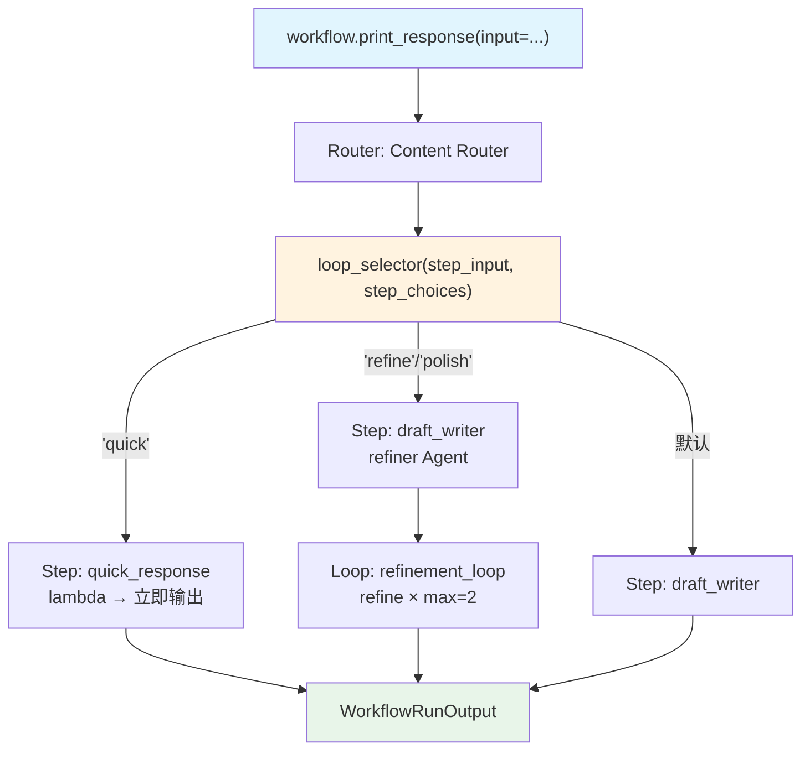

# loop_in_choices.py — 实现原理分析

> 源文件：`cookbook/04_workflows/05_conditional_branching/loop_in_choices.py`

## 概述

本示例展示 Agno Workflow Router 的 **`choices 包含 Loop 和 lambda executor`** 机制：Router choices 同时包含使用 lambda 函数的 Step 和 Loop 对象，selector 可以选择单个 Step、Loop，或多个步骤的组合（先写草稿再用 Loop 精炼）。

**核心配置一览：**

| 配置项 | 值 | 说明 |
|--------|------|------|
| `quick_response` | `Step(executor=lambda x: StepOutput(...))` | Lambda 执行器 |
| `refinement_loop` | `Loop(steps=[refine_step], max_iterations=2)` | 精炼循环 |
| Choices | `[quick_response, draft_writer, refinement_loop]` | 三种选项 |
| 多步组合 | `[draft_writer, refinement_loop]` | 先草稿再精炼 |

## 核心组件解析

### Lambda 执行器 Step

```python
quick_response = Step(
    name="quick_response",
    executor=lambda x: StepOutput(content=f"Quick answer: {x.input}"),
    # lambda 函数可直接用作 executor
)
```

### Loop 作为 Choice

```python
refinement_loop = Loop(
    name="refinement_loop",
    steps=[Step(name="refine_step", agent=refiner)],
    max_iterations=2,  # 最多精炼 2 轮（无 end_condition，依靠 max_iterations）
)
```

### 多步骤选择（组合路由）

```python
def loop_selector(step_input: StepInput, step_choices: list) -> Union[str, Step, List[Step]]:
    user_input = step_input.input.lower()

    if "quick" in user_input:
        return step_choices[0]          # quick_response Step
    if "refine" in user_input or "polish" in user_input:
        return [step_choices[1], step_choices[2]]  # [draft_writer, refinement_loop] 组合
    return step_choices[1]              # 默认 draft_writer
```

### 无 end_condition 的 Loop

当 `Loop.end_condition=None` 时，Loop 固定执行 `max_iterations` 次：

```python
Loop(max_iterations=2)  # 固定执行 2 轮，不做内容质量判断
```

## 执行路径

| 输入内容 | 选择结果 | 执行路径 |
|---------|---------|---------|
| "quick answer" | quick_response | lambda 立即返回 |
| "refine this text" | [draft_writer, refinement_loop] | 先草稿 → Loop 精炼 2 轮 |
| "write a blog" | draft_writer | 单次写作 |

## Mermaid 流程图



## 关键源码文件索引

| 文件 | 关键类/函数 | 作用 |
|------|------------|------|
| `agno/workflow/router.py` | `Router.choices` | 支持 Step/Loop 混合 choices |
| `agno/workflow/step.py` | `Step.executor` L67 | 支持 lambda 函数作为 executor |
| `agno/workflow/loop.py` | `Loop.max_iterations` | 无 end_condition 时的固定迭代次数 |
