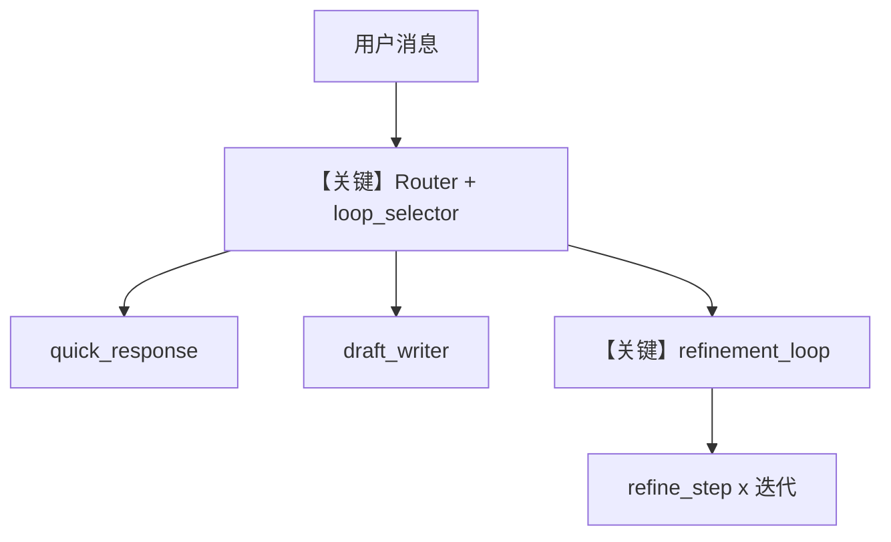

# loop_in_choices.py — 实现原理分析

> 源文件：`cookbook/04_workflows/05_conditional_branching/loop_in_choices.py`

## 概述

本示例展示 Agno 的 **Router 的 choices 含 Loop** 机制：`Router.selector` 可返回 `Step`、步骤名或**嵌套可执行单元**；此处 `refinement_loop` 作为 choice 之一，使路由可选进入多轮 `Loop`（`max_iterations=2`，无 `end_condition` 则跑满迭代）。

**核心配置一览：**

| 配置项 | 值 | 说明 |
|--------|------|------|
| `Workflow.name` | `"Loop Choice Routing"` | 名称 |
| `Router.name` | `"Content Router"` | 路由名 |
| `Router.choices` | `quick_response, draft_writer, refinement_loop` | 含 `Loop` |
| `Router.selector` | `loop_selector` | `L51-L61` |
| `draft_writer` / `refiner` | `OpenAIChat(id="gpt-4o-mini")` + instructions | Chat Completions |
| `refinement_loop` | `max_iterations=2`，单 `refiner` Step | `L41-L45` |

## 架构分层

```
StepInput + choices ──> Router.selector ──> 选中 Step 或 Loop
                              │
                              └── workflow 执行器展开 Loop
```

## 核心组件解析

### loop_selector

`L51-L61`：`quick` → `step_choices[0]`；`refine`/`polish` → `[draft_writer, refinement_loop]` 列表表示**多步顺序**；默认 `step_choices[1]`（`draft_writer`）。

### Router

`Router` 定义见 `agno/workflow/router.py` `L44`：程序化 `selector` 返回待执行步骤集合。

### 运行机制与因果链

1. **数据路径**：用户字符串 → `Router` → 选中 `quick_response` / `draft_writer` / `draft+refinement_loop` 链。
2. **状态**：`refinement_loop` 内 `end_condition` 为 `None` 时依 `max_iterations` 固定轮数（`loop.py` 语义）。
3. **与 `router_basic` 差异**：本例显式 **`OpenAIChat`** 与 **Loop 作为 choice**。

## System Prompt 组装

| Agent | instructions | model |
|-------|--------------|-------|
| draft_writer | `"Write a draft on the given topic. Keep it concise."` | gpt-4o-mini |
| refiner | `"Refine and improve the given draft..."` | gpt-4o-mini |

### 还原后的完整 System 文本（draft_writer）

```text
Write a draft on the given topic. Keep it concise.
```

## 完整 API 请求

```python
# OpenAI Chat Completions（OpenAIChat）
# client.chat.completions.create(
#   model="gpt-4o-mini",
#   messages=[{"role": "system", "content": <get_system_message>}, ...],
# )
```

## Mermaid 流程图


```mermaid
flowchart TD
    U["用户消息"] --> R["【关键】Router + loop_selector"]
    R --> Q["quick_response"]
    R --> D["draft_writer"]
    R --> L["【关键】refinement_loop"]
    L --> M["refine_step x 迭代"]
```

## 关键源码文件索引

| 文件 | 关键函数/类 | 作用 |
|------|------------|------|
| `agno/workflow/router.py` | `Router` L44 | 路由 |
| `agno/workflow/loop.py` | `Loop` L39 | 循环 |
| `agno/models/openai/chat.py` | `OpenAIChat` | 模型适配（路径以仓库为准） |
