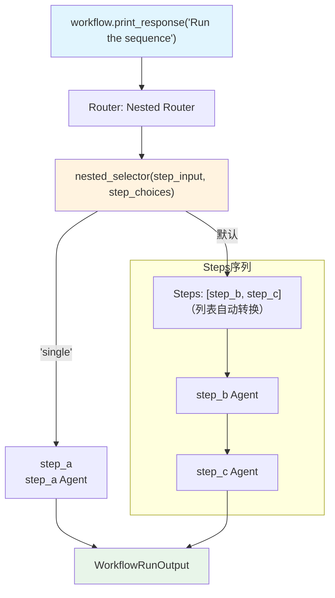

# nested_choices.py — 实现原理分析

> 源文件：`cookbook/04_workflows/05_conditional_branching/nested_choices.py`

## 概述

本示例展示 Agno Workflow Router 的 **`嵌套列表 choices 自动转换`** 机制：`Router.choices` 可包含步骤对象或**步骤列表**，列表类型的 choice 会被自动转换为 `Steps` 容器，使 selector 可以返回「多步骤序列」作为一个路由选项。

**核心配置一览：**

| 配置项 | 值 | 说明 |
|--------|------|------|
| `Router.choices` | `[step_a, [step_b, step_c]]` | 第二个 choice 是列表 |
| 列表自动转换 | `[step_b, step_c]` → `Steps([step_b, step_c])` | 自动包装为 Steps |
| selector 返回 | `step_choices[1]`（Steps 对象） | 串行执行 b → c |

## 核心组件解析

### 嵌套列表 choices

```python
Router(
    name="Nested Router",
    selector=nested_selector,
    choices=[
        step_a,                # 普通 Step choice
        [step_b, step_c],      # 列表自动转为 Steps([step_b, step_c])
    ],
)
```

### 选择器使用 step_choices

```python
def nested_selector(
    step_input: StepInput,
    step_choices: list,   # 注入后：[step_a, Steps([step_b, step_c])]
) -> Union[str, Step, List[Step]]:
    user_input = step_input.input.lower()
    if "single" in user_input:
        return step_choices[0]  # step_a（单步骤）
    return step_choices[1]      # Steps([step_b, step_c])（序列）
```

### 自动转换机制

Router 在初始化时将 `choices` 中的列表元素转换为 `Steps`：

```python
# Router 内部伪代码
for i, choice in enumerate(self.choices):
    if isinstance(choice, list):
        self.choices[i] = Steps(steps=choice)  # 自动包装
```

## 执行路径

| 输入 | 选择结果 | 执行步骤 |
|------|---------|---------|
| "run single" | `step_choices[0]` = step_a | step_a |
| "run sequence" | `step_choices[1]` = Steps([b, c]) | step_b → step_c |

## Mermaid 流程图



## 关键源码文件索引

| 文件 | 关键类/函数 | 作用 |
|------|------------|------|
| `agno/workflow/router.py` | `Router.__post_init__()` | choices 中列表自动转为 Steps |
| `agno/workflow/steps.py` | `Steps` | 步骤序列容器 |
