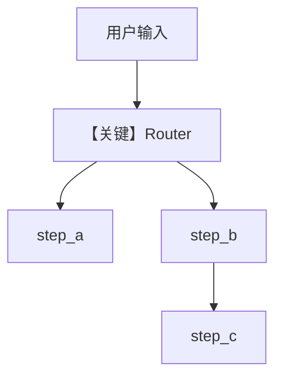

# nested_choices.py — 实现原理分析

> 源文件：`cookbook/04_workflows/05_conditional_branching/nested_choices.py`

## 概述

本示例展示 Agno 的 **Router choices 嵌套列表 → 顺序 Steps** 机制：`choices=[step_a, [step_b, step_c]]` 中第二项为列表，框架将其视为**一段顺序执行的子管线**（文档字符串 `L5` 所述转为 `Steps` 容器）。

**核心配置一览：**

| 配置项 | 值 | 说明 |
|--------|------|------|
| `Workflow.name` | `"Nested Choices Routing"` | 名称 |
| `Router.name` | `"Nested Router"` | 路由名 |
| `Router.choices` | `step_a, [step_b, step_c]` | 嵌套 |
| `Router.selector` | `nested_selector` | `L28-L36` |
| `step_a/b/c` | `OpenAIChat(id="gpt-4o-mini")`, `instructions` `"Step A/B/C"` | 各一步 |

## 核心组件解析

### nested_selector

`L34-L36`：含 `"single"` 则选 `step_choices[0]`（`step_a`）；否则选 `step_choices[1]`（`[step_b, step_c]` 顺序执行）。

### 运行机制与因果链

1. **数据路径**：`"Run the sequence"` → 不含 `single` → 执行 B 再 C。
2. **与扁平 choices 差异**：嵌套列表表达**固定子序列**，无需单独 `Steps(...)` 包装。

## System Prompt 组装

### 还原后的完整 System 文本（step_a）

```text
Step A
```

（B、C 同理为 `"Step B"`、`"Step C"`。）

## 完整 API 请求

`OpenAIChat` → Chat Completions，`model="gpt-4o-mini"`。

## Mermaid 流程图


```mermaid
flowchart TD
    I["用户输入"] --> RT["【关键】Router"]
    RT --> A["step_a"]
    RT --> B["step_b"]
    B --> C["step_c"]
```

## 关键源码文件索引

| 文件 | 关键函数/类 | 作用 |
|------|------------|------|
| `agno/workflow/router.py` | `Router` L44 | 解析 choices |
| `agno/workflow/workflow.py` | 步骤展开与执行 | 嵌套列表序列化 |
