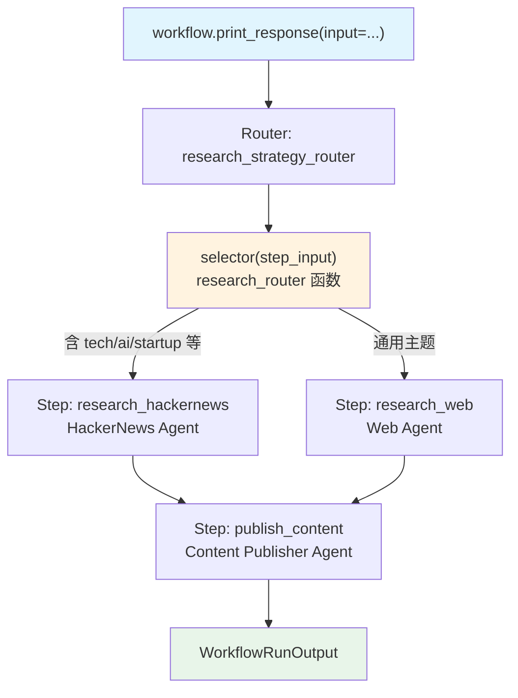

# router_basic.py — 实现原理分析

> 源文件：`cookbook/04_workflows/05_conditional_branching/router_basic.py`

## 概述

本示例展示 Agno Workflow 的 **`Router 动态路由`** 机制：`Router(selector=fn, choices=[...])` 在运行时动态选择要执行的步骤，`selector` 函数根据输入内容返回应执行的步骤对象（一个或多个），实现基于主题的智能研究路径选择。

**核心配置一览：**

| 配置项 | 值 | 说明 |
|--------|------|------|
| `Router.name` | `"research_strategy_router"` | 路由器名称 |
| `Router.selector` | `research_router` | 动态选择函数 |
| `Router.choices` | `[research_hackernews, research_web]` | 可选步骤集合 |
| 选择逻辑 | 技术关键词检测 | 返回 Step 对象列表 |

## 架构分层

```
用户代码层                              agno.workflow 层
┌──────────────────────────────────┐  ┌────────────────────────────────────────────┐
│ router_basic.py                 │  │ Workflow._run()                            │
│                                  │  │  ├─ Router._run()                         │
│ workflow                         │──>│  │   ├─ selector(step_input) → [Step]     │
│   steps=[                        │  │  │   └─ 执行选中的 Step(s)                │
│     Router(                      │  │  └─ Step(publish_content)._run()          │
│       selector=research_router,  │  └────────────────────────────────────────────┘
│       choices=[hn, web],         │
│     ),                           │
│     publish_content,             │
│   ]                              │
└──────────────────────────────────┘
```

## 核心组件解析

### Router selector 函数

```python
def research_router(step_input: StepInput) -> List[Step]:
    topic = (step_input.previous_step_content or step_input.input or "").lower()

    tech_keywords = ["startup", "ai", "machine learning", "software", "github", ...]
    if any(keyword in topic for keyword in tech_keywords):
        return [research_hackernews]  # 技术主题 → HackerNews

    return [research_web]  # 通用主题 → 网页搜索
```

### Router 返回值类型

`selector` 函数可以返回：
- `Step` 对象（单个步骤）
- `List[Step]`（多个步骤，串行执行）
- `str`（步骤名称，从 choices 中查找）

### Router 配置

```python
Router(
    name="research_strategy_router",
    selector=research_router,
    choices=[research_hackernews, research_web],  # 可选步骤必须在 choices 中声明
    description="Intelligently selects research method based on topic",
)
```

### Router vs Condition 对比

| 特性 | `Condition` | `Router` |
|------|------------|---------|
| 决策函数 | `evaluator: bool` | `selector: Step(s)` |
| 分支数量 | 2（if/else） | N（从 choices 中任选） |
| 返回类型 | 布尔值 | Step/List[Step]/str |
| 适用场景 | 二选一分支 | 多路径动态路由 |

## Mermaid 流程图



## 关键源码文件索引

| 文件 | 关键类/函数 | 作用 |
|------|------------|------|
| `agno/workflow/router.py` | `Router` L45 | 动态路由容器 |
| `agno/workflow/router.py` | `Router.selector` L81 | 路由选择函数（callable/CEL） |
| `agno/workflow/router.py` | `Router.choices` L80 | 可选步骤声明列表 |
