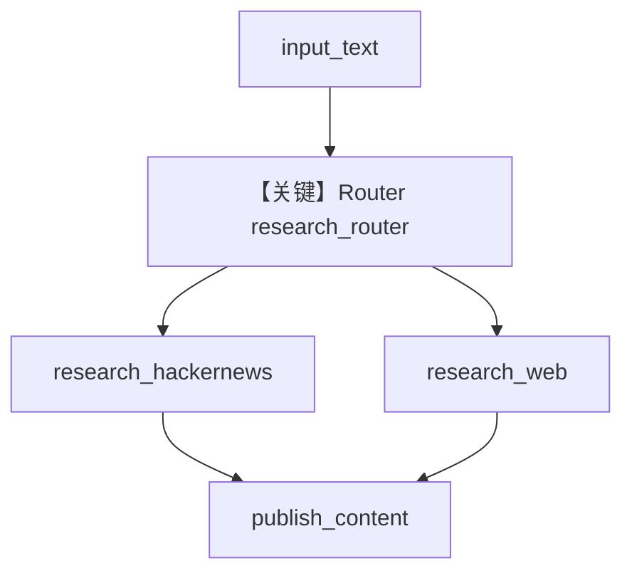

# router_basic.py — 实现原理分析

> 源文件：`cookbook/04_workflows/05_conditional_branching/router_basic.py`

## 概述

本示例展示 Agno 的 **Router 按主题选研究路径** 机制：`selector` 返回 `List[Step]`（单元素列表），在 HN 与 Web 研究之间二选一，再进入统一的 `publish_content`。

**核心配置一览：**

| 配置项 | 值 | 说明 |
|--------|------|------|
| `Workflow.name` | `"Intelligent Research Workflow"` | 名称 |
| `Workflow.description` | 见源码 `L98` | 描述 |
| `Router.name` | `"research_strategy_router"` | 路由名 |
| `Router.selector` | `research_router` | `L64-L90` |
| `Router.choices` | `[research_hackernews, research_web]` | 可选池 |
| `publish_content` | `content_agent` | 后置固定步 |

## 核心组件解析

### research_router

`L64-L90`：从 `previous_step_content` 或 `input` 取主题，匹配 `tech_keywords` 则返回 `[research_hackernews]`，否则 `[research_web]`。

### 运行机制与因果链

1. **数据路径**：用户 `input_text` → `Router` 选研究步 → `publish_content`。
2. **首步即路由**：无前置 Step，`previous_step_content` 可能为空，主要依赖 `step_input.input`（`L65`）。

## System Prompt 组装

长 instructions 见 `L22-L37`，须原样出现在还原块。

### 还原后的完整 System 文本（HackerNews Researcher）

```text
You are a researcher specializing in finding the latest tech news and discussions from Hacker News. Focus on startup trends, programming topics, and tech industry insights.
```

## 完整 API 请求

带 `tools` 的 Chat Completions；默认模型由环境决定。

## Mermaid 流程图


```mermaid
flowchart TD
    IN["input_text"] --> RT["【关键】Router research_router"]
    RT --> HN["research_hackernews"]
    RT --> WEB["research_web"]
    HN --> PUB["publish_content"]
    WEB --> PUB
```

## 关键源码文件索引

| 文件 | 关键函数/类 | 作用 |
|------|------------|------|
| `agno/workflow/router.py` | `Router` L44 | 路由 |
