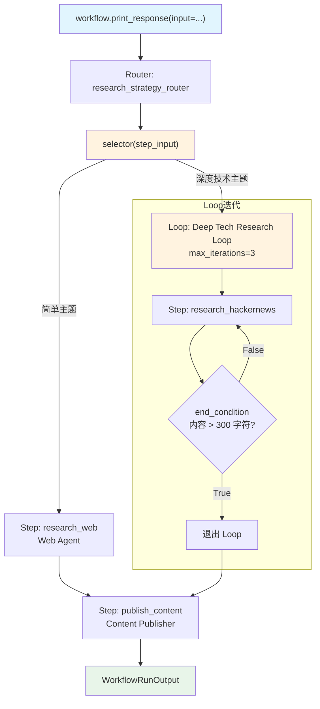

# router_with_loop.py — 实现原理分析

> 源文件：`cookbook/04_workflows/05_conditional_branching/router_with_loop.py`

## 概述

本示例展示 Agno Workflow 的 **`Router 选择 Loop 复合路由`** 机制：Router 的 `choices` 包含普通 Step 和 Loop 复合对象，selector 根据主题复杂度选择简单 Web 研究或迭代式深度技术研究 Loop，演示 Router 对复合步骤类型的支持。

**核心配置一览：**

| 配置项 | 值 | 说明 |
|--------|------|------|
| `Router.choices` | `[research_web, deep_tech_research_loop]` | Step + Loop 混合 |
| `deep_tech_research_loop` | `Loop(steps=[hn_step], max_iterations=3)` | 迭代式技术研究 |
| 路由策略 | 深度技术关键词检测 | 复杂主题 → Loop |

## 核心组件解析

### Loop 作为 Router choice

```python
deep_tech_research_loop = Loop(
    name="Deep Tech Research Loop",
    steps=[research_hackernews],
    end_condition=research_quality_check,  # 内容 > 300 字符退出
    max_iterations=3,
    description="Perform iterative deep research on tech topics",
)

# Router.choices 中同时包含 Step 和 Loop
Router(
    name="research_strategy_router",
    selector=research_strategy_router,
    choices=[research_web, deep_tech_research_loop],
)
```

### Selector 逻辑

```python
def research_strategy_router(step_input: StepInput) -> List[Step]:
    topic = (step_input.previous_step_content or step_input.input or "").lower()

    # 深度技术主题 → 使用迭代 Loop
    if any(k in topic for k in deep_tech_keywords) or ("tech" in topic and len(topic.split()) > 3):
        return [deep_tech_research_loop]  # 返回 Loop 对象

    # 简单主题 → 普通 Web 搜索
    return [research_web]
```

### choices 类型兼容性

| choices 元素类型 | 说明 |
|----------------|------|
| `Step` | 标准单步骤 |
| `Loop` | 迭代循环步骤 |
| `Parallel` | 并行步骤组（Router 也支持） |
| `Condition` | 条件步骤（Router 也支持） |
| 列表 `[Step, ...]` | 嵌套列表自动包装为 Steps |

## 执行路径

**简单主题：**
```
Router → research_web → publish_content
```

**深度技术主题：**
```
Router → Loop(research_hn × ≤3 轮) → publish_content
```

## Mermaid 流程图



## 关键源码文件索引

| 文件 | 关键类/函数 | 作用 |
|------|------------|------|
| `agno/workflow/router.py` | `Router.choices` | 支持 Step/Loop/Parallel/Condition |
| `agno/workflow/loop.py` | `Loop` L40 | 迭代循环执行 |
