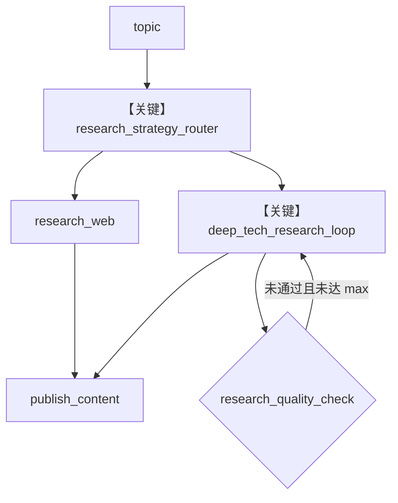

# router_with_loop.py — 实现原理分析

<!-- cookbook-py-source:start -->
## 完整源码

```python
"""
Router With Loop
================

Demonstrates router-based selection between simple web research and iterative loop-based deep tech research.
"""

import asyncio
from typing import List

from agno.agent.agent import Agent
from agno.tools.hackernews import HackerNewsTools
from agno.tools.websearch import WebSearchTools
from agno.workflow.loop import Loop
from agno.workflow.router import Router
from agno.workflow.step import Step
from agno.workflow.types import StepInput, StepOutput
from agno.workflow.workflow import Workflow

# ---------------------------------------------------------------------------
# Create Agents
# ---------------------------------------------------------------------------
hackernews_agent = Agent(
    name="HackerNews Researcher",
    instructions="You are a researcher specializing in finding the latest tech news and discussions from Hacker News. Focus on startup trends, programming topics, and tech industry insights.",
    tools=[HackerNewsTools()],
)

web_agent = Agent(
    name="Web Researcher",
    instructions="You are a comprehensive web researcher. Search across multiple sources including news sites, blogs, and official documentation to gather detailed information.",
    tools=[WebSearchTools()],
)

content_agent = Agent(
    name="Content Publisher",
    instructions="You are a content creator who takes research data and creates engaging, well-structured articles. Format the content with proper headings, bullet points, and clear conclusions.",
)

# ---------------------------------------------------------------------------
# Define Steps
# ---------------------------------------------------------------------------
research_hackernews = Step(
    name="research_hackernews",
    agent=hackernews_agent,
    description="Research latest tech trends from Hacker News",
)

research_web = Step(
    name="research_web",
    agent=web_agent,
    description="Comprehensive web research on the topic",
)

publish_content = Step(
    name="publish_content",
    agent=content_agent,
    description="Create and format final content for publication",
)


# ---------------------------------------------------------------------------
# Define Loop Evaluator
# ---------------------------------------------------------------------------
def research_quality_check(outputs: List[StepOutput]) -> bool:
    if not outputs:
        return False

    for output in outputs:
        if output.content and len(output.content) > 300:
            print(
                f"[PASS] Research quality check passed - found substantial content ({len(output.content)} chars)"
            )
            return True

    print("[FAIL] Research quality check failed - need more substantial research")
    return False


# ---------------------------------------------------------------------------
# Define Loop And Router
# ---------------------------------------------------------------------------
deep_tech_research_loop = Loop(
    name="Deep Tech Research Loop",
    steps=[research_hackernews],
    end_condition=research_quality_check,
    max_iterations=3,
    description="Perform iterative deep research on tech topics",
)


def research_strategy_router(step_input: StepInput) -> List[Step]:
    topic = step_input.previous_step_content or step_input.input or ""
    topic = topic.lower()

    deep_tech_keywords = [
        "startup trends",
        "ai developments",
        "machine learning research",
        "programming languages",
        "developer tools",
        "silicon valley",
        "venture capital",
        "cryptocurrency analysis",
        "blockchain technology",
        "open source projects",
        "github trends",
        "tech industry",
        "software engineering",
    ]

    if any(keyword in topic for keyword in deep_tech_keywords) or (
        "tech" in topic and len(topic.split()) > 3
    ):
        print(f"Deep tech topic detected: Using iterative research loop for '{topic}'")
        return [deep_tech_research_loop]

    print(f"Simple topic detected: Using basic web research for '{topic}'")
    return [research_web]


# ---------------------------------------------------------------------------
# Create Workflow
# ---------------------------------------------------------------------------
workflow = Workflow(
    name="Adaptive Research Workflow",
    description="Intelligently selects between simple web research or deep iterative tech research based on topic complexity",
    steps=[
        Router(
            name="research_strategy_router",
            selector=research_strategy_router,
            choices=[research_web, deep_tech_research_loop],
            description="Chooses between simple web research or deep tech research loop",
        ),
        publish_content,
    ],
)

# ---------------------------------------------------------------------------
# Run Workflow
# ---------------------------------------------------------------------------
if __name__ == "__main__":
    print("=== Testing with deep tech topic ===")
    workflow.print_response(
        "Latest developments in artificial intelligence and machine learning and deep tech research trends"
    )

    asyncio.run(
        workflow.aprint_response(
            "Latest developments in artificial intelligence and machine learning and deep tech research trends"
        )
    )
```

<!-- cookbook-py-source:end -->

> 源文件：`cookbook/04_workflows/05_conditional_branching/router_with_loop.py`

## 概述

本示例展示 Agno 的 **Router 在「单次 Web 研究」与「HN + Loop 深度研究」之间择一** 的机制：`deep_tech_research_loop` 内含 `end_condition=research_quality_check` 与 `max_iterations=3`，满足质量或用尽迭代后退出，再进入 `publish_content`。

**核心配置一览：**

| 配置项 | 值 | 说明 |
|--------|------|------|
| `Workflow.name` | `"Adaptive Research Workflow"` | 名称 |
| `Router.choices` | `[research_web, deep_tech_research_loop]` | 注意顺序与 selector 返回对应 |
| `deep_tech_research_loop` | `Loop` + `research_quality_check` | `L83-L88` |
| `research_strategy_router` | `L92-L119` | 关键词 + `tech` 且词数>3 |

## 核心组件解析

### research_strategy_router

复杂主题匹配则返回 `[deep_tech_research_loop]`（**注意**：`choices` 顺序为 `research_web` 在前、`loop` 在后，selector 返回的是 **Step/Loop 对象列表**，不是 choices 下标）。

### research_quality_check

`L65-L77`：任一步 `content` 长度 >300 则 `True`。

### 运行机制与因果链

1. **数据路径**：用户主题 → Router → 浅层 Web 或深层 HN 循环 → 发布。
2. **与 `router_basic` 差异**：引入 **Loop** 与质量评估函数。

## System Prompt 组装

与 `router_basic` 相同 Agent 文案结构（HN/Web/Content Publisher），可复用长 instructions 还原。

### 还原后的完整 System 文本（Content Publisher）

```text
You are a content creator who takes research data and creates engaging, well-structured articles. Format the content with proper headings, bullet points, and clear conclusions.
```

## 完整 API 请求

研究步带 tools；`Loop` 内重复 Agent 调用直至条件满足。

## Mermaid 流程图


```mermaid
flowchart TD
    T["topic"] --> R["【关键】research_strategy_router"]
    R --> W["research_web"]
    R --> LP["【关键】deep_tech_research_loop"]
    LP --> Q{"research_quality_check"}
    Q -->|未通过且未达 max| LP
    W --> P["publish_content"]
    LP --> P
```

## 关键源码文件索引

| 文件 | 关键函数/类 | 作用 |
|------|------------|------|
| `agno/workflow/router.py` | `Router` L44 | 路由 |
| `agno/workflow/loop.py` | `Loop` L39 | 迭代研究 |
