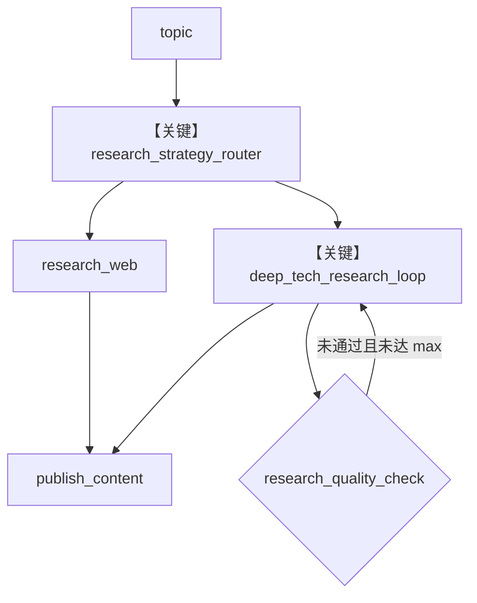

# router_with_loop.py — 实现原理分析

> 源文件：`cookbook/04_workflows/05_conditional_branching/router_with_loop.py`

## 概述

本示例展示 Agno 的 **Router 在「单次 Web 研究」与「HN + Loop 深度研究」之间择一** 的机制：`deep_tech_research_loop` 内含 `end_condition=research_quality_check` 与 `max_iterations=3`，满足质量或用尽迭代后退出，再进入 `publish_content`。

**核心配置一览：**

| 配置项 | 值 | 说明 |
|--------|------|------|
| `Workflow.name` | `"Adaptive Research Workflow"` | 名称 |
| `Router.choices` | `[research_web, deep_tech_research_loop]` | 注意顺序与 selector 返回对应 |
| `deep_tech_research_loop` | `Loop` + `research_quality_check` | `L83-L88` |
| `research_strategy_router` | `L92-L119` | 关键词 + `tech` 且词数>3 |

## 核心组件解析

### research_strategy_router

复杂主题匹配则返回 `[deep_tech_research_loop]`（**注意**：`choices` 顺序为 `research_web` 在前、`loop` 在后，selector 返回的是 **Step/Loop 对象列表**，不是 choices 下标）。

### research_quality_check

`L65-L77`：任一步 `content` 长度 >300 则 `True`。

### 运行机制与因果链

1. **数据路径**：用户主题 → Router → 浅层 Web 或深层 HN 循环 → 发布。
2. **与 `router_basic` 差异**：引入 **Loop** 与质量评估函数。

## System Prompt 组装

与 `router_basic` 相同 Agent 文案结构（HN/Web/Content Publisher），可复用长 instructions 还原。

### 还原后的完整 System 文本（Content Publisher）

```text
You are a content creator who takes research data and creates engaging, well-structured articles. Format the content with proper headings, bullet points, and clear conclusions.
```

## 完整 API 请求

研究步带 tools；`Loop` 内重复 Agent 调用直至条件满足。

## Mermaid 流程图


```mermaid
flowchart TD
    T["topic"] --> R["【关键】research_strategy_router"]
    R --> W["research_web"]
    R --> LP["【关键】deep_tech_research_loop"]
    LP --> Q{"research_quality_check"}
    Q -->|未通过且未达 max| LP
    W --> P["publish_content"]
    LP --> P
```

## 关键源码文件索引

| 文件 | 关键函数/类 | 作用 |
|------|------------|------|
| `agno/workflow/router.py` | `Router` L44 | 路由 |
| `agno/workflow/loop.py` | `Loop` L39 | 迭代研究 |
