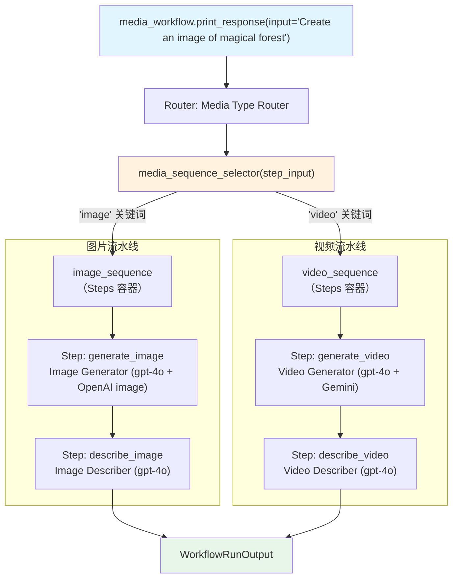

# selector_media_pipeline.py — 实现原理分析

> 源文件：`cookbook/04_workflows/05_conditional_branching/selector_media_pipeline.py`

## 概述

本示例展示 Agno Workflow Router 的 **`Steps 序列作为路由选项（媒体生成流水线）`** 机制：Router choices 包含完整的 `Steps` 序列对象（图片生成序列 vs 视频生成序列），根据用户输入关键词动态路由到不同媒体生成流水线，演示生产级的多步骤路由场景。

**核心配置一览：**

| 配置项 | 值 | 说明 |
|--------|------|------|
| `Router.choices` | `[image_sequence, video_sequence]` | 两个 Steps 序列 |
| `image_sequence` | `Steps([generate_image, describe_image])` | 图片生成 + 描述 |
| `video_sequence` | `Steps([generate_video, describe_video])` | 视频生成 + 描述 |
| 输入模型 | `MediaRequest(BaseModel)` | Pydantic 结构化输入 |
| 图片生成工具 | `OpenAITools(image_model="gpt-image-1")` | OpenAI 图片生成 |
| 视频生成工具 | `GeminiTools(vertexai=True)` | Gemini 视频生成 |

## 架构分层

```
用户代码层                              agno.workflow 层
┌──────────────────────────────────┐  ┌────────────────────────────────────────────┐
│ selector_media_pipeline.py      │  │ Workflow._run()                            │
│                                  │  │  └─ Router._run()                         │
│ media_workflow                   │──>│      ├─ media_sequence_selector(step_input)│
│   steps=[Router(                 │  │      └─ 执行选中的 Steps 序列              │
│     choices=[image_seq,          │  │          ├─ generate_step                 │
│              video_seq],         │  │          └─ describe_step                 │
│   )]                             │  └────────────────────────────────────────────┘
└──────────────────────────────────┘
```

## 核心组件解析

### Steps 序列 choices

```python
image_sequence = Steps(
    name="image_generation",
    description="Complete image generation and analysis workflow",
    steps=[generate_image_step, describe_image_step],  # 串行
)

video_sequence = Steps(
    name="video_generation",
    description="Complete video production and analysis workflow",
    steps=[generate_video_step, describe_video_step],
)

Router(
    name="Media Type Router",
    selector=media_sequence_selector,
    choices=[image_sequence, video_sequence],  # Steps 对象作为 choices
)
```

### 关键词路由

```python
def media_sequence_selector(step_input: StepInput) -> List[Step]:
    message_lower = step_input.input.lower()
    if "video" in message_lower:
        return [video_sequence]   # 路由到视频流水线
    if "image" in message_lower:
        return [image_sequence]   # 路由到图片流水线
    return [image_sequence]       # 默认图片
```

### Pydantic 输入模型

```python
class MediaRequest(BaseModel):
    topic: str
    content_type: str     # "image" 或 "video"
    prompt: str
    style: Optional[str] = "realistic"
    duration: Optional[int] = None
    resolution: Optional[str] = "1024x1024"
```

Workflow 支持 Pydantic 模型作为 `input`，通过 `step_input.input` 可访问结构化数据。

## Mermaid 流程图



## 关键源码文件索引

| 文件 | 关键类/函数 | 作用 |
|------|------------|------|
| `agno/workflow/router.py` | `Router` L45 | 支持 Steps 对象作为 choices |
| `agno/workflow/steps.py` | `Steps` | 步骤序列容器 |
| `agno/tools/openai.py` | `OpenAITools` | OpenAI 图片生成工具 |
| `agno/tools/models/gemini.py` | `GeminiTools` | Gemini 视频生成工具 |
