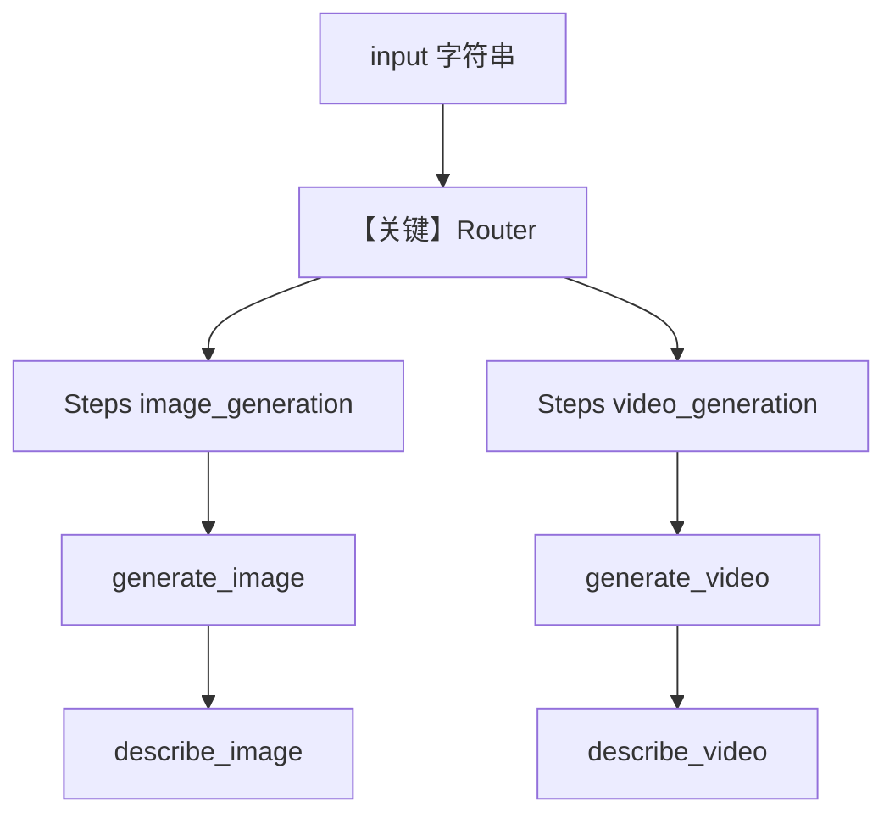

# selector_media_pipeline.py — 实现原理分析

> 源文件：`cookbook/04_workflows/05_conditional_branching/selector_media_pipeline.py`

## 概述

本示例展示 Agno 的 **Router + Steps 子管线** 机制：`choices` 为 `Steps` 对象（`image_sequence` / `video_sequence`），selector 返回其一，从而跑通「生成 + 描述」两阶段媒体流水线；Agent 使用 `OpenAIChat`、`OpenAITools` 图像与 `GeminiTools` 视频相关能力。

**核心配置一览：**

| 配置项 | 值 | 说明 |
|--------|------|------|
| `media_workflow.name` | `"AI Media Generation Workflow"` | 名称 |
| `Router.choices` | `image_sequence`, `video_sequence` | `Steps` 容器 |
| `media_sequence_selector` | `L132-L141` | 按 input 字符串含 video/image |
| `image_generator` | `OpenAIChat(gpt-4o)` + `OpenAITools(image_model="gpt-image-1")` | 生图 |
| `video_generator` | `GeminiTools(vertexai=True)` | 视频策划 |

## 架构分层

```
StepInput ──> Router ──> Steps(image 或 video) ──> 顺序两步 Agent
```

## 核心组件解析

### Steps

`Steps` 见 `agno/workflow/steps.py` `L35`：命名顺序管道。本例 `image_sequence`/`video_sequence`（`L116-L126`）。

### media_sequence_selector

`L132-L141`：`input` 非 `str` 时默认 `image_sequence`；`video` → `video_sequence`；`image` 或默认 → `image_sequence`。

### 运行机制与因果链

1. **数据路径**：字符串 prompt → Router → 两阶段 Step 顺序执行。
2. **MediaRequest**：`L165-172` 定义了 Pydantic 模型但运行示例仅用字符串（`image_request` 赋值 `_` 未传入 workflow），演示以**纯字符串**为主。
3. **副作用**：调用图像/视频相关云端 API。

## System Prompt 组装

各 Agent 含长多行 `instructions`（`L42-86`），须整段还原。示例（image_generator 开头）：

### 还原后的完整 System 文本（节选 image_generator）

```text
You are an expert image generation specialist.
    When users request image creation, you should ACTUALLY GENERATE the image using your available image generation tools.
...
```

（全文见源文件 `L42-48`，文档中应复制完整块；此处因篇幅请直接对照 `.py`。）

## 完整 API 请求

- `OpenAIChat`：`gpt-4o` Chat Completions + 工具调用（生图工具链）。
- `GeminiTools`：按 `agno/tools/models/gemini` 封装调用 Vertex/Gemini。

## Mermaid 流程图


```mermaid
flowchart TD
    I["input 字符串"] --> R["【关键】Router"]
    R --> IS["Steps image_generation"]
    R --> VS["Steps video_generation"]
    IS --> G1["generate_image"]
    G1 --> D1["describe_image"]
    VS --> G2["generate_video"]
    G2 --> D2["describe_video"]
```

## 关键源码文件索引

| 文件 | 关键函数/类 | 作用 |
|------|------------|------|
| `agno/workflow/steps.py` | `Steps` L35 | 顺序子管线 |
| `agno/workflow/router.py` | `Router` L44 | 路由 |
