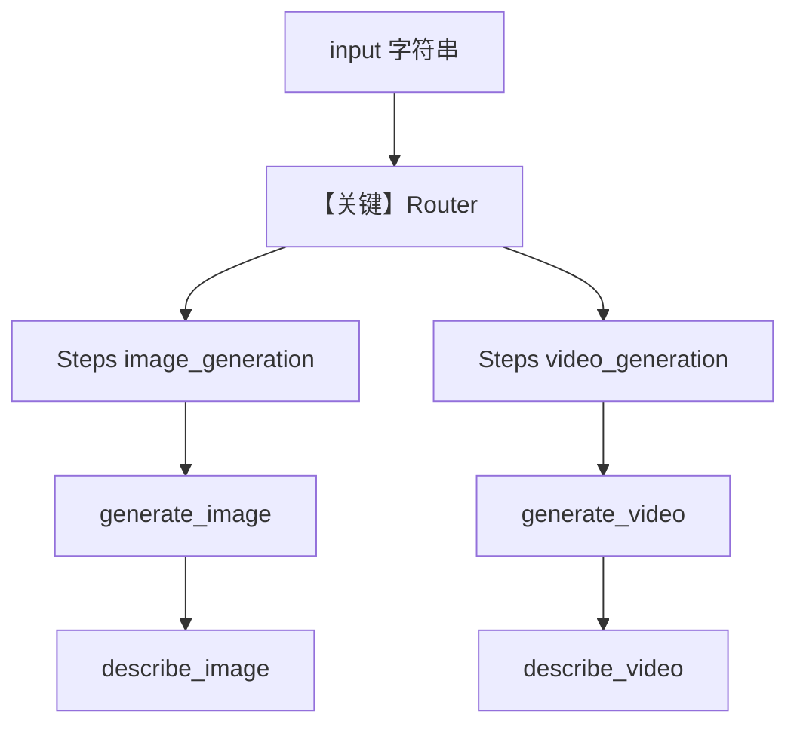

# selector_media_pipeline.py — 实现原理分析

<!-- cookbook-py-source:start -->
## 完整源码

```python
"""
Selector Media Pipeline
=======================

Demonstrates routing between image and video generation pipelines using a router selector.
"""

import asyncio
from typing import List, Optional

from agno.agent import Agent
from agno.models.openai import OpenAIChat
from agno.tools.models.gemini import GeminiTools
from agno.tools.openai import OpenAITools
from agno.workflow.router import Router
from agno.workflow.step import Step
from agno.workflow.steps import Steps
from agno.workflow.types import StepInput
from agno.workflow.workflow import Workflow
from pydantic import BaseModel


# ---------------------------------------------------------------------------
# Define Input Model
# ---------------------------------------------------------------------------
class MediaRequest(BaseModel):
    topic: str
    content_type: str
    prompt: str
    style: Optional[str] = "realistic"
    duration: Optional[int] = None
    resolution: Optional[str] = "1024x1024"


# ---------------------------------------------------------------------------
# Create Agents
# ---------------------------------------------------------------------------
image_generator = Agent(
    name="Image Generator",
    model=OpenAIChat(id="gpt-4o"),
    tools=[OpenAITools(image_model="gpt-image-1")],
    instructions="""You are an expert image generation specialist.
    When users request image creation, you should ACTUALLY GENERATE the image using your available image generation tools.

    Always use the generate_image tool to create the requested image based on the user's specifications.
    Include detailed, creative prompts that incorporate style, composition, lighting, and mood details.

    After generating the image, provide a brief description of what you created.""",
)

image_describer = Agent(
    name="Image Describer",
    model=OpenAIChat(id="gpt-4o"),
    instructions="""You are an expert image analyst and describer.
    When you receive an image (either as input or from a previous step), analyze and describe it in vivid detail, including:
    - Visual elements and composition
    - Colors, lighting, and mood
    - Artistic style and technique
    - Emotional impact and narrative

    If no image is provided, work with the image description or prompt from the previous step.
    Provide rich, engaging descriptions that capture the essence of the visual content.""",
)

video_generator = Agent(
    name="Video Generator",
    model=OpenAIChat(id="gpt-4o"),
    tools=[GeminiTools(vertexai=True)],
    instructions="""You are an expert video production specialist.
    Create detailed video generation prompts and storyboards based on user requests.
    Include scene descriptions, camera movements, transitions, and timing.
    Consider pacing, visual storytelling, and technical aspects like resolution and duration.
    Format your response as a comprehensive video production plan.""",
)

video_describer = Agent(
    name="Video Describer",
    model=OpenAIChat(id="gpt-4o"),
    instructions="""You are an expert video analyst and critic.
    Analyze and describe videos comprehensively, including:
    - Scene composition and cinematography
    - Narrative flow and pacing
    - Visual effects and production quality
    - Audio-visual harmony and mood
    - Technical execution and artistic merit
    Provide detailed, professional video analysis.""",
)

# ---------------------------------------------------------------------------
# Define Steps
# ---------------------------------------------------------------------------
generate_image_step = Step(
    name="generate_image",
    agent=image_generator,
    description="Generate a detailed image creation prompt based on the user's request",
)

describe_image_step = Step(
    name="describe_image",
    agent=image_describer,
    description="Analyze and describe the generated image concept in vivid detail",
)

generate_video_step = Step(
    name="generate_video",
    agent=video_generator,
    description="Create a comprehensive video production plan and storyboard",
)

describe_video_step = Step(
    name="describe_video",
    agent=video_describer,
    description="Analyze and critique the video production plan with professional insights",
)

image_sequence = Steps(
    name="image_generation",
    description="Complete image generation and analysis workflow",
    steps=[generate_image_step, describe_image_step],
)

video_sequence = Steps(
    name="video_generation",
    description="Complete video production and analysis workflow",
    steps=[generate_video_step, describe_video_step],
)


# ---------------------------------------------------------------------------
# Define Router Selector
# ---------------------------------------------------------------------------
def media_sequence_selector(step_input: StepInput) -> List[Step]:
    if not step_input.input or not isinstance(step_input.input, str):
        return [image_sequence]

    message_lower = step_input.input.lower()
    if "video" in message_lower:
        return [video_sequence]
    if "image" in message_lower:
        return [image_sequence]
    return [image_sequence]


# ---------------------------------------------------------------------------
# Create Workflow
# ---------------------------------------------------------------------------
media_workflow = Workflow(
    name="AI Media Generation Workflow",
    description="Generate and analyze images or videos using AI agents",
    steps=[
        Router(
            name="Media Type Router",
            description="Routes to appropriate media generation pipeline based on content type",
            selector=media_sequence_selector,
            choices=[image_sequence, video_sequence],
        )
    ],
)

# ---------------------------------------------------------------------------
# Run Workflow
# ---------------------------------------------------------------------------
if __name__ == "__main__":
    print("=== Example 1: Image Generation (using message_data) ===")
    image_request = MediaRequest(
        topic="Create an image of magical forest for a movie scene",
        content_type="image",
        prompt="A mystical forest with glowing mushrooms",
        style="fantasy art",
        resolution="1920x1080",
    )
    _ = image_request

    media_workflow.print_response(
        input="Create an image of magical forest for a movie scene",
        markdown=True,
    )

    asyncio.run(
        media_workflow.aprint_response(
            input="Create an image of magical forest for a movie scene",
            markdown=True,
        )
    )
```

<!-- cookbook-py-source:end -->

> 源文件：`cookbook/04_workflows/05_conditional_branching/selector_media_pipeline.py`

## 概述

本示例展示 Agno 的 **Router + Steps 子管线** 机制：`choices` 为 `Steps` 对象（`image_sequence` / `video_sequence`），selector 返回其一，从而跑通「生成 + 描述」两阶段媒体流水线；Agent 使用 `OpenAIChat`、`OpenAITools` 图像与 `GeminiTools` 视频相关能力。

**核心配置一览：**

| 配置项 | 值 | 说明 |
|--------|------|------|
| `media_workflow.name` | `"AI Media Generation Workflow"` | 名称 |
| `Router.choices` | `image_sequence`, `video_sequence` | `Steps` 容器 |
| `media_sequence_selector` | `L132-L141` | 按 input 字符串含 video/image |
| `image_generator` | `OpenAIChat(gpt-4o)` + `OpenAITools(image_model="gpt-image-1")` | 生图 |
| `video_generator` | `GeminiTools(vertexai=True)` | 视频策划 |

## 架构分层

```
StepInput ──> Router ──> Steps(image 或 video) ──> 顺序两步 Agent
```

## 核心组件解析

### Steps

`Steps` 见 `agno/workflow/steps.py` `L35`：命名顺序管道。本例 `image_sequence`/`video_sequence`（`L116-L126`）。

### media_sequence_selector

`L132-L141`：`input` 非 `str` 时默认 `image_sequence`；`video` → `video_sequence`；`image` 或默认 → `image_sequence`。

### 运行机制与因果链

1. **数据路径**：字符串 prompt → Router → 两阶段 Step 顺序执行。
2. **MediaRequest**：`L165-172` 定义了 Pydantic 模型但运行示例仅用字符串（`image_request` 赋值 `_` 未传入 workflow），演示以**纯字符串**为主。
3. **副作用**：调用图像/视频相关云端 API。

## System Prompt 组装

各 Agent 含长多行 `instructions`（`L42-86`），须整段还原。示例（image_generator 开头）：

### 还原后的完整 System 文本（节选 image_generator）

```text
You are an expert image generation specialist.
    When users request image creation, you should ACTUALLY GENERATE the image using your available image generation tools.
...
```

（全文见源文件 `L42-48`，文档中应复制完整块；此处因篇幅请直接对照 `.py`。）

## 完整 API 请求

- `OpenAIChat`：`gpt-4o` Chat Completions + 工具调用（生图工具链）。
- `GeminiTools`：按 `agno/tools/models/gemini` 封装调用 Vertex/Gemini。

## Mermaid 流程图


```mermaid
flowchart TD
    I["input 字符串"] --> R["【关键】Router"]
    R --> IS["Steps image_generation"]
    R --> VS["Steps video_generation"]
    IS --> G1["generate_image"]
    G1 --> D1["describe_image"]
    VS --> G2["generate_video"]
    G2 --> D2["describe_video"]
```

## 关键源码文件索引

| 文件 | 关键函数/类 | 作用 |
|------|------------|------|
| `agno/workflow/steps.py` | `Steps` L35 | 顺序子管线 |
| `agno/workflow/router.py` | `Router` L44 | 路由 |
