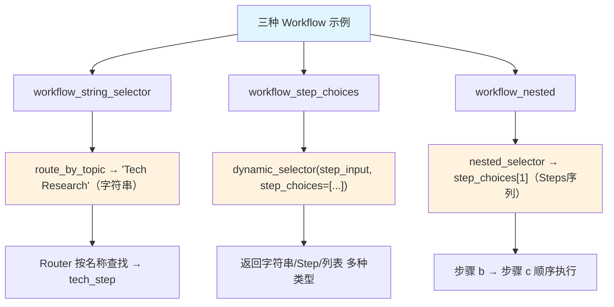

# selector_types.py — 实现原理分析

> 源文件：`cookbook/04_workflows/05_conditional_branching/selector_types.py`

## 概述

本示例展示 Agno Workflow Router `selector` 的 **`三种返回类型对比`** 机制：通过三个独立 Workflow 分别演示 selector 返回字符串名称、`step_choices` 动态查找、嵌套列表 choices 三种模式，作为 Router 选择器类型的完整参考。

**核心配置一览（三个 Workflow）：**

| Workflow | Router 模式 | selector 返回类型 |
|---------|------------|-----------------|
| `workflow_string_selector` | 字符串名称选择 | `str`（步骤名） |
| `workflow_step_choices` | step_choices 注入 | 字符串或 Step 对象 |
| `workflow_nested` | 嵌套列表 choices | `step_choices[i]`（可为 Steps） |

## 核心组件解析

### 1. 字符串选择器

```python
def route_by_topic(step_input: StepInput) -> Union[str, Step, List[Step]]:
    topic = step_input.input.lower()
    if "tech" in topic or "ai" in topic:
        return "Tech Research"       # 字符串名称
    if "business" in topic:
        return "Business Research"   # 字符串名称
    return "General Research"        # 字符串名称
```

### 2. step_choices 注入选择器

```python
def dynamic_selector(
    step_input: StepInput,
    step_choices: list,               # 自动注入
) -> Union[str, Step, List[Step]]:
    user_input = step_input.input.lower()
    step_map = {s.name: s for s in step_choices if hasattr(s, "name") and s.name}

    if "research" in user_input:
        return "researcher"           # 字符串（从 step_map 查找）
    if "write" in user_input:
        return step_map.get("writer", step_choices[0])   # Step 对象
    if "full" in user_input:
        return [step_map["researcher"], step_map["writer"], step_map["reviewer"]]  # 列表
    return step_choices[0]            # 默认第一个 Step
```

### 3. 嵌套 choices 选择器

```python
def nested_selector(step_input: StepInput, step_choices: list):
    if "single" in step_input.input.lower():
        return step_choices[0]  # step_a
    return step_choices[1]      # Steps([step_b, step_c])（自动转换）
```

## 三种模式对比总结

| 特性 | 字符串选择器 | step_choices 选择器 | 嵌套 choices |
|------|-----------|------------------|------------|
| selector 参数 | `(StepInput)` | `(StepInput, step_choices)` | `(StepInput, step_choices)` |
| 返回类型 | `str` | `str \| Step \| List[Step]` | `Step \| Steps` |
| choices 类型 | 普通 Step 列表 | 普通 Step 列表 | 含嵌套列表 |
| 动态性 | 固定名称映射 | 高（从注入列表查找） | 高（索引访问） |

## Mermaid 流程图



## 关键源码文件索引

| 文件 | 关键类/函数 | 作用 |
|------|------------|------|
| `agno/workflow/router.py` | `Router._run()` | 处理三种返回类型 |
| `agno/workflow/router.py` | `Router.selector` | 路由选择函数 |
