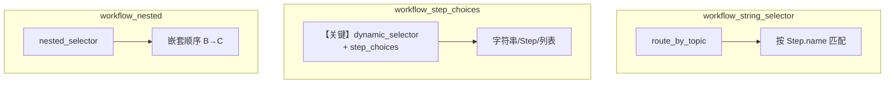

# selector_types.py — 实现原理分析

> 源文件：`cookbook/04_workflows/05_conditional_branching/selector_types.py`

## 概述

本示例在**单文件**内展示三种 **Router selector 返回形态**：(1) **字符串步名**（与 `Step.name` 匹配）；(2) 带 **`step_choices`** 参数，返回步名字符串、`Step` 引用或 `List[Step]` 多步；(3) **嵌套 choices** `[step_a, [step_b, step_c]]`。对应三个 `Workflow`：`workflow_string_selector`、`workflow_step_choices`、`workflow_nested`。

**核心配置一览：**

| 对象 | 作用 |
|------|------|
| `workflow_string_selector` | `route_by_topic` 返回 `"Tech Research"` 等 `L49-53` |
| `workflow_step_choices` | `dynamic_selector(step_input, step_choices)` `L92-107` |
| `workflow_nested` | `nested_selector` + 嵌套 choices `L146-155` |
| 模型 | 均为 `OpenAIChat(id="gpt-4o-mini")` |

## 核心组件解析

### 字符串选择器

`route_by_topic` 返回的字符串必须与 `Step.name` 一致（`tech_step` 等为 `Tech Research` 等，`L38-40`）。

### step_choices 动态选择器

`dynamic_selector` 用 `step_map` 解析 `choices` 中的 Agent（`researcher`/`writer`/`reviewer` 无显式 `Step` 包装时框架会处理）；`"research"` → 名字 `"researcher"`；`"full"` → 三 Agent 顺序列表。

### 运行机制与因果链

1. **数据路径**：各 `print_response` 独立演示，无共享 session。
2. **与拆分示例关系**：`string_selector.py` 与 `step_choices_parameter.py` 分别是本文件第一、二段的子集提取。

## System Prompt 组装

示例 instructions：`"You are a tech expert..."`、`"You are a researcher."` 等（`L23-35`、`L76-88`、`L127-129`）。

### 还原后的完整 System 文本（tech_expert）

```text
You are a tech expert. Provide technical analysis.
```

## 完整 API 请求

`gpt-4o-mini` Chat Completions；无 tools。

## Mermaid 流程图


```mermaid
flowchart TD
    subgraph S1["workflow_string_selector"]
        A1["route_by_topic"] --> B1["按 Step.name 匹配"]
    end
    subgraph S2["workflow_step_choices"]
        A2["【关键】dynamic_selector + step_choices"] --> B2["字符串/Step/列表"]
    end
    subgraph S3["workflow_nested"]
        A3["nested_selector"] --> B3["嵌套顺序 B→C"]
    end
```

## 关键源码文件索引

| 文件 | 关键函数/类 | 作用 |
|------|------------|------|
| `agno/workflow/router.py` | `Router` L44 | 解析 selector 返回值 |
