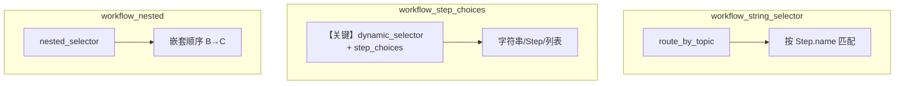

# selector_types.py — 实现原理分析

<!-- cookbook-py-source:start -->
## 完整源码

```python
"""
Selector Types
==============

Demonstrates router selector flexibility across string, step object, list, and nested-choice return patterns.
"""

from typing import List, Union

from agno.agent.agent import Agent
from agno.models.openai import OpenAIChat
from agno.workflow.router import Router
from agno.workflow.step import Step
from agno.workflow.types import StepInput
from agno.workflow.workflow import Workflow

# ---------------------------------------------------------------------------
# Create Agents For String Selector
# ---------------------------------------------------------------------------
tech_expert = Agent(
    name="tech_expert",
    model=OpenAIChat(id="gpt-4o-mini"),
    instructions="You are a tech expert. Provide technical analysis.",
)

biz_expert = Agent(
    name="biz_expert",
    model=OpenAIChat(id="gpt-4o-mini"),
    instructions="You are a business expert. Provide business insights.",
)

generalist = Agent(
    name="generalist",
    model=OpenAIChat(id="gpt-4o-mini"),
    instructions="You are a generalist. Provide general information.",
)

tech_step = Step(name="Tech Research", agent=tech_expert)
business_step = Step(name="Business Research", agent=biz_expert)
general_step = Step(name="General Research", agent=generalist)


# ---------------------------------------------------------------------------
# Define Selectors
# ---------------------------------------------------------------------------
def route_by_topic(step_input: StepInput) -> Union[str, Step, List[Step]]:
    topic = step_input.input.lower()

    if "tech" in topic or "ai" in topic or "software" in topic:
        return "Tech Research"
    if "business" in topic or "market" in topic or "finance" in topic:
        return "Business Research"
    return "General Research"


# ---------------------------------------------------------------------------
# Create Workflow (String Selector)
# ---------------------------------------------------------------------------
workflow_string_selector = Workflow(
    name="Expert Routing (String Selector)",
    steps=[
        Router(
            name="Topic Router",
            selector=route_by_topic,
            choices=[tech_step, business_step, general_step],
        ),
    ],
)

# ---------------------------------------------------------------------------
# Create Agents For step_choices Selector
# ---------------------------------------------------------------------------
researcher = Agent(
    name="researcher",
    model=OpenAIChat(id="gpt-4o-mini"),
    instructions="You are a researcher.",
)

writer = Agent(
    name="writer",
    model=OpenAIChat(id="gpt-4o-mini"),
    instructions="You are a writer.",
)

reviewer = Agent(
    name="reviewer",
    model=OpenAIChat(id="gpt-4o-mini"),
    instructions="You are a reviewer.",
)


def dynamic_selector(
    step_input: StepInput,
    step_choices: list,
) -> Union[str, Step, List[Step]]:
    user_input = step_input.input.lower()
    step_map = {s.name: s for s in step_choices if hasattr(s, "name") and s.name}

    print(f"Available steps: {list(step_map.keys())}")

    if "research" in user_input:
        return "researcher"
    if "write" in user_input:
        return step_map.get("writer", step_choices[0])
    if "full" in user_input:
        return [step_map["researcher"], step_map["writer"], step_map["reviewer"]]
    return step_choices[0]


# ---------------------------------------------------------------------------
# Create Workflow (step_choices)
# ---------------------------------------------------------------------------
workflow_step_choices = Workflow(
    name="Dynamic Routing (step_choices)",
    steps=[
        Router(
            name="Dynamic Router",
            selector=dynamic_selector,
            choices=[researcher, writer, reviewer],
        ),
    ],
)

# ---------------------------------------------------------------------------
# Create Agents For Nested Choices Selector
# ---------------------------------------------------------------------------
step_a = Agent(name="step_a", model=OpenAIChat(id="gpt-4o-mini"), instructions="Step A")
step_b = Agent(name="step_b", model=OpenAIChat(id="gpt-4o-mini"), instructions="Step B")
step_c = Agent(name="step_c", model=OpenAIChat(id="gpt-4o-mini"), instructions="Step C")


def nested_selector(
    step_input: StepInput,
    step_choices: list,
) -> Union[str, Step, List[Step]]:
    user_input = step_input.input.lower()

    if "single" in user_input:
        return step_choices[0]
    return step_choices[1]


# ---------------------------------------------------------------------------
# Create Workflow (Nested Choices)
# ---------------------------------------------------------------------------
workflow_nested = Workflow(
    name="Nested Choices Routing",
    steps=[
        Router(
            name="Nested Router",
            selector=nested_selector,
            choices=[step_a, [step_b, step_c]],
        ),
    ],
)

# ---------------------------------------------------------------------------
# Run Workflows
# ---------------------------------------------------------------------------
if __name__ == "__main__":
    print("=" * 60)
    print("Example 1: String-based selector (returns step name)")
    print("=" * 60)
    workflow_string_selector.print_response("Tell me about AI trends", stream=True)

    print("\n" + "=" * 60)
    print("Example 2: step_choices parameter")
    print("=" * 60)
    workflow_step_choices.print_response("I need to research something", stream=True)

    print("\n" + "=" * 60)
    print("Example 3: Nested choices")
    print("=" * 60)
    workflow_nested.print_response("Run the sequence", stream=True)
```

<!-- cookbook-py-source:end -->

> 源文件：`cookbook/04_workflows/05_conditional_branching/selector_types.py`

## 概述

本示例在**单文件**内展示三种 **Router selector 返回形态**：(1) **字符串步名**（与 `Step.name` 匹配）；(2) 带 **`step_choices`** 参数，返回步名字符串、`Step` 引用或 `List[Step]` 多步；(3) **嵌套 choices** `[step_a, [step_b, step_c]]`。对应三个 `Workflow`：`workflow_string_selector`、`workflow_step_choices`、`workflow_nested`。

**核心配置一览：**

| 对象 | 作用 |
|------|------|
| `workflow_string_selector` | `route_by_topic` 返回 `"Tech Research"` 等 `L49-53` |
| `workflow_step_choices` | `dynamic_selector(step_input, step_choices)` `L92-107` |
| `workflow_nested` | `nested_selector` + 嵌套 choices `L146-155` |
| 模型 | 均为 `OpenAIChat(id="gpt-4o-mini")` |

## 核心组件解析

### 字符串选择器

`route_by_topic` 返回的字符串必须与 `Step.name` 一致（`tech_step` 等为 `Tech Research` 等，`L38-40`）。

### step_choices 动态选择器

`dynamic_selector` 用 `step_map` 解析 `choices` 中的 Agent（`researcher`/`writer`/`reviewer` 无显式 `Step` 包装时框架会处理）；`"research"` → 名字 `"researcher"`；`"full"` → 三 Agent 顺序列表。

### 运行机制与因果链

1. **数据路径**：各 `print_response` 独立演示，无共享 session。
2. **与拆分示例关系**：`string_selector.py` 与 `step_choices_parameter.py` 分别是本文件第一、二段的子集提取。

## System Prompt 组装

示例 instructions：`"You are a tech expert..."`、`"You are a researcher."` 等（`L23-35`、`L76-88`、`L127-129`）。

### 还原后的完整 System 文本（tech_expert）

```text
You are a tech expert. Provide technical analysis.
```

## 完整 API 请求

`gpt-4o-mini` Chat Completions；无 tools。

## Mermaid 流程图


```mermaid
flowchart TD
    subgraph S1["workflow_string_selector"]
        A1["route_by_topic"] --> B1["按 Step.name 匹配"]
    end
    subgraph S2["workflow_step_choices"]
        A2["【关键】dynamic_selector + step_choices"] --> B2["字符串/Step/列表"]
    end
    subgraph S3["workflow_nested"]
        A3["nested_selector"] --> B3["嵌套顺序 B→C"]
    end
```

## 关键源码文件索引

| 文件 | 关键函数/类 | 作用 |
|------|------------|------|
| `agno/workflow/router.py` | `Router` L44 | 解析 selector 返回值 |
