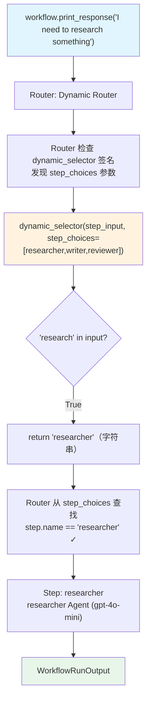

# step_choices_parameter.py — 实现原理分析

> 源文件：`cookbook/04_workflows/05_conditional_branching/step_choices_parameter.py`

## 概述

本示例展示 Agno Workflow Router 的 **`step_choices 参数注入`** 机制：`selector` 函数声明 `step_choices` 参数时，Router 自动将 `choices` 列表注入该参数，使 selector 函数可以动态遍历所有可用步骤，无需硬编码步骤引用。

**核心配置一览：**

| 配置项 | 值 | 说明 |
|--------|------|------|
| `selector` 函数签名 | `(StepInput, step_choices: list) -> ...` | 注入 choices 列表 |
| `step_choices` 注入内容 | `[researcher, writer, reviewer]` | 所有可用步骤 |
| 选择逻辑 | 关键词匹配 + 动态查找 | 从注入列表中选择 |

## 核心组件解析

### step_choices 参数注入

```python
def dynamic_selector(
    step_input: StepInput,
    step_choices: list,   # Router 自动注入 choices 列表
) -> Union[str, Step, List[Step]]:
    user_input = step_input.input.lower()
    
    # 从注入的 step_choices 动态构建名称→步骤映射
    step_map = {s.name: s for s in step_choices if hasattr(s, "name") and s.name}
    print(f"Available steps: {list(step_map.keys())}")

    if "research" in user_input:
        return "researcher"                      # 字符串
    if "write" in user_input:
        return step_map.get("writer", step_choices[0])  # Step 对象（动态查找）
    if "full" in user_input:
        return [step_map["researcher"], step_map["writer"], step_map["reviewer"]]  # 多步
    return step_choices[0]                       # 默认第一个
```

### 参数注入机制

Router 在调用 `selector` 前，通过 `inspect.signature` 检查是否有 `step_choices` 参数，如有则注入：

```python
# Router 内部伪代码
sig = inspect.signature(selector)
kwargs = {}
if "step_choices" in sig.parameters:
    kwargs["step_choices"] = self.choices  # 注入 choices 列表
result = selector(step_input, **kwargs)
```

### 与字符串选择器的区别

| 特性 | 字符串选择器 | step_choices 选择器 |
|------|------------|-------------------|
| 步骤引用方式 | 硬编码字符串名称 | 动态从注入列表构建 |
| 灵活性 | 固定名称 | 运行时可变 choices |
| 适用场景 | 固定路由逻辑 | 动态/可扩展路由 |

## Mermaid 流程图



## 关键源码文件索引

| 文件 | 关键类/函数 | 作用 |
|------|------------|------|
| `agno/workflow/router.py` | `Router._run()` | 检测 step_choices 参数并注入 |
| `agno/workflow/router.py` | `Router.choices` L80 | 注入到 selector 的步骤列表 |
