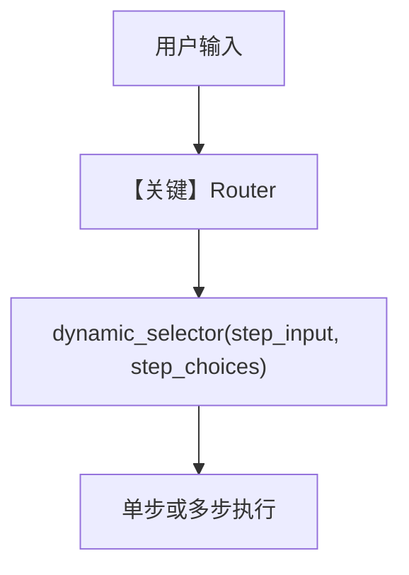

# step_choices_parameter.py — 实现原理分析

<!-- cookbook-py-source:start -->
## 完整源码

```python
"""
Step Choices Parameter
======================

Demonstrates using `step_choices` in a router selector for dynamic step selection.
"""

from typing import List, Union

from agno.agent.agent import Agent
from agno.models.openai import OpenAIChat
from agno.workflow.router import Router
from agno.workflow.step import Step
from agno.workflow.types import StepInput
from agno.workflow.workflow import Workflow

# ---------------------------------------------------------------------------
# Create Agents
# ---------------------------------------------------------------------------
researcher = Agent(
    name="researcher",
    model=OpenAIChat(id="gpt-4o-mini"),
    instructions="You are a researcher.",
)

writer = Agent(
    name="writer",
    model=OpenAIChat(id="gpt-4o-mini"),
    instructions="You are a writer.",
)

reviewer = Agent(
    name="reviewer",
    model=OpenAIChat(id="gpt-4o-mini"),
    instructions="You are a reviewer.",
)


# ---------------------------------------------------------------------------
# Define Router Selector
# ---------------------------------------------------------------------------
def dynamic_selector(
    step_input: StepInput,
    step_choices: list,
) -> Union[str, Step, List[Step]]:
    user_input = step_input.input.lower()
    step_map = {s.name: s for s in step_choices if hasattr(s, "name") and s.name}

    print(f"Available steps: {list(step_map.keys())}")

    if "research" in user_input:
        return "researcher"
    if "write" in user_input:
        return step_map.get("writer", step_choices[0])
    if "full" in user_input:
        return [step_map["researcher"], step_map["writer"], step_map["reviewer"]]
    return step_choices[0]


# ---------------------------------------------------------------------------
# Create Workflow
# ---------------------------------------------------------------------------
workflow = Workflow(
    name="Dynamic Routing (step_choices)",
    steps=[
        Router(
            name="Dynamic Router",
            selector=dynamic_selector,
            choices=[researcher, writer, reviewer],
        ),
    ],
)

# ---------------------------------------------------------------------------
# Run Workflow
# ---------------------------------------------------------------------------
if __name__ == "__main__":
    workflow.print_response("I need to research something", stream=True)
```

<!-- cookbook-py-source:end -->

> 源文件：`cookbook/04_workflows/05_conditional_branching/step_choices_parameter.py`

## 概述

本示例展示 Agno 的 **Router selector 接收 `step_choices`** 机制：第二参数为当前 Router 解析后的可选对象列表，可在运行时按名称映射到具体 `Agent`/Step，并支持返回字符串名、`Step` 或多步列表。

**核心配置一览：**

| 配置项 | 值 | 说明 |
|--------|------|------|
| `Workflow.name` | `"Dynamic Routing (step_choices)"` | 名称 |
| `Router.selector` | `dynamic_selector` | `L42-L57` |
| `Router.choices` | `researcher, writer, reviewer` | 直接传 Agent |
| `researcher` 等 | `gpt-4o-mini` + 短 instructions | `L20-36` |

## 核心组件解析

### dynamic_selector

`L42-L57`：构建 `step_map`（需 `name` 属性）；`research` → `"researcher"`；`write` → `writer` 对应对象；`full` → 三对象列表；默认 `step_choices[0]`。

### 与 selector_types 关系

与 `selector_types.py` 中 `workflow_step_choices` 段落等价，本文件为**独立可运行**的最小示例。

## System Prompt 组装

### 还原后的完整 System 文本（researcher）

```text
You are a researcher.
```

## 完整 API 请求

`OpenAIChat` + `gpt-4o-mini`，无工具。

## Mermaid 流程图


```mermaid
flowchart TD
    U["用户输入"] --> R["【关键】Router"]
    R --> DS["dynamic_selector(step_input, step_choices)"]
    DS --> X["单步或多步执行"]
```

## 关键源码文件索引

| 文件 | 关键函数/类 | 作用 |
|------|------------|------|
| `agno/workflow/router.py` | `Router` L44 | 注入 step_choices |
