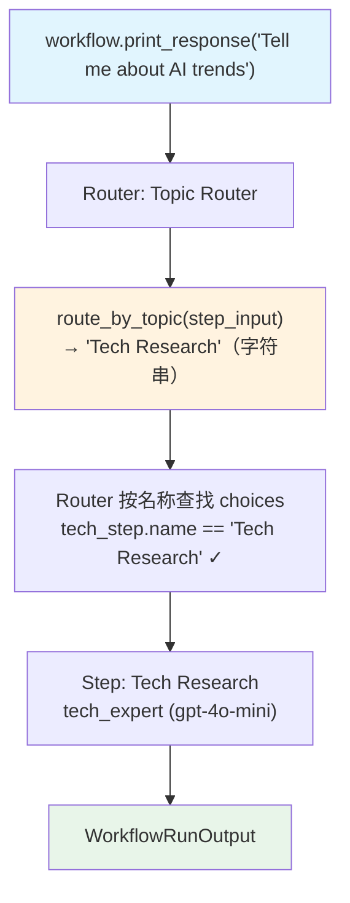

# string_selector.py — 实现原理分析

> 源文件：`cookbook/04_workflows/05_conditional_branching/string_selector.py`

## 概述

本示例展示 Agno Workflow Router 的 **`字符串选择器`** 机制：`selector` 函数返回**步骤名称字符串**而非 Step 对象，Router 根据名称从 `choices` 中查找对应步骤并执行，简化了对步骤对象引用的依赖。

**核心配置一览：**

| 配置项 | 值 | 说明 |
|--------|------|------|
| `Router.choices` | `[tech_step, business_step, general_step]` | 三个步骤 |
| `selector` 返回类型 | `str` | 步骤名称字符串 |
| 名称匹配 | `"Tech Research"` → `tech_step` | 按 Step.name 查找 |

## 核心组件解析

### 字符串选择器

```python
def route_by_topic(step_input: StepInput) -> Union[str, Step, List[Step]]:
    topic = step_input.input.lower()

    if "tech" in topic or "ai" in topic or "software" in topic:
        return "Tech Research"    # 返回字符串名称（不是 Step 对象）
    if "business" in topic or "market" in topic:
        return "Business Research"
    return "General Research"     # 默认路由
```

### Router 名称解析逻辑

Router 接收到字符串时，在 `choices` 中按 `step.name` 查找：

```python
# Router 内部伪代码
def _resolve_selection(self, result):
    if isinstance(result, str):
        # 从 choices 中按名称查找
        for step in self.choices:
            if step.name == result:
                return step
    # ...
```

### 步骤名称与 Router 的对应关系

```python
tech_step = Step(name="Tech Research", agent=tech_expert)      # name 用于字符串匹配
business_step = Step(name="Business Research", agent=biz_expert)
general_step = Step(name="General Research", agent=generalist)

Router(
    name="Topic Router",
    selector=route_by_topic,
    choices=[tech_step, business_step, general_step],  # selector 返回名称时从此查找
)
```

### 三种 selector 返回类型对比

| 返回类型 | 示例 | Router 处理方式 |
|---------|------|---------------|
| `str` | `"Tech Research"` | 按名称在 choices 中查找 |
| `Step` | `tech_step` | 直接执行该 Step |
| `List[Step]` | `[tech_step, biz_step]` | 顺序执行多个步骤 |

## Mermaid 流程图



## 关键源码文件索引

| 文件 | 关键类/函数 | 作用 |
|------|------------|------|
| `agno/workflow/router.py` | `Router._resolve_selection()` | 字符串→Step 名称解析 |
| `agno/workflow/step.py` | `Step.name` L62 | 名称字段（字符串匹配用） |
