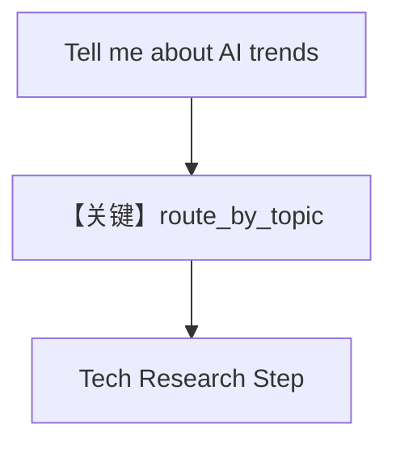

# string_selector.py — 实现原理分析

> 源文件：`cookbook/04_workflows/05_conditional_branching/string_selector.py`

## 概述

本示例展示 Agno 的 **Router selector 返回步名字符串** 机制：返回值与 `Step.name` 完全一致（如 `"Tech Research"`），由框架解析到 `choices` 中对应 `Step`。

**核心配置一览：**

| 配置项 | 值 | 说明 |
|--------|------|------|
| `Workflow.name` | `"Expert Routing (String Selector)"` | 名称 |
| `Router.selector` | `route_by_topic` | `L49-56` |
| `choices` | `tech_step, business_step, general_step` | `name` 与返回字符串对应 |
| `model` | `OpenAIChat(gpt-4o-mini)` | 各 Agent |

## 核心组件解析

### route_by_topic

关键词 `tech`/`ai`/`software` → `"Tech Research"`；`business`/`market`/`finance` → `"Business Research"`；否则 `"General Research"`。

### 运行机制与因果链

与 `selector_types.py` 第一例相同；适合作为**最小 teaching 片段**单独维护。

## System Prompt 组装

### 还原后的完整 System 文本（tech_expert）

```text
You are a tech expert. Provide technical analysis.
```

## 完整 API 请求

Chat Completions，`model=gpt-4o-mini`。

## Mermaid 流程图


```mermaid
flowchart TD
    I["Tell me about AI trends"] --> R["【关键】route_by_topic"]
    R --> T["Tech Research Step"]
```

## 关键源码文件索引

| 文件 | 关键函数/类 | 作用 |
|------|------------|------|
| `agno/workflow/router.py` | `Router` L44 | 步名解析 |
