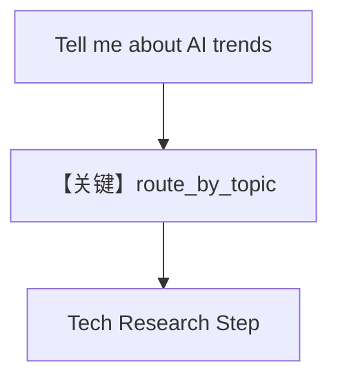

# string_selector.py — 实现原理分析

<!-- cookbook-py-source:start -->
## 完整源码

```python
"""
String Selector
===============

Demonstrates returning a step name string from a router selector.
"""

from typing import List, Union

from agno.agent.agent import Agent
from agno.models.openai import OpenAIChat
from agno.workflow.router import Router
from agno.workflow.step import Step
from agno.workflow.types import StepInput
from agno.workflow.workflow import Workflow

# ---------------------------------------------------------------------------
# Create Agents
# ---------------------------------------------------------------------------
tech_expert = Agent(
    name="tech_expert",
    model=OpenAIChat(id="gpt-4o-mini"),
    instructions="You are a tech expert. Provide technical analysis.",
)

biz_expert = Agent(
    name="biz_expert",
    model=OpenAIChat(id="gpt-4o-mini"),
    instructions="You are a business expert. Provide business insights.",
)

generalist = Agent(
    name="generalist",
    model=OpenAIChat(id="gpt-4o-mini"),
    instructions="You are a generalist. Provide general information.",
)

# ---------------------------------------------------------------------------
# Define Steps
# ---------------------------------------------------------------------------
tech_step = Step(name="Tech Research", agent=tech_expert)
business_step = Step(name="Business Research", agent=biz_expert)
general_step = Step(name="General Research", agent=generalist)


# ---------------------------------------------------------------------------
# Define Router Selector
# ---------------------------------------------------------------------------
def route_by_topic(step_input: StepInput) -> Union[str, Step, List[Step]]:
    topic = step_input.input.lower()

    if "tech" in topic or "ai" in topic or "software" in topic:
        return "Tech Research"
    if "business" in topic or "market" in topic or "finance" in topic:
        return "Business Research"
    return "General Research"


# ---------------------------------------------------------------------------
# Create Workflow
# ---------------------------------------------------------------------------
workflow = Workflow(
    name="Expert Routing (String Selector)",
    steps=[
        Router(
            name="Topic Router",
            selector=route_by_topic,
            choices=[tech_step, business_step, general_step],
        ),
    ],
)

# ---------------------------------------------------------------------------
# Run Workflow
# ---------------------------------------------------------------------------
if __name__ == "__main__":
    workflow.print_response("Tell me about AI trends", stream=True)
```

<!-- cookbook-py-source:end -->

> 源文件：`cookbook/04_workflows/05_conditional_branching/string_selector.py`

## 概述

本示例展示 Agno 的 **Router selector 返回步名字符串** 机制：返回值与 `Step.name` 完全一致（如 `"Tech Research"`），由框架解析到 `choices` 中对应 `Step`。

**核心配置一览：**

| 配置项 | 值 | 说明 |
|--------|------|------|
| `Workflow.name` | `"Expert Routing (String Selector)"` | 名称 |
| `Router.selector` | `route_by_topic` | `L49-56` |
| `choices` | `tech_step, business_step, general_step` | `name` 与返回字符串对应 |
| `model` | `OpenAIChat(gpt-4o-mini)` | 各 Agent |

## 核心组件解析

### route_by_topic

关键词 `tech`/`ai`/`software` → `"Tech Research"`；`business`/`market`/`finance` → `"Business Research"`；否则 `"General Research"`。

### 运行机制与因果链

与 `selector_types.py` 第一例相同；适合作为**最小 teaching 片段**单独维护。

## System Prompt 组装

### 还原后的完整 System 文本（tech_expert）

```text
You are a tech expert. Provide technical analysis.
```

## 完整 API 请求

Chat Completions，`model=gpt-4o-mini`。

## Mermaid 流程图


```mermaid
flowchart TD
    I["Tell me about AI trends"] --> R["【关键】route_by_topic"]
    R --> T["Tech Research Step"]
```

## 关键源码文件索引

| 文件 | 关键函数/类 | 作用 |
|------|------------|------|
| `agno/workflow/router.py` | `Router` L44 | 步名解析 |
