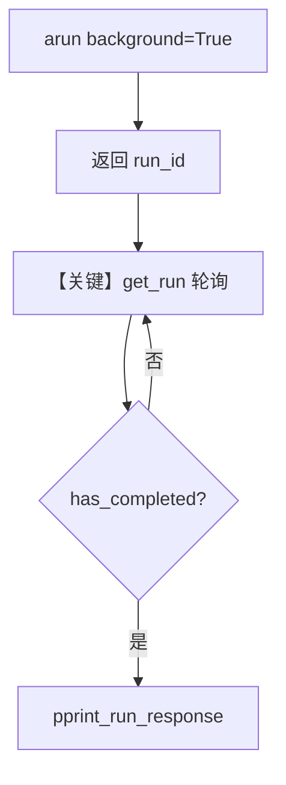

# background_poll.py — 实现原理分析

<!-- cookbook-py-source:start -->
## 完整源码

```python
"""
Background Poll
===============

Demonstrates running a workflow in async background mode and polling run status until completion.
"""

import asyncio

from agno.agent import Agent
from agno.db.sqlite import SqliteDb
from agno.models.openai import OpenAIChat
from agno.team import Team
from agno.tools.hackernews import HackerNewsTools
from agno.tools.websearch import WebSearchTools
from agno.utils.pprint import pprint_run_response
from agno.workflow.step import Step
from agno.workflow.workflow import Workflow

# ---------------------------------------------------------------------------
# Create Agents
# ---------------------------------------------------------------------------
hackernews_agent = Agent(
    name="Hackernews Agent",
    model=OpenAIChat(id="gpt-4o-mini"),
    tools=[HackerNewsTools()],
    role="Extract key insights and content from Hackernews posts",
)

web_agent = Agent(
    name="Web Agent",
    model=OpenAIChat(id="gpt-4o-mini"),
    tools=[WebSearchTools()],
    role="Search the web for the latest news and trends",
)

content_planner = Agent(
    name="Content Planner",
    model=OpenAIChat(id="gpt-4o"),
    instructions=[
        "Plan a content schedule over 4 weeks for the provided topic and research content",
        "Ensure that I have posts for 3 posts per week",
    ],
)

# ---------------------------------------------------------------------------
# Create Team
# ---------------------------------------------------------------------------
research_team = Team(
    name="Research Team",
    members=[hackernews_agent, web_agent],
    instructions="Research tech topics from Hackernews and the web",
)

# ---------------------------------------------------------------------------
# Define Steps
# ---------------------------------------------------------------------------
research_step = Step(
    name="Research Step",
    team=research_team,
)

content_planning_step = Step(
    name="Content Planning Step",
    agent=content_planner,
)

# ---------------------------------------------------------------------------
# Create Workflow
# ---------------------------------------------------------------------------
content_creation_workflow = Workflow(
    name="Content Creation Workflow",
    description="Automated content creation from blog posts to social media",
    db=SqliteDb(
        session_table="workflow_session",
        db_file="tmp/workflow.db",
    ),
    steps=[research_step, content_planning_step],
)


# ---------------------------------------------------------------------------
# Run Workflow
# ---------------------------------------------------------------------------
async def main() -> None:
    print("Starting Async Background Workflow Test")

    bg_response = await content_creation_workflow.arun(
        input="AI trends in 2024",
        background=True,
    )
    print(f"Initial Response: {bg_response.status} - {bg_response.content}")
    print(f"Run ID: {bg_response.run_id}")

    poll_count = 0

    while True:
        poll_count += 1
        print(f"\nPoll #{poll_count} (every 5s)")

        result = content_creation_workflow.get_run(bg_response.run_id)

        if result is None:
            print("Workflow not found yet, still waiting...")
            if poll_count > 50:
                print(f"Timeout after {poll_count} attempts")
                break
            await asyncio.sleep(5)
            continue

        if result.has_completed():
            break

        if poll_count > 200:
            print(f"Timeout after {poll_count} attempts")
            break

        await asyncio.sleep(5)

    final_result = content_creation_workflow.get_run(bg_response.run_id)

    print("\nFinal Result:")
    print("=" * 50)
    pprint_run_response(final_result, markdown=True)


if __name__ == "__main__":
    asyncio.run(main())
```

<!-- cookbook-py-source:end -->

> 源文件：`cookbook/04_workflows/06_advanced_concepts/background_execution/background_poll.py`

## 概述

本示例展示 Agno 的 **`arun(..., background=True)` + `get_run(run_id)` 轮询** 机制：异步提交后台工作流后立即返回带 `run_id` 的响应，再通过周期性 `get_run` 直到 `has_completed()`，用于长任务不阻塞调用方。

**核心配置一览：**

| 配置项 | 值 | 说明 |
|--------|------|------|
| `content_creation_workflow.db` | `SqliteDb(db_file="tmp/workflow.db", ...)` | 会话持久化 |
| `steps` | `research_step`（Team）, `content_planning_step`（Agent） | 两步 |
| `research_team` | `Team(members=[...], instructions=...)` | 多 Agent 协作 |
| `arun` | `background=True` | `L88-91` |

## 架构分层

```
main() ──> arun(background=True) ──> 返回 run_id
              │
              └── 循环 get_run(run_id) ──> has_completed()
```

## 核心组件解析

### 后台运行

`Workflow.arun` 在 `background=True` 时由框架异步调度执行（实现见 `workflow.py` 中 async 路径）；`get_run` 从 `db` 拉取运行状态。

### 运行机制与因果链

1. **数据路径**：`input` 字符串 → 后台任务 → 轮询读库 → `pprint_run_response`。
2. **状态与副作用**：`tmp/workflow.db` 写入；需并发安全时注意 SQLite 限制。
3. **关键分支**：`result is None` 时继续等待；超时退出（`L103-116`）。

## System Prompt 组装

- **Team**：`research_team.instructions` = `"Research tech topics from Hackernews and the web"`（`L49-53`）。
- **content_planner**：`instructions` 为列表（`L40-43`）。
- 成员 Agent 使用 `role` 与默认 system 拼装。

### 还原后的完整 System 文本（content_planner 指令列表拼接）

以 `get_system_message()` 实际拼接为准；字面量包含：

```text
Plan a content schedule over 4 weeks for the provided topic and research content
Ensure that I have posts for 3 posts per week
```

## 完整 API 请求

各 `OpenAIChat` 子调用为 Chat Completions；后台模式不改变单次 Agent 请求形态。

## Mermaid 流程图



## 关键源码文件索引

| 文件 | 关键函数/类 | 作用 |
|------|------------|------|
| `agno/workflow/workflow.py` | `arun`；`get_run` | 后台与查询 |
| `agno/db/sqlite.py` | `SqliteDb` | 会话存储 |
