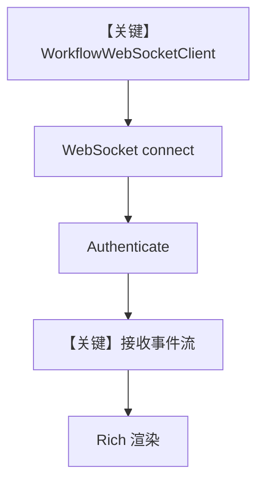

# websocket_client.py — 实现原理分析

> 源文件：`cookbook/04_workflows/06_advanced_concepts/background_execution/websocket_client.py`

## 概述

本文件为 **独立 WebSocket 客户端演示**（`websockets` + `rich`），**不 import `agno`**：用于连接 `websocket_server.py` 暴露的 `/ws`，完成鉴权、接收工作流事件流并在终端渲染。与 Agno 框架的衔接点在**协议与事件类型**（如 `WorkflowStarted`、`StepCompleted`），而非直接调用 `Workflow` API。

**核心配置一览：**

| 项 | 说明 |
|----|------|
| `WorkflowWebSocketClient` | `server_url` 默认 `ws://localhost:8000/ws` |
| `auth_token` | 可选，与服务器 `SECURITY_KEY` 对应 |
| 依赖 | `websockets`、`rich` |

## 架构分层

```
终端用户 ──> WorkflowWebSocketClient ──> WebSocket 服务器
                │
                └── parse_sse_message / format_event 展示
```

## 核心组件解析

### 事件解析

`parse_sse_message`（`L67-86`）解析 `event:` / `data:` 行；`format_event`（`L88+`）映射事件类型到展示样式。

### 运行机制与因果链

1. **数据路径**：TCP WebSocket 文本帧 → JSON → UI Panel。
2. **无 Agno 因果链**：不经过 `Workflow.run`；若需对照框架事件定义，见 `agno/run/workflow` 中事件类型。

## System Prompt 组装

不适用（无 LLM、无 Agent）。

## 完整 API 请求

不适用；网络层为 WebSocket 帧，非 OpenAI HTTP。

## Mermaid 流程图



## 关键源码文件索引

| 文件 | 作用 |
|------|------|
| 本客户端 | UI 与协议解析 |
| `cookbook/.../websocket_server.py` | 服务端 Workflow + WS |
