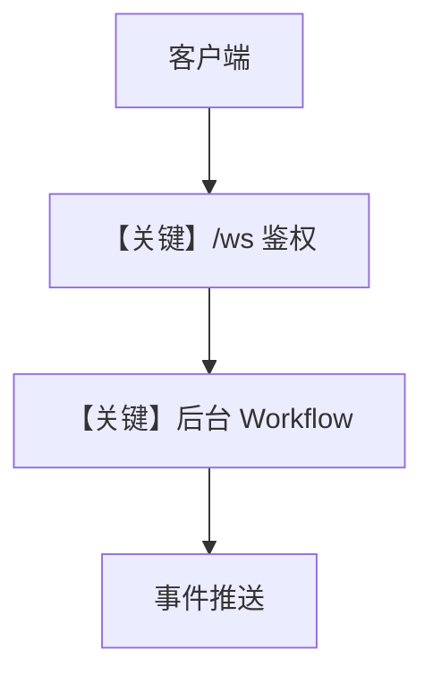

# websocket_server.py — 实现原理分析

> 源文件：`cookbook/04_workflows/06_advanced_concepts/background_execution/websocket_server.py`

## 概述

本示例展示 **FastAPI + WebSocket** 与 Agno `Workflow` 结合：在鉴权后通过消息触发**后台工作流**并把事件推送到 WebSocket 客户端；使用 `SqliteDb` 与 `OpenAIChat` 子 Agent 做研究类步骤。

**核心配置一览：**

| 配置项 | 值 | 说明 |
|--------|------|------|
| `SECURITY_KEY` | 环境变量或默认占位 | `L25` |
| `Workflow` | 两步 Agent 研究 | 见服务器内定义（文件后半） |
| `db` | `SqliteDb` | 与 background 示例一致模式 |

（若需完整 Agent/Step 列表请 Read 源文件 `L100` 之后。）

## 核心组件解析

### FastAPI WebSocket

`@app.websocket("/ws")`（`L80+`）：维护 `active_connections`、`authenticated_connections`，校验 `validate_token`（`L57-62`）。

### 与 Workflow 集成

服务器在收到客户端指令后启动 `Workflow` 异步运行并转发事件（具体消息协议见文件内 `json.dumps` 负载）。

### 运行机制与因果链

1. **数据路径**：客户端 → WS 鉴权 → 启动 workflow → 事件流回传。
2. **副作用**：SQLite、外部 API（HN/Web）。

## System Prompt 组装

子 Agent `instructions` 见 `L34-41`（HackerNews / Search）。

### 还原后的完整 System 文本（HackerNews Researcher）

```text
Research tech news and trends from HackerNews
```

## 完整 API 请求

- HTTP：`uvicorn` 提供 REST/WS。
- LLM：`OpenAIChat` → Chat Completions（具体 `invoke` 见 `agno/models/openai`）。

## Mermaid 流程图



## 关键源码文件索引

| 文件 | 关键函数/类 | 作用 |
|------|------------|------|
| `agno/workflow/workflow.py` | `Workflow` | 工作流 |
| `libs/agno/agno/os`（若使用） | WebSocketHandler | 可选集成 |
