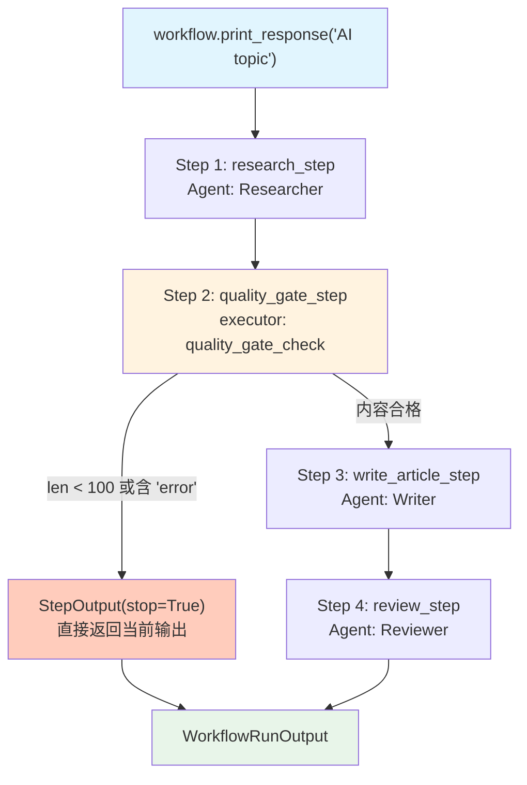

# early_stop_basic.py — 实现原理分析

> 源文件：`cookbook/04_workflows/06_advanced_concepts/early_stopping/early_stop_basic.py`

## 概述

本示例展示 Agno Workflow **`StepOutput(stop=True)` 触发提前终止**机制：步骤执行器返回 `stop=True` 的 `StepOutput`，Workflow 立即停止后续所有步骤的执行，并将当前步骤的输出作为工作流结果返回。

**核心配置一览：**

| 配置项 | 值 | 说明 |
|--------|------|------|
| 触发方式 | `StepOutput(stop=True)` | 执行器返回值 |
| 终止效果 | 立即中止后续步骤 | 包括所有剩余 Step |
| 检查位置 | 可在任意 Step executor 中 | 不限 Agent/Function |
| 正常继续 | `StepOutput(stop=False)` | 默认值 |

## 核心组件解析

### 提前终止逻辑

```python
def quality_gate_check(step_input: StepInput) -> StepOutput:
    content = step_input.previous_step_content or ""

    # 检查内容是否满足质量要求
    if len(content) < 100:
        return StepOutput(
            content="Quality gate failed: Content too short. Stopping workflow.",
            stop=True,   # 触发提前终止
        )

    if "error" in content.lower():
        return StepOutput(
            content="Quality gate failed: Error detected in content.",
            stop=True,
        )

    return StepOutput(
        content=f"Quality gate passed. Content length: {len(content)}",
        stop=False,  # 继续执行
    )
```

### Workflow 结构

```python
workflow = Workflow(
    name="Content Pipeline with Quality Gate",
    steps=[
        research_step,          # Step 1: 研究
        quality_gate_step,      # Step 2: 质量检查（可能 stop=True）
        write_article_step,     # Step 3: 写文章（可能被跳过）
        review_step,            # Step 4: 审核（可能被跳过）
    ],
)
```

## 执行流程

| 步骤 | 执行 | 说明 |
|------|------|------|
| research_step | 始终执行 | 生成研究内容 |
| quality_gate_step | 始终执行 | 检查内容质量 |
| write_article_step | 仅当质量门通过时 | `stop=True` 则跳过 |
| review_step | 仅当前两步通过时 | `stop=True` 则跳过 |

## Mermaid 流程图



## 关键源码文件索引

| 文件 | 关键类/函数 | 作用 |
|------|------------|------|
| `agno/workflow/types.py` | `StepOutput.stop` L334 | 触发提前终止的字段 |
| `agno/workflow/workflow.py` | `Workflow._run()` | 检查 stop 标志并终止执行 |
