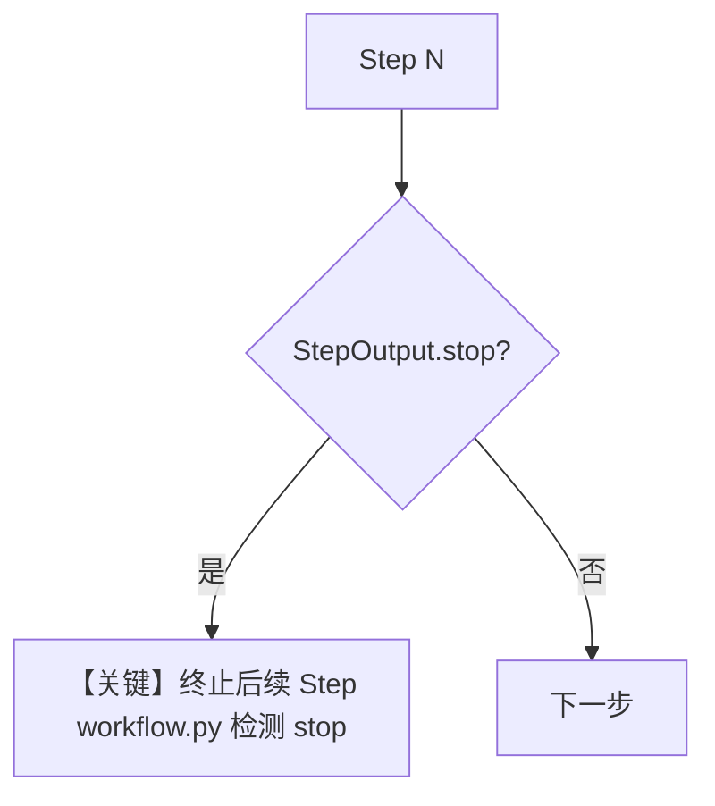

# early_stop_basic.py — 实现原理分析

<!-- cookbook-py-source:start -->
## 完整源码

```python
"""
Early Stop Basic
================

Demonstrates early termination with `StepOutput(stop=True)` across direct steps, `Steps` containers, and agent/function workflows.
"""

from agno.agent import Agent
from agno.models.openai import OpenAIChat
from agno.tools.websearch import WebSearchTools
from agno.workflow import Step, Workflow
from agno.workflow.steps import Steps
from agno.workflow.types import StepInput, StepOutput

# ---------------------------------------------------------------------------
# Create Agents (Security Deployment)
# ---------------------------------------------------------------------------
security_scanner = Agent(
    name="Security Scanner",
    model=OpenAIChat(id="gpt-5.2"),
    instructions=[
        "You are a security scanner. Analyze the provided code or system for security vulnerabilities.",
        "Return 'SECURE' if no critical vulnerabilities found.",
        "Return 'VULNERABLE' if critical security issues are detected.",
        "Explain your findings briefly.",
    ],
)

code_deployer = Agent(
    name="Code Deployer",
    model=OpenAIChat(id="gpt-5.2"),
    instructions="Deploy the security-approved code to production environment.",
)

monitoring_agent = Agent(
    name="Monitoring Agent",
    model=OpenAIChat(id="gpt-5.2"),
    instructions="Set up monitoring and alerts for the deployed application.",
)


# ---------------------------------------------------------------------------
# Define Security Gate
# ---------------------------------------------------------------------------
def security_gate(step_input: StepInput) -> StepOutput:
    security_result = step_input.previous_step_content or ""
    print(f"Security scan result: {security_result}")

    if "VULNERABLE" in security_result.upper():
        return StepOutput(
            content="[ALERT] SECURITY ALERT: Critical vulnerabilities detected. Deployment blocked for security reasons.",
            stop=True,
        )
    return StepOutput(
        content="[OK] Security check passed. Proceeding with deployment...",
        stop=False,
    )


# ---------------------------------------------------------------------------
# Create Security Workflow
# ---------------------------------------------------------------------------
security_workflow = Workflow(
    name="Secure Deployment Pipeline",
    description="Deploy code only if security checks pass",
    steps=[
        Step(name="Security Scan", agent=security_scanner),
        Step(name="Security Gate", executor=security_gate),
        Step(name="Deploy Code", agent=code_deployer),
        Step(name="Setup Monitoring", agent=monitoring_agent),
    ],
)

# ---------------------------------------------------------------------------
# Create Agents (Content Quality Pipeline)
# ---------------------------------------------------------------------------
content_creator = Agent(
    name="Content Creator",
    model=OpenAIChat(id="gpt-4o-mini"),
    tools=[WebSearchTools()],
    instructions="Create engaging content on the given topic. Research and write comprehensive articles.",
)

fact_checker = Agent(
    name="Fact Checker",
    model=OpenAIChat(id="gpt-4o-mini"),
    instructions="Verify facts and check accuracy of content. Flag any misinformation.",
)

editor = Agent(
    name="Editor",
    model=OpenAIChat(id="gpt-4o-mini"),
    instructions="Edit and polish content for publication. Ensure clarity and flow.",
)

publisher = Agent(
    name="Publisher",
    model=OpenAIChat(id="gpt-4o-mini"),
    instructions="Prepare content for publication and handle final formatting.",
)


# ---------------------------------------------------------------------------
# Define Quality Gate
# ---------------------------------------------------------------------------
def content_quality_gate(step_input: StepInput) -> StepOutput:
    content = step_input.previous_step_content or ""

    if len(content) < 100:
        return StepOutput(
            step_name="content_quality_gate",
            content="[FAIL] QUALITY CHECK FAILED: Content too short. Stopping workflow.",
            stop=True,
        )

    problematic_keywords = ["fake", "misinformation", "unverified", "conspiracy"]
    if any(keyword in content.lower() for keyword in problematic_keywords):
        return StepOutput(
            step_name="content_quality_gate",
            content="[FAIL] QUALITY CHECK FAILED: Problematic content detected. Stopping workflow.",
            stop=True,
        )

    return StepOutput(
        step_name="content_quality_gate",
        content="[PASS] QUALITY CHECK PASSED: Content meets quality standards.",
        stop=False,
    )


# ---------------------------------------------------------------------------
# Create Content Workflow
# ---------------------------------------------------------------------------
content_pipeline = Steps(
    name="content_pipeline",
    description="Content creation pipeline with quality gates",
    steps=[
        Step(name="create_content", agent=content_creator),
        Step(name="quality_gate", executor=content_quality_gate),
        Step(name="fact_check", agent=fact_checker),
        Step(name="edit_content", agent=editor),
        Step(name="publish", agent=publisher),
    ],
)

content_workflow = Workflow(
    name="Content Creation with Quality Gate",
    description="Content creation workflow with early termination on quality issues",
    steps=[
        content_pipeline,
        Step(name="final_review", agent=editor),
    ],
)

# ---------------------------------------------------------------------------
# Create Agents (Data Validation Workflow)
# ---------------------------------------------------------------------------
data_validator = Agent(
    name="Data Validator",
    model=OpenAIChat(id="gpt-5.2"),
    instructions=[
        "You are a data validator. Analyze the provided data and determine if it's valid.",
        "For data to be VALID, it must meet these criteria:",
        "- user_count: Must be a positive number (> 0)",
        "- revenue: Must be a positive number (> 0)",
        "- date: Must be in a reasonable date format (YYYY-MM-DD)",
        "Return exactly 'VALID' if all criteria are met.",
        "Return exactly 'INVALID' if any criteria fail.",
        "Also briefly explain your reasoning.",
    ],
)

data_processor = Agent(
    name="Data Processor",
    model=OpenAIChat(id="gpt-5.2"),
    instructions="Process and transform the validated data.",
)

report_generator = Agent(
    name="Report Generator",
    model=OpenAIChat(id="gpt-5.2"),
    instructions="Generate a final report from processed data.",
)


# ---------------------------------------------------------------------------
# Define Validation Gate
# ---------------------------------------------------------------------------
def early_exit_validator(step_input: StepInput) -> StepOutput:
    validation_result = step_input.previous_step_content or ""

    if "INVALID" in validation_result.upper():
        return StepOutput(
            content="[FAIL] Data validation failed. Workflow stopped early to prevent processing invalid data.",
            stop=True,
        )
    return StepOutput(
        content="[PASS] Data validation passed. Continuing with processing...",
        stop=False,
    )


# ---------------------------------------------------------------------------
# Create Data Workflow
# ---------------------------------------------------------------------------
data_workflow = Workflow(
    name="Data Processing with Early Exit",
    description="Process data but stop early if validation fails",
    steps=[
        data_validator,
        early_exit_validator,
        data_processor,
        report_generator,
    ],
)

# ---------------------------------------------------------------------------
# Run Workflows
# ---------------------------------------------------------------------------
if __name__ == "__main__":
    print("\n=== Testing VULNERABLE code deployment ===")
    security_workflow.print_response(
        input="Scan this code: exec(input('Enter command: '))"
    )

    print("=== Testing SECURE code deployment ===")
    security_workflow.print_response(
        input="Scan this code: def hello(): return 'Hello World'"
    )

    print("\n=== Test: Short content (should stop early) ===")
    content_workflow.print_response(
        input="Write a short note about conspiracy theories",
        markdown=True,
        stream=True,
    )

    print("\n=== Testing with INVALID data ===")
    data_workflow.print_response(
        input="Process this data: {'user_count': -50, 'revenue': 'invalid_amount', 'date': 'bad_date'}"
    )

    print("=== Testing with VALID data ===")
    data_workflow.print_response(
        input="Process this data: {'user_count': 1000, 'revenue': 50000, 'date': '2024-01-15'}"
    )
```

<!-- cookbook-py-source:end -->

> 源文件：`cookbook/04_workflows/06_advanced_concepts/early_stopping/early_stop_basic.py`

## 概述

本示例展示 Agno 的 **`StepOutput(stop=True)` 提前终止整条工作流** 机制：在函数型 `executor` 或条件门中返回 `stop=True`，执行器在多处检测 `step_output.stop`（如 `workflow.py` `L1932` 附近）并结束后续步骤。文件内含三条独立管线：**安全部署**（扫描→门控→部署→监控）、**内容质量**（`Steps` 容器内多步 + `final_review`）、**数据校验**（Agent 直接作首步 + 校验函数）。

**核心配置一览：**

| Workflow | 要点 |
|----------|------|
| `security_workflow` | `security_gate` 含 `VULNERABLE` 时 `stop=True` `L49-52` |
| `content_workflow` | `Steps` + `content_quality_gate`；短内容或敏感词 `stop=True` `L109-121` |
| `data_workflow` | `early_exit_validator` 遇 `INVALID` `stop=True` `L192-195` |
| 模型 | `gpt-5.2` / `gpt-4o-mini` 等见各 Agent |

## 核心组件解析

### StepOutput.stop

框架在顺序执行路径上检测 `if step_output.stop` 后停止计时并中断后续 Step（`workflow.py` 多处，如 `L1932`）。

### security_gate / content_quality_gate / early_exit_validator

均读 `previous_step_content`，按业务规则设置 `stop`。

### 运行机制与因果链

1. **数据路径**：用户 input → 第一步 Agent/函数 → 若 `stop=True` 则不再执行后续。
2. **Steps 容器**：`steps.py` 内同样聚合 `stop`（如 `L273-L298` 一带）。
3. **与 `early_stop_condition` 差异**：本文件侧重 **executor 直接 stop**，条件分支另见专门示例。

## System Prompt 组装

各 Agent `instructions` 为列表或字符串（如 `security_scanner` `L21-26`）。示例还原：

### 还原后的完整 System 文本（security_scanner 列表合并）

以运行时 `get_system_message` 为准，字面量包含：

```text
You are a security scanner. Analyze the provided code or system for security vulnerabilities.
Return 'SECURE' if no critical vulnerabilities found.
Return 'VULNERABLE' if critical security issues are detected.
Explain your findings briefly.
```

## 完整 API 请求

`OpenAIChat` + Chat Completions；带 `WebSearchTools` 的步骤含 tools schema。

## Mermaid 流程图


```mermaid
flowchart TD
    S["Step N"] --> G{"StepOutput.stop?"}
    G -->|是| X["【关键】终止后续 Step<br/>workflow.py 检测 stop"]
    G -->|否| S2["下一步"]
```

## 关键源码文件索引

| 文件 | 关键函数/类 | 作用 |
|------|------------|------|
| `agno/workflow/workflow.py` | `step_output.stop` 分支 ~L1932 | 提前结束 |
| `agno/workflow/types.py` | `StepOutput` | `stop` 字段 |
| `agno/workflow/steps.py` | `Steps` 执行 | 聚合 stop |
