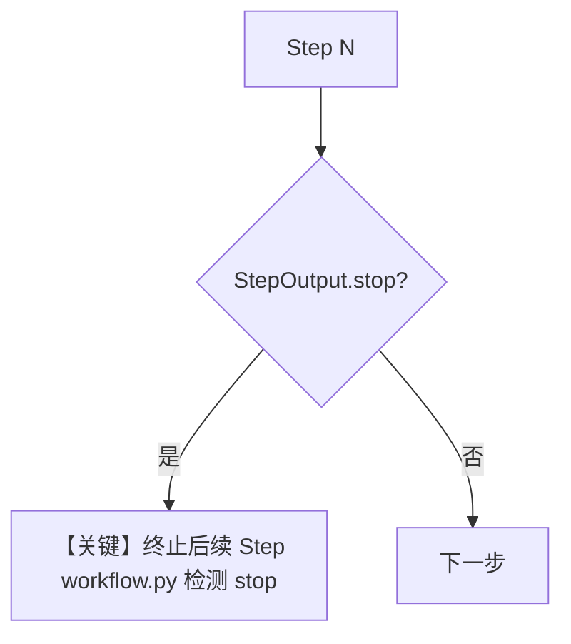

# early_stop_basic.py — 实现原理分析

> 源文件：`cookbook/04_workflows/06_advanced_concepts/early_stopping/early_stop_basic.py`

## 概述

本示例展示 Agno 的 **`StepOutput(stop=True)` 提前终止整条工作流** 机制：在函数型 `executor` 或条件门中返回 `stop=True`，执行器在多处检测 `step_output.stop`（如 `workflow.py` `L1932` 附近）并结束后续步骤。文件内含三条独立管线：**安全部署**（扫描→门控→部署→监控）、**内容质量**（`Steps` 容器内多步 + `final_review`）、**数据校验**（Agent 直接作首步 + 校验函数）。

**核心配置一览：**

| Workflow | 要点 |
|----------|------|
| `security_workflow` | `security_gate` 含 `VULNERABLE` 时 `stop=True` `L49-52` |
| `content_workflow` | `Steps` + `content_quality_gate`；短内容或敏感词 `stop=True` `L109-121` |
| `data_workflow` | `early_exit_validator` 遇 `INVALID` `stop=True` `L192-195` |
| 模型 | `gpt-5.2` / `gpt-4o-mini` 等见各 Agent |

## 核心组件解析

### StepOutput.stop

框架在顺序执行路径上检测 `if step_output.stop` 后停止计时并中断后续 Step（`workflow.py` 多处，如 `L1932`）。

### security_gate / content_quality_gate / early_exit_validator

均读 `previous_step_content`，按业务规则设置 `stop`。

### 运行机制与因果链

1. **数据路径**：用户 input → 第一步 Agent/函数 → 若 `stop=True` 则不再执行后续。
2. **Steps 容器**：`steps.py` 内同样聚合 `stop`（如 `L273-L298` 一带）。
3. **与 `early_stop_condition` 差异**：本文件侧重 **executor 直接 stop**，条件分支另见专门示例。

## System Prompt 组装

各 Agent `instructions` 为列表或字符串（如 `security_scanner` `L21-26`）。示例还原：

### 还原后的完整 System 文本（security_scanner 列表合并）

以运行时 `get_system_message` 为准，字面量包含：

```text
You are a security scanner. Analyze the provided code or system for security vulnerabilities.
Return 'SECURE' if no critical vulnerabilities found.
Return 'VULNERABLE' if critical security issues are detected.
Explain your findings briefly.
```

## 完整 API 请求

`OpenAIChat` + Chat Completions；带 `WebSearchTools` 的步骤含 tools schema。

## Mermaid 流程图


```mermaid
flowchart TD
    S["Step N"] --> G{"StepOutput.stop?"}
    G -->|是| X["【关键】终止后续 Step<br/>workflow.py 检测 stop"]
    G -->|否| S2["下一步"]
```

## 关键源码文件索引

| 文件 | 关键函数/类 | 作用 |
|------|------------|------|
| `agno/workflow/workflow.py` | `step_output.stop` 分支 ~L1932 | 提前结束 |
| `agno/workflow/types.py` | `StepOutput` | `stop` 字段 |
| `agno/workflow/steps.py` | `Steps` 执行 | 聚合 stop |
