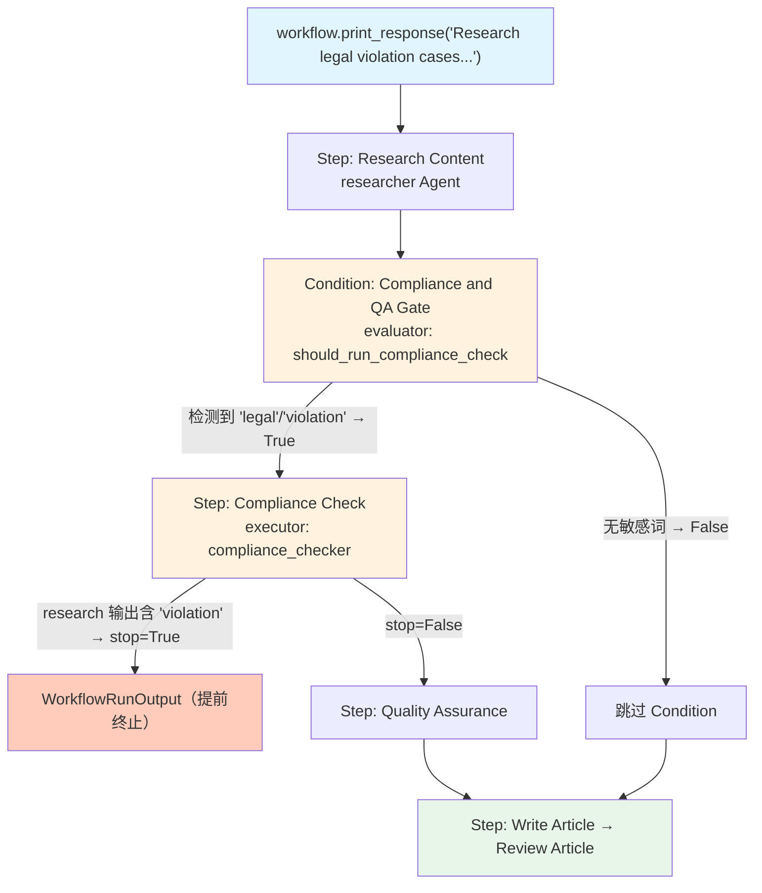

# early_stop_condition.py — 实现原理分析

> 源文件：`cookbook/04_workflows/06_advanced_concepts/early_stopping/early_stop_condition.py`

## 概述

本示例展示 Agno Workflow **在 `Condition` 分支内触发提前终止**：`Condition` 的 `evaluator` 判断是否进入合规检查分支，分支内的 `compliance_checker` executor 返回 `StepOutput(stop=True)` 时，Workflow 立即终止，跳过所有后续步骤（包括 Condition 之后的步骤）。

**核心配置一览：**

| 配置项 | 值 | 说明 |
|--------|------|------|
| Condition evaluator | `should_run_compliance_check` | 检测敏感关键词决定是否进入检查 |
| 分支内 stop=True | `compliance_checker` executor | 检测违规内容后停止 |
| 终止范围 | 整个 Workflow | Condition 内的 stop=True 向上传播 |

## 核心组件解析

### 两级控制：Condition 评估 + stop=True 终止

```python
def should_run_compliance_check(step_input: StepInput) -> bool:
    """第一级：Condition evaluator 判断是否需要合规检查"""
    content = step_input.input or ""
    sensitive_keywords = ["legal", "financial", "medical", "violation", "illegal"]
    return any(keyword in content.lower() for keyword in sensitive_keywords)

def compliance_checker(step_input: StepInput) -> StepOutput:
    """第二级：Condition 内的步骤，发现违规时 stop=True"""
    content = step_input.previous_step_content or ""
    if "violation" in content.lower() or "illegal" in content.lower():
        return StepOutput(content="[ALERT] COMPLIANCE VIOLATION!", stop=True)
    return StepOutput(content="[PASS] Compliance OK.", stop=False)
```

### Condition 内 stop=True 结构

```python
workflow = Workflow(
    steps=[
        research_step,
        Condition(
            name="Compliance and QA Gate",
            evaluator=should_run_compliance_check,  # 检测敏感词
            steps=[
                compliance_check_step,    # 可能 stop=True
                quality_assurance_step,   # 若 compliance 通过才执行
            ],
        ),
        write_step,     # Condition 内 stop=True → 不执行
        review_step,    # Condition 内 stop=True → 不执行
    ],
)
```

## 两级过滤流程

```
输入: "Research legal violation cases..."
第一级 (evaluator): "legal" + "violation" → True → 进入 Condition.steps
第二级 (compliance_checker): "violation" in research_output → stop=True
→ Workflow 立即终止（write_step 和 review_step 不执行）
```

## Mermaid 流程图



## 关键源码文件索引

| 文件 | 关键类/函数 | 作用 |
|------|------------|------|
| `agno/workflow/condition.py` | `Condition._run()` | 将步骤 stop=True 向上传播 |
| `agno/workflow/types.py` | `StepOutput.stop` | 终止标志 |
| `agno/workflow/workflow.py` | `Workflow._run()` | 汇总时检查 stop 标志 |
