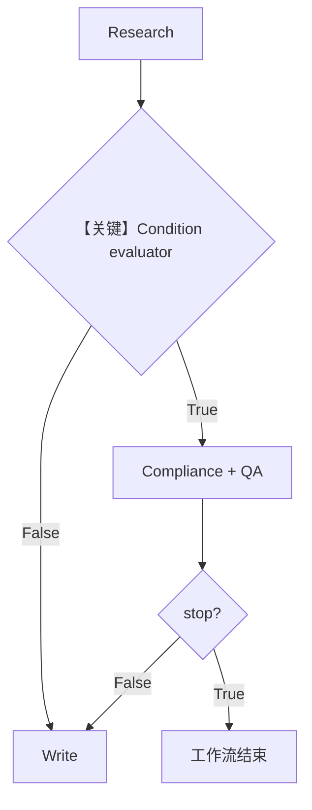

# early_stop_condition.py — 实现原理分析

> 源文件：`cookbook/04_workflows/06_advanced_concepts/early_stopping/early_stop_condition.py`

## 概述

本示例展示在 **`Condition` 为真时执行的门控链** 中通过 `StepOutput(stop=True)` **终止整个工作流**（不仅跳过 Condition 内剩余步）：`compliance_checker` 在检测到违规关键词时设 `stop=True`（`L40-44`），框架在 condition 分支执行路径上同样检测 `stop`（`workflow.py` `L5009` 等 `condition_step_output.stop`）。

**核心配置一览：**

| 配置项 | 值 | 说明 |
|--------|------|------|
| `Condition.name` | `"Compliance and QA Gate"` | `L86-92` |
| `evaluator` | `should_run_compliance_check` | 敏感词则进入分支 `L63-66` |
| `steps` | `compliance_check_step`, `quality_assurance_step` | 顺序执行 |

## 核心组件解析

### should_run_compliance_check

`L63-66`：`input` 含 legal/financial/medical/violation/illegal 等则 `True`，从而运行合规与 QA。

### compliance_checker

若内容含 `violation`/`illegal` 则 `stop=True`，阻止后续 `write_step`、`review_step`。

### 运行机制与因果链

1. **数据路径**：`research_step` → 可能进入 Condition → 合规失败则全局停止。
2. **与 `early_stop_basic` 差异**：stop 发生在 **Condition 分支内部**，强调与 `evaluator` 联动。

## System Prompt 组装

`researcher`/`writer`/`reviewer` instructions（`L17-30`）。

### 还原后的完整 System 文本（researcher）

```text
Research the given topic thoroughly and provide detailed findings.
```

## 完整 API 请求

`WebSearchTools` + 默认模型 Chat Completions。

## Mermaid 流程图


```mermaid
flowchart TD
    R["Research"] --> C{"【关键】Condition evaluator"}
    C -->|False| W["Write"]
    C -->|True| G["Compliance + QA"]
    G --> S{"stop?"}
    S -->|True| STOP["工作流结束"]
    S -->|False| W
```

## 关键源码文件索引

| 文件 | 关键函数/类 | 作用 |
|------|------------|------|
| `agno/workflow/workflow.py` | `condition_step_output.stop` ~L5009 | Condition 内 stop |
| `agno/workflow/condition.py` | `Condition` | 条件块 |
