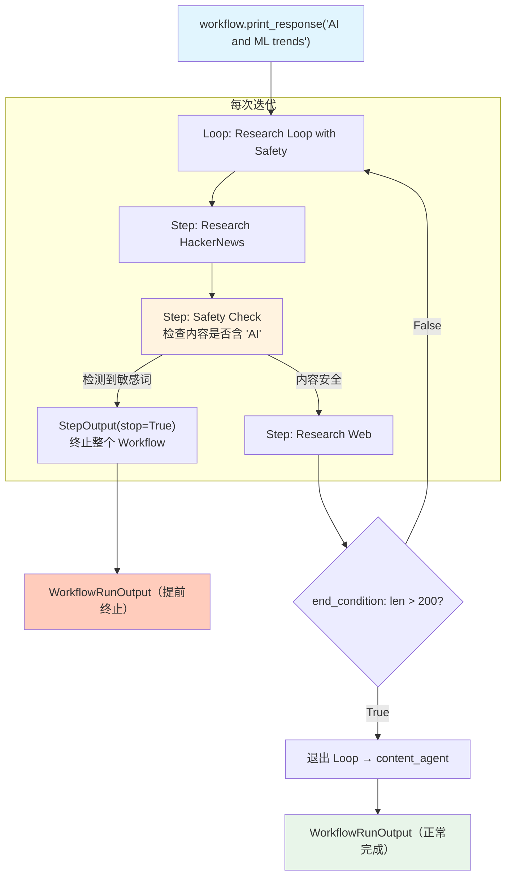

# early_stop_loop.py — 实现原理分析

> 源文件：`cookbook/04_workflows/06_advanced_concepts/early_stopping/early_stop_loop.py`

## 概述

本示例展示 Agno Workflow **在 `Loop` 迭代内部通过 `stop=True` 提前终止整个 Workflow**：Loop 的某个步骤返回 `StepOutput(stop=True)` 时，不仅终止当前循环迭代，还会终止整个 Workflow 的后续执行（包括 Loop 之后的步骤）。

**核心配置一览：**

| 配置项 | 值 | 说明 |
|--------|------|------|
| `Loop` 内安全检查步骤 | `stop=True` | 终止 Loop + 整个 Workflow |
| `Loop.end_condition` | `research_evaluator` | 正常退出条件（内容充足时） |
| `max_iterations` | `3` | 最大迭代上限 |

## 核心组件解析

### Loop 内的安全检查步骤

```python
def safety_checker(step_input: StepInput) -> StepOutput:
    content = step_input.previous_step_content or ""

    if "AI" in content or "machine learning" in content:
        return StepOutput(
            content="[ALERT] SAFETY CONCERN! Stopping research loop.",
            stop=True,    # 终止 Loop + 整个 Workflow
        )
    return StepOutput(content="[OK] Safety check passed.", stop=False)
```

### 普通退出条件

```python
def research_evaluator(outputs: List[StepOutput]) -> bool:
    return any(o.content and len(o.content) > 200 for o in outputs)
```

### Loop 结构与双重退出机制

```python
workflow = Workflow(
    steps=[
        Loop(
            name="Research Loop with Safety",
            steps=[
                research_hackernews_step,
                safety_check_step,       # 可能触发 stop=True
                research_web_step,
            ],
            end_condition=research_evaluator,  # 普通退出条件
            max_iterations=3,
        ),
        content_agent,   # 若 Loop 内 stop=True，此步骤不执行
    ],
)
```

## 两种退出路径

| 退出路径 | 触发条件 | 范围 |
|---------|---------|------|
| `stop=True` | 安全检查发现敏感词 | 终止整个 Workflow |
| `end_condition` 返回 True | 内容长度 > 200 | 退出 Loop，继续后续步骤 |
| `max_iterations=3` | 迭代达到上限 | 退出 Loop，继续后续步骤 |

## Mermaid 流程图



## 关键源码文件索引

| 文件 | 关键类/函数 | 作用 |
|------|------------|------|
| `agno/workflow/loop.py` | `Loop._run()` | 检查步骤的 `stop` 标志 |
| `agno/workflow/types.py` | `StepOutput.stop` | 终止标志字段 |
| `agno/workflow/workflow.py` | `Workflow._run()` | 收到 stop=True 时终止后续步骤 |
