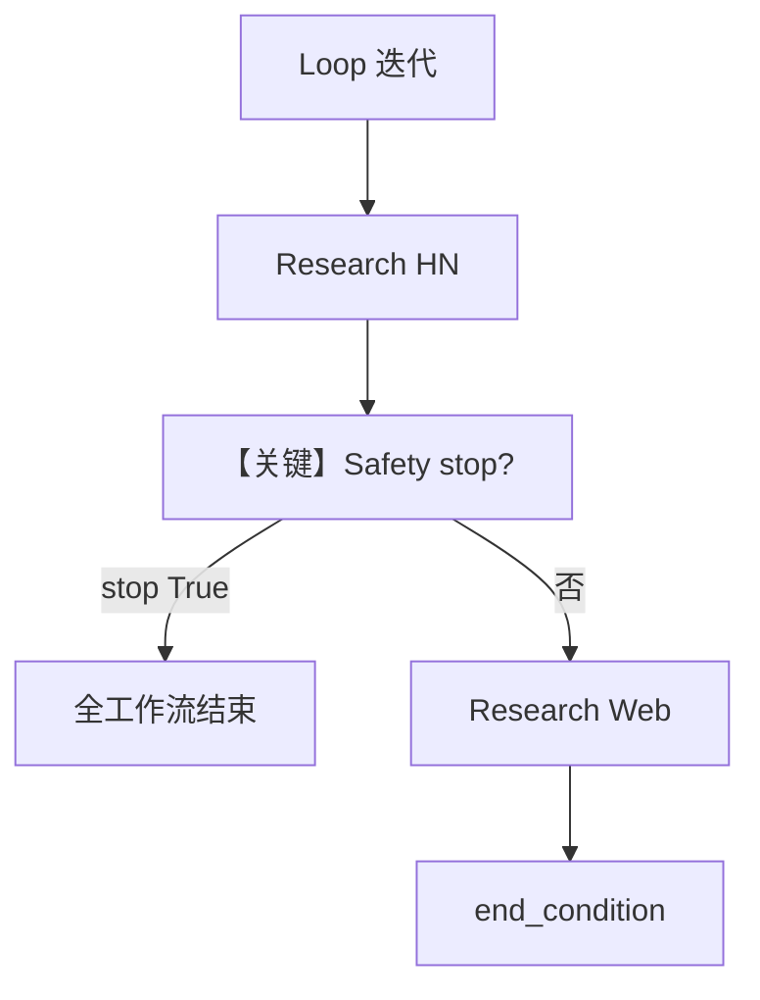

# early_stop_loop.py — 实现原理分析

<!-- cookbook-py-source:start -->
## 完整源码

```python
"""
Early Stop Loop
===============

Demonstrates stopping a looped workflow early using a safety-check step.
"""

from typing import List

from agno.agent import Agent
from agno.tools.hackernews import HackerNewsTools
from agno.tools.websearch import WebSearchTools
from agno.workflow import Loop, Step, Workflow
from agno.workflow.types import StepInput, StepOutput

# ---------------------------------------------------------------------------
# Create Agents
# ---------------------------------------------------------------------------
research_agent = Agent(
    name="Research Agent",
    role="Research specialist",
    tools=[HackerNewsTools(), WebSearchTools()],
    instructions="You are a research specialist. Research the given topic thoroughly.",
    markdown=True,
)

content_agent = Agent(
    name="Content Agent",
    role="Content creator",
    instructions="You are a content creator. Create engaging content based on research.",
    markdown=True,
)


# ---------------------------------------------------------------------------
# Define Functions
# ---------------------------------------------------------------------------
def safety_checker(step_input: StepInput) -> StepOutput:
    content = step_input.previous_step_content or ""

    if "AI" in content or "machine learning" in content:
        return StepOutput(
            step_name="Safety Checker",
            content="[ALERT] SAFETY CONCERN DETECTED! Content contains sensitive AI-related information. Stopping research loop for review.",
            stop=True,
        )
    return StepOutput(
        step_name="Safety Checker",
        content="[OK] Safety check passed. Content is safe to continue.",
        stop=False,
    )


def research_evaluator(outputs: List[StepOutput]) -> bool:
    if not outputs:
        print("[INFO] No research outputs - continuing loop")
        return False

    for output in outputs:
        if output.content and len(output.content) > 200:
            print(
                f"[PASS] Research evaluation passed - found substantial content ({len(output.content)} chars)"
            )
            return True

    print("[FAIL] Research evaluation failed - need more substantial research")
    return False


# ---------------------------------------------------------------------------
# Define Steps
# ---------------------------------------------------------------------------
research_hackernews_step = Step(
    name="Research HackerNews",
    agent=research_agent,
    description="Research trending topics on HackerNews",
)

safety_check_step = Step(
    name="Safety Check",
    executor=safety_checker,
    description="Check if research content is safe to continue",
)

research_web_step = Step(
    name="Research Web",
    agent=research_agent,
    description="Research additional information from web sources",
)

# ---------------------------------------------------------------------------
# Create Workflow
# ---------------------------------------------------------------------------
workflow = Workflow(
    name="Research with Safety Check Workflow",
    description="Research topics in loop with safety checks, stop if safety issues found",
    steps=[
        Loop(
            name="Research Loop with Safety",
            steps=[
                research_hackernews_step,
                safety_check_step,
                research_web_step,
            ],
            end_condition=research_evaluator,
            max_iterations=3,
        ),
        content_agent,
    ],
)

# ---------------------------------------------------------------------------
# Run Workflow
# ---------------------------------------------------------------------------
if __name__ == "__main__":
    print("=== Testing Loop Early Termination with Safety Check ===")
    print("Expected: Safety check should detect 'AI' and stop the entire workflow")
    print()

    workflow.print_response(
        input="Research the latest trends in AI and machine learning, then create a summary",
        stream=True,
    )
```

<!-- cookbook-py-source:end -->

> 源文件：`cookbook/04_workflows/06_advanced_concepts/early_stopping/early_stop_loop.py`

## 概述

本示例展示在 **`Loop` 循环体内部** 用 `StepOutput(stop=True)` **终止整个工作流**（含循环外后续步）：`safety_checker` 在内容含 `AI`/`machine learning` 时设 `stop=True`（`L41-45`），使 `research_evaluator` 与最终 `content` 步均不再有意义执行。

**核心配置一览：**

| 配置项 | 值 | 说明 |
|--------|------|------|
| `Loop.steps` | HN research → safety → web | `L100-104` |
| `end_condition` | `research_evaluator` | `L54-L67` |
| `max_iterations` | `3` | |
| 循环后 | `content_agent` | **注意**：源码为 `Agent` 实例；规范用法应为 `Step(agent=content_agent)`，若运行报错请按 API 修正 |

## 核心组件解析

### safety_checker

`L38-51`：基于 `previous_step_content` 的简单关键词熔断，`stop=True` 全局早停。

### research_evaluator

与经典 loop 示例相同：长度阈值退出循环逻辑；若 safety 已 `stop`，以框架实际行为为准。

### 运行机制与因果链

1. **数据路径**：每轮：HN → 安全 → Web → 评估是否结束循环。
2. **stop 优先级**：循环内任一步 `stop=True` 应触发工作流级中断（见 `workflow.py` loop 段 `~L2655` 等）。

## System Prompt 组装

`research_agent` / `content_agent`（`L19-31`）。

### 还原后的完整 System 文本（research_agent）

```text
You are a research specialist. Research the given topic thoroughly.
```

## 完整 API 请求

带 `HackerNewsTools`、`WebSearchTools` 的 Chat Completions。

## Mermaid 流程图


```mermaid
flowchart TD
    L["Loop 迭代"] --> A["Research HN"]
    A --> B["【关键】Safety stop?"]
    B -->|stop True| STOP["全工作流结束"]
    B -->|否| C["Research Web"]
    C --> E["end_condition"]
```

## 关键源码文件索引

| 文件 | 关键函数/类 | 作用 |
|------|------------|------|
| `agno/workflow/workflow.py` | Loop 内 `step_output.stop` | 早停 |
| `agno/workflow/loop.py` | `Loop` L39 | 循环 |
