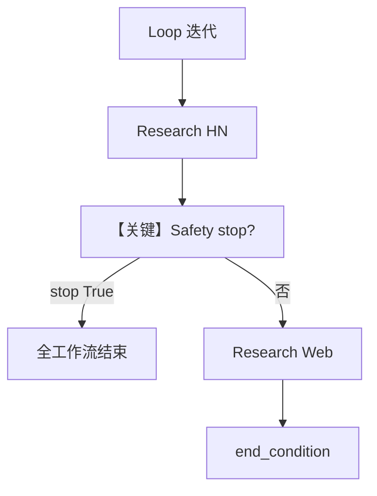

# early_stop_loop.py — 实现原理分析

> 源文件：`cookbook/04_workflows/06_advanced_concepts/early_stopping/early_stop_loop.py`

## 概述

本示例展示在 **`Loop` 循环体内部** 用 `StepOutput(stop=True)` **终止整个工作流**（含循环外后续步）：`safety_checker` 在内容含 `AI`/`machine learning` 时设 `stop=True`（`L41-45`），使 `research_evaluator` 与最终 `content` 步均不再有意义执行。

**核心配置一览：**

| 配置项 | 值 | 说明 |
|--------|------|------|
| `Loop.steps` | HN research → safety → web | `L100-104` |
| `end_condition` | `research_evaluator` | `L54-L67` |
| `max_iterations` | `3` | |
| 循环后 | `content_agent` | **注意**：源码为 `Agent` 实例；规范用法应为 `Step(agent=content_agent)`，若运行报错请按 API 修正 |

## 核心组件解析

### safety_checker

`L38-51`：基于 `previous_step_content` 的简单关键词熔断，`stop=True` 全局早停。

### research_evaluator

与经典 loop 示例相同：长度阈值退出循环逻辑；若 safety 已 `stop`，以框架实际行为为准。

### 运行机制与因果链

1. **数据路径**：每轮：HN → 安全 → Web → 评估是否结束循环。
2. **stop 优先级**：循环内任一步 `stop=True` 应触发工作流级中断（见 `workflow.py` loop 段 `~L2655` 等）。

## System Prompt 组装

`research_agent` / `content_agent`（`L19-31`）。

### 还原后的完整 System 文本（research_agent）

```text
You are a research specialist. Research the given topic thoroughly.
```

## 完整 API 请求

带 `HackerNewsTools`、`WebSearchTools` 的 Chat Completions。

## Mermaid 流程图


```mermaid
flowchart TD
    L["Loop 迭代"] --> A["Research HN"]
    A --> B["【关键】Safety stop?"]
    B -->|stop True| STOP["全工作流结束"]
    B -->|否| C["Research Web"]
    C --> E["end_condition"]
```

## 关键源码文件索引

| 文件 | 关键函数/类 | 作用 |
|------|------------|------|
| `agno/workflow/workflow.py` | Loop 内 `step_output.stop` | 早停 |
| `agno/workflow/loop.py` | `Loop` L39 | 循环 |
