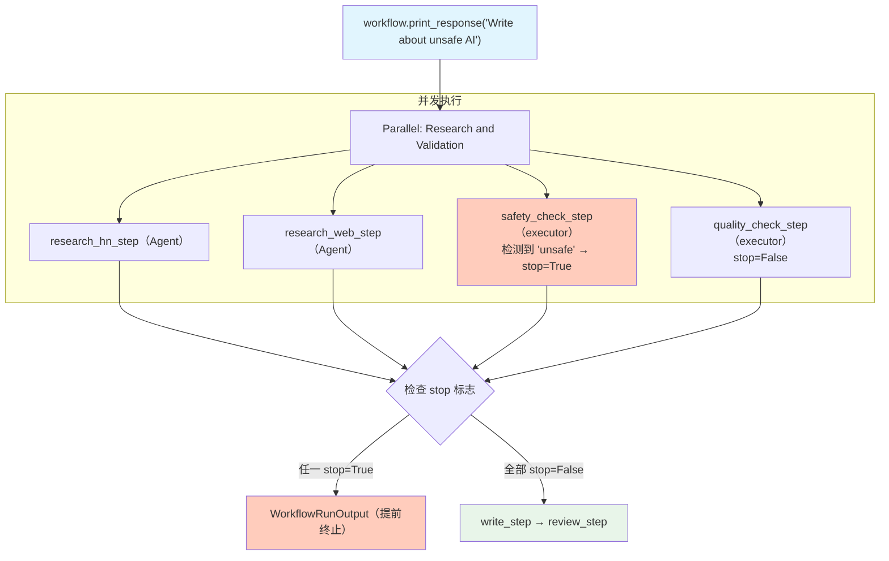

# early_stop_parallel.py — 实现原理分析

> 源文件：`cookbook/04_workflows/06_advanced_concepts/early_stopping/early_stop_parallel.py`

## 概述

本示例展示 Agno Workflow **在 `Parallel` 块内触发提前终止**机制：`Parallel` 块中的某个步骤返回 `StepOutput(stop=True)` 时，虽然所有并行步骤已同时开始（`ThreadPoolExecutor` 并发执行），但 Workflow 在收集完并行结果后会检查 `stop` 标志，若任一步骤返回 `stop=True`，则终止后续步骤。

**核心配置一览：**

| 配置项 | 值 | 说明 |
|--------|------|------|
| 并行结构 | `Parallel(研究1, 研究2, 安全检查, 质检)` | 4 步并发 |
| 安全检查 | `stop=True`（检测到不安全词） | 终止整个 Workflow |
| 质检 | `stop=False` | 仅警告不终止 |
| 并发工具 | `ThreadPoolExecutor` | Parallel 内部实现 |

## 核心组件解析

### 安全检查：返回 stop=True

```python
def content_safety_checker(step_input: StepInput) -> StepOutput:
    content = step_input.input or ""

    if "unsafe" in content.lower() or "dangerous" in content.lower():
        return StepOutput(
            step_name="Safety Checker",
            content="[ALERT] UNSAFE CONTENT DETECTED! Stopping workflow.",
            stop=True,   # 触发 Workflow 级终止
        )
    return StepOutput(content="[PASS] Content safe.", stop=False)
```

### 质检：返回 stop=False（仅警告）

```python
def quality_checker(step_input: StepInput) -> StepOutput:
    content = step_input.input or ""
    if len(content) < 10:
        return StepOutput(content="[WARN] Too short.", stop=False)  # 不终止
    return StepOutput(content="[PASS] Quality OK.", stop=False)
```

### 包含安全检查的 Parallel 结构

```python
workflow = Workflow(
    steps=[
        Parallel(
            research_hn_step,      # 并发执行
            research_web_step,     # 并发执行
            safety_check_step,     # 并发执行（可能 stop=True）
            quality_check_step,    # 并发执行
            name="Research and Validation Phase",
        ),
        write_step,     # 仅当 Parallel 无 stop=True 时执行
        review_step,    # 仅当前步均无 stop=True 时执行
    ],
)
```

## 执行时序

```
T=0: 4 个步骤同时开始（ThreadPoolExecutor）
T=t: 安全检查返回 stop=True（最早完成的可能是任何一个）
T=end: Parallel 完成收集所有结果 → 发现 stop=True → 终止
后续: write_step 和 review_step 均不执行
```

## Mermaid 流程图



## 关键源码文件索引

| 文件 | 关键类/函数 | 作用 |
|------|------------|------|
| `agno/workflow/parallel.py` | `Parallel._run()` | 并发执行并收集所有 StepOutput |
| `agno/workflow/types.py` | `StepOutput.stop` | 终止标志 |
| `agno/workflow/workflow.py` | `Workflow._run()` | 汇总后检查 stop 并决定是否继续 |
