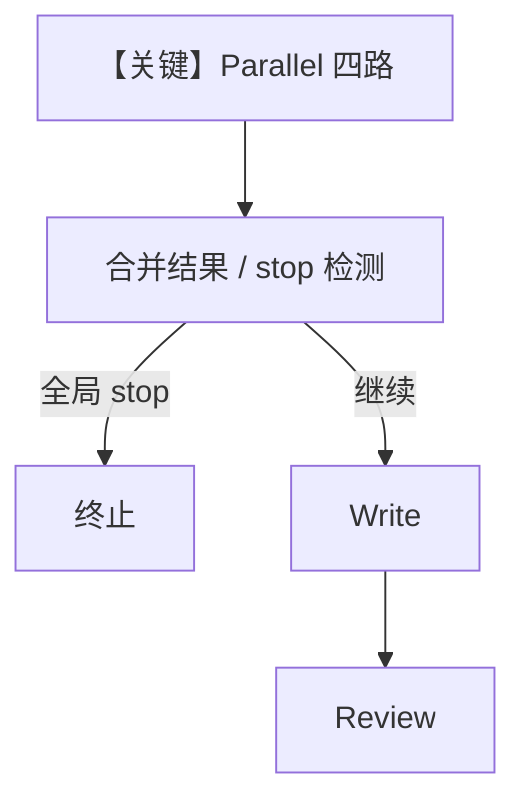

# early_stop_parallel.py — 实现原理分析

<!-- cookbook-py-source:start -->
## 完整源码

```python
"""
Early Stop Parallel
===================

Demonstrates stopping the workflow from within a step running inside a `Parallel` block.
"""

from agno.agent import Agent
from agno.tools.hackernews import HackerNewsTools
from agno.tools.websearch import WebSearchTools
from agno.workflow import Step, Workflow
from agno.workflow.parallel import Parallel
from agno.workflow.types import StepInput, StepOutput

# ---------------------------------------------------------------------------
# Create Agents
# ---------------------------------------------------------------------------
researcher = Agent(name="Researcher", tools=[HackerNewsTools(), WebSearchTools()])
writer = Agent(name="Writer")
reviewer = Agent(name="Reviewer")


# ---------------------------------------------------------------------------
# Define Functions
# ---------------------------------------------------------------------------
def content_safety_checker(step_input: StepInput) -> StepOutput:
    content = step_input.input or ""

    if "unsafe" in content.lower() or "dangerous" in content.lower():
        return StepOutput(
            step_name="Safety Checker",
            content="[ALERT] UNSAFE CONTENT DETECTED! Content contains dangerous material. Stopping entire workflow immediately for safety review.",
            stop=True,
        )
    return StepOutput(
        step_name="Safety Checker",
        content="[PASS] Content safety verification passed. Material is safe to proceed.",
        stop=False,
    )


def quality_checker(step_input: StepInput) -> StepOutput:
    content = step_input.input or ""

    if len(content) < 10:
        return StepOutput(
            step_name="Quality Checker",
            content="[WARN] Quality check failed: Content too short for processing.",
            stop=False,
        )
    return StepOutput(
        step_name="Quality Checker",
        content="[PASS] Quality check passed. Content meets processing standards.",
        stop=False,
    )


# ---------------------------------------------------------------------------
# Define Steps
# ---------------------------------------------------------------------------
research_hn_step = Step(name="Research HackerNews", agent=researcher)
research_web_step = Step(name="Research Web", agent=researcher)
safety_check_step = Step(name="Safety Check", executor=content_safety_checker)
quality_check_step = Step(name="Quality Check", executor=quality_checker)
write_step = Step(name="Write Article", agent=writer)
review_step = Step(name="Review Article", agent=reviewer)

# ---------------------------------------------------------------------------
# Create Workflow
# ---------------------------------------------------------------------------
workflow = Workflow(
    name="Content Creation with Parallel Safety Checks",
    description="Creates content with parallel safety and quality checks that can stop the workflow",
    steps=[
        Parallel(
            research_hn_step,
            research_web_step,
            safety_check_step,
            quality_check_step,
            name="Research and Validation Phase",
        ),
        write_step,
        review_step,
    ],
)

# ---------------------------------------------------------------------------
# Run Workflow
# ---------------------------------------------------------------------------
if __name__ == "__main__":
    print("=== Testing Parallel Early Termination with Safety Check ===")
    print("Expected: Safety check should detect 'unsafe' and stop the entire workflow")
    print(
        "Note: All parallel steps run concurrently, but safety check will stop the workflow"
    )
    print()

    workflow.print_response(
        input="Write about unsafe and dangerous AI developments that could harm society",
    )
```

<!-- cookbook-py-source:end -->

> 源文件：`cookbook/04_workflows/06_advanced_concepts/early_stopping/early_stop_parallel.py`

## 概述

本示例展示在 **`Parallel` 并行块内** 某步返回 `StepOutput(stop=True)` 时 **终止整条工作流**：`content_safety_checker` 检查 `step_input.input` 是否含 `unsafe`/`dangerous`（`L29-33`），并行中任一执行单元触发 stop 后，后续 `write_step`、`review_step` 不应再执行。

**核心配置一览：**

| 配置项 | 值 | 说明 |
|--------|------|------|
| `Parallel` | HN、Web、safety、quality 四步并行 | `L75-80` |
| `content_safety_checker` | `stop=True` 条件见上 | |
| `quality_checker` | 仅 `stop=False`，过短仅警告 | `L42-54` |

## 核心组件解析

### 并行与 stop 传播

`parallel.py` / `workflow.py` 并行执行路径会合并各分支 `StepOutput`；若任一分支 `stop=True`，工作流级逻辑应中止剩余步骤（见 `workflow.py` 并行段 `step_output.stop` 检测，如 `~L2899`）。

### 运行机制与因果链

1. **数据路径**：用户 input 同时进入四并行步；safety 读 `step_input.input`（`L27`），与读 `previous_step_content` 的写法不同，注意**并行时输入来源**以框架注入为准。
2. **与顺序 early stop 差异**：强调 **并发竞态** 下仍要全局一致停。

## System Prompt 组装

`researcher` 无显式 instructions（`L18`）；`writer`/`reviewer` 仅 name。

### 还原后的完整 System 文本

无法从 cookbook 静态还原长 system；默认模型行为请断点 `get_system_message()`。

## 完整 API 请求

带 tools 的 Chat Completions（researcher）。

## Mermaid 流程图


```mermaid
flowchart TD
    P["【关键】Parallel 四路"] --> M["合并结果 / stop 检测"]
    M -->|全局 stop| X["终止"]
    M -->|继续| W["Write"]
    W --> Rv["Review"]
```

## 关键源码文件索引

| 文件 | 关键函数/类 | 作用 |
|------|------------|------|
| `agno/workflow/workflow.py` | Parallel 分支 `stop` | 早停 |
| `agno/workflow/parallel.py` | `Parallel` L42 | 并行块 |
