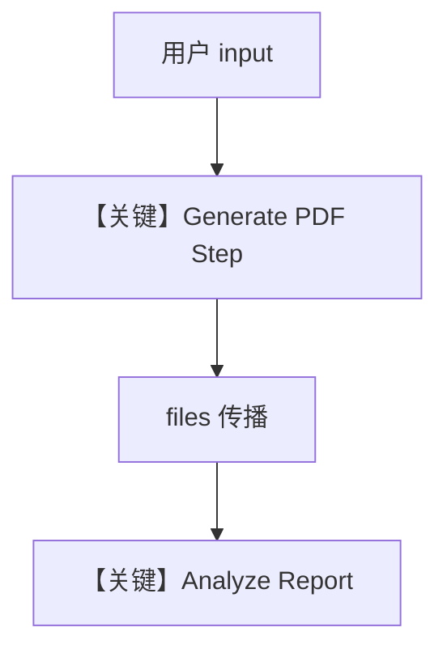

# file_generation_workflow.py — 实现原理分析

<!-- cookbook-py-source:start -->
## 完整源码

```python
from agno.agent import Agent
from agno.db.sqlite import SqliteDb
from agno.models.openai import OpenAIChat
from agno.tools.file_generation import FileGenerationTools
from agno.workflow.step import Step
from agno.workflow.workflow import Workflow

# ---------------------------------------------------------------------------
# Step 1: Generate a Report
# ---------------------------------------------------------------------------
report_generator = Agent(
    name="Report Generator",
    model=OpenAIChat(id="gpt-4o-mini"),
    tools=[FileGenerationTools(enable_pdf_generation=True)],
    instructions=[
        "You are a data analyst that generates reports.",
        "When asked to create a report, use the generate_pdf_file tool to create it.",
        "Include meaningful data in the report.",
    ],
)

generate_report_step = Step(
    name="Generate Report",
    agent=report_generator,
    description="Generate a PDF report with quarterly sales data",
)

# ---------------------------------------------------------------------------
# Step 2: Analyze the Report
# ---------------------------------------------------------------------------
report_analyzer = Agent(
    name="Report Analyzer",
    model=OpenAIChat(id="gpt-4o"),
    instructions=[
        "You are a business analyst.",
        "Analyze the attached PDF report and provide insights.",
        "Focus on trends, anomalies, and recommendations.",
    ],
)

analyze_report_step = Step(
    name="Analyze Report",
    agent=report_analyzer,
    description="Analyze the generated report and provide insights",
)

# ---------------------------------------------------------------------------
# Create Workflow
# ---------------------------------------------------------------------------
report_workflow = Workflow(
    name="Report Generation and Analysis",
    description="Generate a report and analyze it for insights",
    db=SqliteDb(
        session_table="file_propagation_workflow",
        db_file="tmp/file_propagation_workflow.db",
    ),
    steps=[generate_report_step, analyze_report_step],
)

# ---------------------------------------------------------------------------
# Run Workflow
# ---------------------------------------------------------------------------
if __name__ == "__main__":
    print("=" * 60)
    print("File Generation and Propagation Workflow")
    print("=" * 60)
    print()
    print("This workflow demonstrates file propagation between steps:")
    print("1. Step 1 generates a PDF report using FileGenerationTools")
    print("2. The file is automatically propagated to Step 2")
    print("3. Step 2 analyzes the report content")
    print()
    print("-" * 60)

    result = report_workflow.run(
        input="Create a quarterly sales report for Q4 2024 with data for 4 regions (North, South, East, West) and then analyze it for insights.",
    )

    print()
    print("=" * 60)
    print("Workflow Result")
    print("=" * 60)
    print()
    print(result.content)
    print()

    # Show file propagation
    print("-" * 60)
    print("Files in workflow output:")
    if result.files:
        for f in result.files:
            print(f"  - {f.filename} ({f.mime_type}, {f.size} bytes)")
    else:
        print("  No files in final output (files were consumed by analysis step)")
```

<!-- cookbook-py-source:end -->

> 源文件：`cookbook/04_workflows/06_advanced_concepts/file_propagation/file_generation_workflow.py`

## 概述

本示例展示 Agno 工作流中 **文件在 Step 间自动传播**：第一步用 `FileGenerationTools` 生成 PDF，第二步分析 Agent 接收前序产生的 `File` 附件；`WorkflowRunOutput.files` 可反映最终残留文件列表。

**核心配置一览：**

| 配置项 | 值 | 说明 |
|--------|------|------|
| `report_workflow.db` | `SqliteDb(..., tmp/file_propagation_workflow.db)` | 会话 |
| `report_generator` | `FileGenerationTools(enable_pdf_generation=True)` | PDF 工具 |
| `steps` | `Generate Report` → `Analyze Report` | 顺序两步 |

## 核心组件解析

### 文件传播

框架将前一步输出的 `files` 媒体合并进后续 `StepInput`（与 `workflow.py` 中 `shared_files` / `output_files` 收集逻辑一致，参见 `~L1920-L1930` 一带）。

### 运行机制与因果链

1. **数据路径**：自然语言需求 → 生成 PDF → 分析带附件的报告。
2. **副作用**：本地/临时目录写入 PDF；DB 记录会话。

## System Prompt 组装

`report_generator` instructions（`L15-19`）；`report_analyzer`（`L34-38`）。

### 还原后的完整 System 文本（report_generator）

```text
You are a data analyst that generates reports.
When asked to create a report, use the generate_pdf_file tool to create it.
Include meaningful data in the report.
```

## 完整 API 请求

Chat Completions + `FileGenerationTools` 工具调用；第二步可能含 **多模态/文件** 输入，依 `OpenAIChat` 与消息构造而定。

## Mermaid 流程图



## 关键源码文件索引

| 文件 | 作用 |
|------|------|
| `agno/workflow/workflow.py` | 媒体收集与传递 |
| `agno/tools/file_generation` | PDF 生成工具 |
