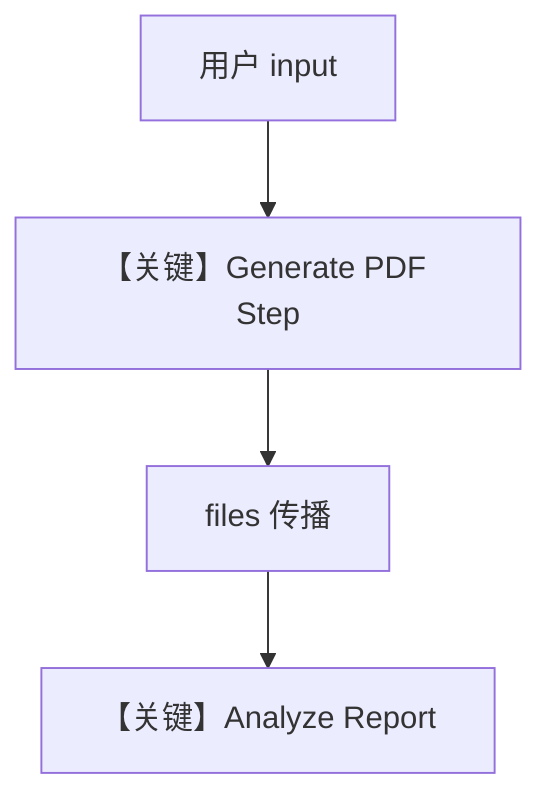

# file_generation_workflow.py — 实现原理分析

> 源文件：`cookbook/04_workflows/06_advanced_concepts/file_propagation/file_generation_workflow.py`

## 概述

本示例展示 Agno 工作流中 **文件在 Step 间自动传播**：第一步用 `FileGenerationTools` 生成 PDF，第二步分析 Agent 接收前序产生的 `File` 附件；`WorkflowRunOutput.files` 可反映最终残留文件列表。

**核心配置一览：**

| 配置项 | 值 | 说明 |
|--------|------|------|
| `report_workflow.db` | `SqliteDb(..., tmp/file_propagation_workflow.db)` | 会话 |
| `report_generator` | `FileGenerationTools(enable_pdf_generation=True)` | PDF 工具 |
| `steps` | `Generate Report` → `Analyze Report` | 顺序两步 |

## 核心组件解析

### 文件传播

框架将前一步输出的 `files` 媒体合并进后续 `StepInput`（与 `workflow.py` 中 `shared_files` / `output_files` 收集逻辑一致，参见 `~L1920-L1930` 一带）。

### 运行机制与因果链

1. **数据路径**：自然语言需求 → 生成 PDF → 分析带附件的报告。
2. **副作用**：本地/临时目录写入 PDF；DB 记录会话。

## System Prompt 组装

`report_generator` instructions（`L15-19`）；`report_analyzer`（`L34-38`）。

### 还原后的完整 System 文本（report_generator）

```text
You are a data analyst that generates reports.
When asked to create a report, use the generate_pdf_file tool to create it.
Include meaningful data in the report.
```

## 完整 API 请求

Chat Completions + `FileGenerationTools` 工具调用；第二步可能含 **多模态/文件** 输入，依 `OpenAIChat` 与消息构造而定。

## Mermaid 流程图



## 关键源码文件索引

| 文件 | 作用 |
|------|------|
| `agno/workflow/workflow.py` | 媒体收集与传递 |
| `agno/tools/file_generation` | PDF 生成工具 |
