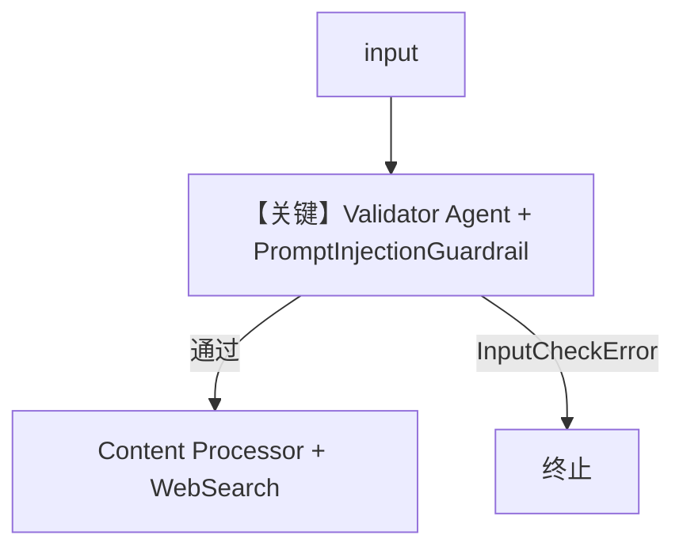

# prompt_injection.py — 实现原理分析

> 源文件：`cookbook/04_workflows/06_advanced_concepts/guardrails/prompt_injection.py`

## 概述

本示例展示在 **Agent 上配置 `pre_hooks=[PromptInjectionGuardrail()]`**，在运行 LLM 前拦截提示注入；工作流分「校验步」与「处理步」，配合 `SqliteDb` 持久化；恶意输入触发 `InputCheckError`（见 `main` 中测试用例）。

**核心配置一览：**

| 配置项 | 值 | 说明 |
|--------|------|------|
| `input_validator` | `pre_hooks=[PromptInjectionGuardrail()]` | `L25` |
| `validation_step` | `max_retries=0` | 避免重复触发 |
| `guardrails_workflow.db` | `tmp/guardrails_workflow.db` | 会话 |

## 核心组件解析

### PromptInjectionGuardrail

位于 `agno/guardrails`；在 Agent `run` 前检查用户输入，异常时抛出 `InputCheckError`（`L12` import）。

### 运行机制与因果链

1. **数据路径**：用户字符串 → validation Agent（带 guardrail）→ 通过则 processing Agent + WebSearch。
2. **失败路径**：注入样例被拦，不进入第二步。

## System Prompt 组装

`input_validator` 含 `description` 与 `instructions` 列表（`L26-32`）。

### 还原后的完整 System 文本（instructions 合并）

```text
You are a friendly input validation assistant.
Your job is to understand and rephrase user requests in a safe, constructive way.
Always maintain a helpful and professional tone.
Validate that the request is legitimate and safe to process.
```

（`description` 会进入另一 system 段，以 `_messages.py` 为准。）

## 完整 API 请求

若 guard 通过：Chat Completions + hooks 在请求前执行；失败则无后续 completion。

## Mermaid 流程图


```mermaid
flowchart TD
    U["input"] --> V["【关键】Validator Agent + PromptInjectionGuardrail"]
    V -->|通过| P["Content Processor + WebSearch"]
    V -->|InputCheckError| X["终止"]
```

## 关键源码文件索引

| 文件 | 作用 |
|------|------|
| `agno/guardrails` | `PromptInjectionGuardrail` |
| `agno/agent/agent.py` | `pre_hooks` 调用链 |
