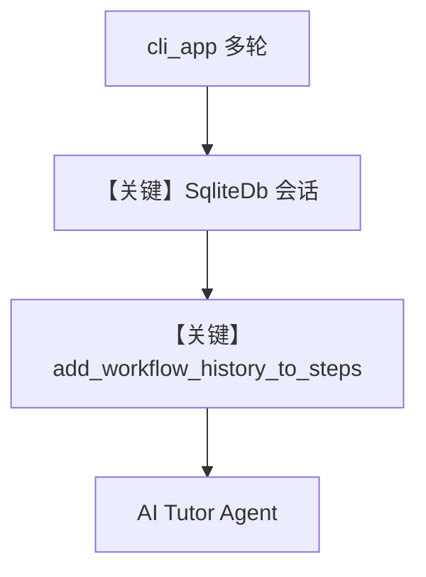

# continuous_execution.py — 实现原理分析

> 源文件：`cookbook/04_workflows/06_advanced_concepts/history/continuous_execution.py`

## 概述

本示例展示 **`add_workflow_history_to_steps=True`**：工作流级历史注入各 Step 内 Agent，使单步「导师」对话可跨多轮 CLI 交互延续上下文；通过 `Workflow.cli_app` 驱动 REPL 式体验。

**核心配置一览：**

| 配置项 | 值 | 说明 |
|--------|------|------|
| `tutor_workflow.add_workflow_history_to_steps` | `True` | `L40` |
| `db` | `SqliteDb(tmp/simple_tutor_workflow.db)` | 持久化 |
| `steps` | 单 `Step("AI Tutoring")` | `L39` |
| `cli_app` | `session_id`, `stream=True` | `L54-60` |

## 核心组件解析

### add_workflow_history_to_steps

`Workflow` 字段（`workflow.py` `L274-L277`）：为 True 时把历史 run 注入下游消息上下文（与 Step 级 `add_workflow_history` 配合理解）。

### 运行机制与因果链

1. **数据路径**：多轮用户输入经 CLI → 同 `session_id` → DB 累积 → Agent 消息含历史。
2. **与仅 Agent+db 差异**：历史由 **工作流** 统一裁剪为 `num_history_runs`（默认 3，可配置）。

## System Prompt 组装

`tutor_agent` instructions（`L20-29`）。

### 还原后的完整 System 文本

```text
You are an expert tutor who provides personalized educational support.
You have access to our full conversation history.
Build on previous discussions - do not repeat questions or information.
Reference what the student has told you earlier in our conversation.
Adapt your teaching style based on what you have learned about the student.
Be encouraging, patient, and supportive.
When asked about conversation history, provide a helpful summary.
Focus on helping the student understand concepts and improve their skills.
```

## 完整 API 请求

每轮 CLI 输入对应一次 Chat Completions，`messages` 含拼接后的历史（具体由 `get_run_messages` 系逻辑处理）。

## Mermaid 流程图



## 关键源码文件索引

| 文件 | 作用 |
|------|------|
| `agno/workflow/workflow.py` | `add_workflow_history_to_steps` L274 |
| `agno/workflow/types.py` | `StepInput` 历史 API |
