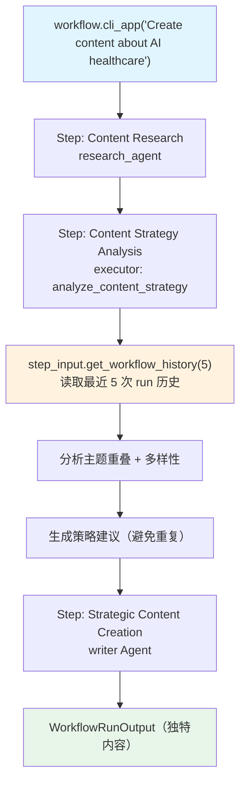

# history_in_function.py — 实现原理分析

> 源文件：`cookbook/04_workflows/06_advanced_concepts/history/history_in_function.py`

## 概述

本示例展示 Agno Workflow **函数步骤通过 `StepInput` API 读取 Workflow 历史记录**：`step_input.get_workflow_history(num_runs=5)` 返回最近 N 次 run 的输入/输出对，函数执行器可利用历史分析主题重叠、内容多样性，为后续步骤生成策略性内容规划建议。

**核心配置一览：**

| 配置项 | 值 | 说明 |
|--------|------|------|
| `step_input.get_workflow_history(num_runs=5)` | 返回历史列表 | `[(input, output), ...]` |
| `step_input.get_last_step_content()` | 返回前驱步骤输出 | 即 `previous_step_content` |
| `add_workflow_history_to_steps=True` | Workflow 级配置 | 所有步骤可获取历史 |

## 核心组件解析

### 函数步骤读取历史

```python
def analyze_content_strategy(step_input: StepInput) -> StepOutput:
    current_topic = step_input.input
    research_data = step_input.get_last_step_content()          # 前驱步骤输出
    history_data = step_input.get_workflow_history(num_runs=5)  # 最近 5 次历史

    # 分析历史中的主题重叠
    covered_topics = []
    for input_request, _content_output in history_data:  # 解包 (input, output) 元组
        covered_topics.append(input_request.lower())

    # 计算关键词重叠度、内容多样性
    overlap_percentage = ...
    diversity_score = len(set(covered_topics)) / max(len(covered_topics), 1)

    # 生成策略建议
    if overlap_percentage > 60:
        recommendations.append("HIGH OVERLAP - consider a fresh angle")

    return StepOutput(content=formatted_analysis)
```

### 历史 API 返回格式

```python
history_data = step_input.get_workflow_history(num_runs=5)
# 返回: [(input_text, output_content), ...]
# 示例:
# [
#   ("Create content about AI in healthcare", "# AI Healthcare Article..."),
#   ("Write about ML applications", "# ML Applications..."),
# ]
```

### Workflow 配置

```python
workflow = Workflow(
    db=SqliteDb(db_file="tmp/content_workflow.db"),
    steps=[research_step, strategy_step, writer_step],
    add_workflow_history_to_steps=True,   # 开启历史注入
)

# CLI 模式运行（支持多轮对话）
workflow.cli_app(session_id="content_strategy_demo", stream=True)
```

## 历史分析场景

| 分析维度 | 方法 | 目的 |
|---------|------|------|
| 主题重叠度 | 关键词交集 / 历史主题 | 避免重复内容 |
| 内容多样性 | 唯一话题数 / 总话题数 | 保持内容多样 |
| 历史数量 | `len(history_data)` | 了解历史积累量 |
| 避免重复 | `avoid_repeating` 列表 | 差异化定位 |

## Mermaid 流程图



## 关键源码文件索引

| 文件 | 关键类/函数 | 作用 |
|------|------------|------|
| `agno/workflow/types.py` | `StepInput.get_workflow_history()` | 读取历史 run 的输入/输出对 |
| `agno/workflow/types.py` | `StepInput.get_last_step_content()` | 读取前驱步骤输出 |
| `agno/workflow/workflow.py` | `Workflow.add_workflow_history_to_steps` | 开启历史注入 |
| `agno/workflow/workflow.py` | `Workflow.cli_app()` | 交互式 CLI 模式 |
