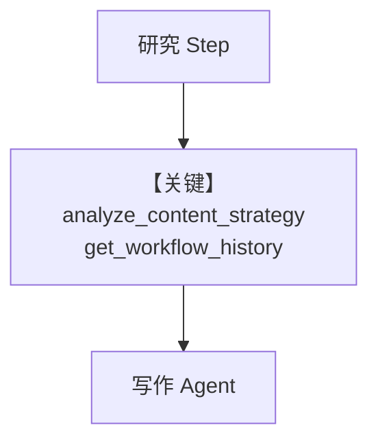

# history_in_function.py — 实现原理分析

<!-- cookbook-py-source:start -->
## 完整源码

```python
"""
History In Function
===================

Demonstrates reading workflow history inside a custom function step for strategic content planning.
"""

import json

from agno.agent import Agent
from agno.db.sqlite import SqliteDb
from agno.models.openai import OpenAIChat
from agno.workflow.step import Step
from agno.workflow.types import StepInput, StepOutput
from agno.workflow.workflow import Workflow


# ---------------------------------------------------------------------------
# Define Analysis Function
# ---------------------------------------------------------------------------
def analyze_content_strategy(step_input: StepInput) -> StepOutput:
    current_topic = step_input.input or ""
    research_data = step_input.get_last_step_content() or ""
    history_data = step_input.get_workflow_history(num_runs=5)

    def extract_keywords(text: str) -> set:
        stop_words = {
            "create",
            "content",
            "about",
            "write",
            "the",
            "a",
            "an",
            "how",
            "is",
            "of",
            "this",
            "that",
            "in",
            "on",
            "for",
            "to",
        }
        words = set(text.lower().split()) - stop_words

        keyword_map = {
            "ai": ["ai", "artificial", "intelligence"],
            "ml": ["machine", "learning", "ml"],
            "healthcare": ["medical", "health", "healthcare", "medicine"],
            "blockchain": ["crypto", "cryptocurrency", "blockchain"],
        }

        expanded_keywords = set(words)
        for word in list(words):
            for synonyms in keyword_map.values():
                if word in synonyms:
                    expanded_keywords.update([word])

        return expanded_keywords

    current_keywords = extract_keywords(current_topic)
    max_possible_overlap = len(current_keywords)
    topic_overlaps = []
    covered_topics = []

    for input_request, _content_output in history_data:
        if input_request:
            covered_topics.append(input_request.lower())
            previous_keywords = extract_keywords(input_request)

            overlap = len(current_keywords.intersection(previous_keywords))
            if overlap > 0:
                topic_overlaps.append(overlap)

    topic_overlap = max(topic_overlaps) if topic_overlaps else 0
    overlap_percentage = (topic_overlap / max(max_possible_overlap, 1)) * 100
    diversity_score = len(set(covered_topics)) / max(len(covered_topics), 1)

    recommendations = []
    if overlap_percentage > 60:
        recommendations.append(
            "HIGH OVERLAP detected - consider a fresh angle or advanced perspective"
        )
    elif overlap_percentage > 30:
        recommendations.append(
            "MODERATE OVERLAP detected - differentiate your approach"
        )
    if diversity_score < 0.6:
        recommendations.append(
            "Low content diversity - explore different aspects of the topic"
        )
    if len(history_data) > 0:
        recommendations.append(
            f"Building on {len(history_data)} previous content pieces - ensure progression"
        )

    strategy_analysis = {
        "content_topic": current_topic,
        "historical_coverage": {
            "previous_topics": covered_topics[-3:],
            "topic_overlap_score": topic_overlap,
            "overlap_percentage": round(overlap_percentage, 1),
            "content_diversity": diversity_score,
        },
        "strategic_recommendations": recommendations,
        "research_summary": research_data[:500] + "..."
        if len(research_data) > 500
        else research_data,
        "suggested_angle": "unique perspective"
        if overlap_percentage > 30
        else "comprehensive overview",
        "content_gap_analysis": {
            "avoid_repeating": [
                topic
                for topic in covered_topics
                if any(word in current_topic.lower() for word in topic.split()[:2])
            ],
            "build_upon": "previous insights"
            if len(history_data) > 0
            else "foundational knowledge",
        },
    }

    formatted_analysis = f"""
        CONTENT STRATEGY ANALYSIS
        ========================

        STRATEGIC OVERVIEW:
        - Topic: {strategy_analysis["content_topic"]}
        - Previous Content Count: {len(history_data)}
        - Keyword Overlap: {strategy_analysis["historical_coverage"]["topic_overlap_score"]} keywords ({strategy_analysis["historical_coverage"]["overlap_percentage"]}%)
        - Content Diversity: {strategy_analysis["historical_coverage"]["content_diversity"]:.2f}

        RECOMMENDATIONS:
        {chr(10).join([f"- {rec}" for rec in strategy_analysis["strategic_recommendations"]])}

        RESEARCH FOUNDATION:
        {strategy_analysis["research_summary"]}

        CONTENT POSITIONING:
        - Suggested Angle: {strategy_analysis["suggested_angle"]}
        - Build Upon: {strategy_analysis["content_gap_analysis"]["build_upon"]}
        - Differentiate From: {", ".join(strategy_analysis["content_gap_analysis"]["avoid_repeating"]) if strategy_analysis["content_gap_analysis"]["avoid_repeating"] else "No similar content found"}

        CREATIVE DIRECTION:
        Based on historical analysis, focus on providing {strategy_analysis["suggested_angle"]} while ensuring the content complements rather than duplicates previous work.

        STRUCTURED_DATA: {json.dumps(strategy_analysis, indent=2)}
    """

    return StepOutput(content=formatted_analysis.strip())


# ---------------------------------------------------------------------------
# Create Workflow
# ---------------------------------------------------------------------------
def create_content_workflow() -> Workflow:
    research_step = Step(
        name="Content Research",
        agent=Agent(
            name="Research Specialist",
            model=OpenAIChat(id="gpt-4o"),
            instructions=[
                "You are an expert research specialist for content creation.",
                "Conduct thorough research on the requested topic.",
                "Gather current trends, key insights, statistics, and expert perspectives.",
                "Structure your research with clear sections: Overview, Key Points, Recent Developments, Expert Insights.",
                "Prioritize accurate, up-to-date information from credible sources.",
                "Keep research comprehensive but concise for content creators to use.",
            ],
        ),
    )

    strategy_step = Step(
        name="Content Strategy Analysis",
        executor=analyze_content_strategy,
        description="Analyze content strategy using historical data to prevent duplication and identify opportunities",
    )

    writer_step = Step(
        name="Strategic Content Creation",
        agent=Agent(
            name="Content Strategist",
            model=OpenAIChat(id="gpt-4o"),
            instructions=[
                "You are a strategic content writer who creates high-quality, unique content.",
                "Use the research and strategic analysis to create compelling content.",
                "Follow the strategic recommendations to ensure content uniqueness.",
                "Structure content with: Hook, Main Content, Key Takeaways, Call-to-Action.",
                "Ensure your content builds upon previous work rather than repeating it.",
                "Include 'Target Audience:' and 'Content Type:' at the end for tracking.",
                "Make content engaging, actionable, and valuable to readers.",
            ],
        ),
    )

    return Workflow(
        name="Strategic Content Creation",
        description="Research -> Strategic Analysis -> Content Creation with historical awareness",
        db=SqliteDb(db_file="tmp/content_workflow.db"),
        steps=[research_step, strategy_step, writer_step],
        add_workflow_history_to_steps=True,
    )


# ---------------------------------------------------------------------------
# Run Workflow
# ---------------------------------------------------------------------------
def demo_content_workflow() -> None:
    workflow = create_content_workflow()

    print("Strategic Content Creation Workflow")
    print("Flow: Research -> Strategy Analysis -> Content Writing")
    print("")
    print("This workflow prevents duplicate content and ensures strategic progression")
    print("")
    print("Try these content requests:")
    print("- 'Create content about AI in healthcare'")
    print("- 'Write about machine learning applications' (will detect overlap)")
    print("- 'Content on blockchain technology' (different topic)")
    print("")
    print("Type 'exit' to quit")
    print("-" * 70)

    workflow.cli_app(
        session_id="content_strategy_demo",
        user="Content Manager",
        emoji="",
        stream=True,
    )


if __name__ == "__main__":
    demo_content_workflow()
```

<!-- cookbook-py-source:end -->

> 源文件：`cookbook/04_workflows/06_advanced_concepts/history/history_in_function.py`

## 概述

本示例展示在 **函数型 Step** 中调用 `StepInput.get_workflow_history(num_runs=5)`（实现见 `agno/workflow/types.py` `L244`），基于历史用户请求做关键词重叠与多样性分析，输出结构化策略建议，再进入写作 Agent。

**核心配置一览：**

| 配置项 | 说明 |
|--------|------|
| `analyze_content_strategy` | 读 `get_last_step_content` + `get_workflow_history` |
| 后续 Agent | `OpenAIChat` 写作 |
| `db` | `SqliteDb`（见文件后半） |

（完整 Workflow 定义请 Read 源文件 `L100` 之后。）

## 核心组件解析

### get_workflow_history

返回 `List[Tuple[str, str]]`（输入与内容对）；`analyze_content_strategy` 遍历计算 overlap、diversity（`L67-78`）。

### 运行机制与因果链

1. **数据路径**：研究步输出 → 函数步读历史 → 建议文本 → 写作步。
2. **适用场景**：防重复选题、内容运营策略。

## System Prompt 组装

函数步无 LLM；写作 Agent instructions 见源文件 Agent 定义。

## 完整 API 请求

仅写作步调用 Chat Completions；函数步无 API。

## Mermaid 流程图


```mermaid
flowchart TD
    R["研究 Step"] --> F["【关键】analyze_content_strategy<br/>get_workflow_history"]
    F --> W["写作 Agent"]
```

## 关键源码文件索引

| 文件 | 关键函数/类 | 作用 |
|------|------------|------|
| `agno/workflow/types.py` | `get_workflow_history` L244 | 读历史 |
