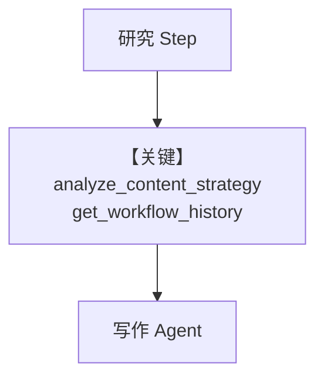

# history_in_function.py — 实现原理分析

> 源文件：`cookbook/04_workflows/06_advanced_concepts/history/history_in_function.py`

## 概述

本示例展示在 **函数型 Step** 中调用 `StepInput.get_workflow_history(num_runs=5)`（实现见 `agno/workflow/types.py` `L244`），基于历史用户请求做关键词重叠与多样性分析，输出结构化策略建议，再进入写作 Agent。

**核心配置一览：**

| 配置项 | 说明 |
|--------|------|
| `analyze_content_strategy` | 读 `get_last_step_content` + `get_workflow_history` |
| 后续 Agent | `OpenAIChat` 写作 |
| `db` | `SqliteDb`（见文件后半） |

（完整 Workflow 定义请 Read 源文件 `L100` 之后。）

## 核心组件解析

### get_workflow_history

返回 `List[Tuple[str, str]]`（输入与内容对）；`analyze_content_strategy` 遍历计算 overlap、diversity（`L67-78`）。

### 运行机制与因果链

1. **数据路径**：研究步输出 → 函数步读历史 → 建议文本 → 写作步。
2. **适用场景**：防重复选题、内容运营策略。

## System Prompt 组装

函数步无 LLM；写作 Agent instructions 见源文件 Agent 定义。

## 完整 API 请求

仅写作步调用 Chat Completions；函数步无 API。

## Mermaid 流程图

```mermaid
flowchart TD
    R["研究 Step"] --> F["【关键】analyze_content_strategy<br/>get_workflow_history"]
    F --> W["写作 Agent"]
```

## 关键源码文件索引

| 文件 | 关键函数/类 | 作用 |
|------|------------|------|
| `agno/workflow/types.py` | `get_workflow_history` L244 | 读历史 |
